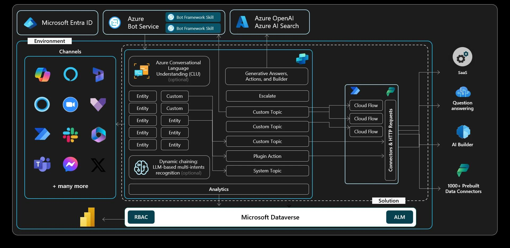

# Develop your own agent with Copilot Studio

This lab teaches you how to create and enhance a custom AI-powered customer service agent using Microsoft Copilot Studio. You'll start by learning to create a new agent, add content, and explore the fundamentals of **Message** and **Question** nodes, entities, slot filling, and variables, essential for building interactive conversational agents.

As you progress, you'll integrate external data sources and services with your agent. You'll use Power Automate to request data from other sources and return it in a conversational dialog. You'll also understand the basics of the **HTTP Request** node and how to retrieve information from external services. By pointing your agent to your website and other knowledge sources, you'll make it smarter and more capable of providing accurate information, guided by custom prompt instructions.

Finally, you'll explore advanced features like using plugin actions to interact with other data sources and invoking AI Builder prompts to analyze customer feedback. These skills will enable you to create a highly functional customer service agent that handles complex tasks and provides valuable insights. By the end of this lab, you'll understand how to leverage Microsoft Copilot Studio to improve customer service efficiency and support an organization's growing needs.

## Architecture

## Exercises

This lab has the following exercises:

-   Create your first agent in Microsoft Copilot Studio.
-   Learn basic authoring.
-   Build and call Power Automate cloud flows from your agent.
-   Make HTTP requests to connect to an API.
-   Leverage knowledge sources, AI knowledge, and custom instructions
-   Use generative AI orchestration to interact with your connectors.
-   Invoke AI Builder prompts

## Prerequisites

For running this lab, you’ll need:

-   Power Platform Environment with Dataverse enabled
-   Microsoft Copilot Studio Trial Subscription activated within Power Platform environment
-   Power Automate
-   Access to Azure OpenAI services

## Customer story

Contoso, Inc. leases specialty medical equipment to hospitals throughout the Northwestern United States. Founded in 2005 with headquarters in Seattle, WA, the company has grown significantly over the years. They now support over 900 hospitals and more than 15,000 individuals, providing essential medical equipment.

Despite their success, Contoso has faced challenges in recent years due to a surge in demand for their services. Keeping up with their promises of excellent customer service and 24-hour turnaround on service contracts has become increasingly difficult. The company has outgrown its current customer service and service deployment tools, leading to issues such as staff capacity problems, and increased workload for Customer Service Reps.

To address these challenges and improve customer service efficiency, Contoso, Inc. decides to implement a new AI-powered customer service agent using Microsoft Copilot Studio. The goal is to create a scalable solution that can handle the current and future workload, streamline the process of managing equipment maintenance requests, and enhance the overall customer experience.

By leveraging the capabilities of Microsoft Copilot Studio, Contoso aims to reduce the workload on Customer Service Reps, improve response times, and provide more accurate and timely information to their customers. This initiative will help Contoso maintain its reputation for excellent customer service and support its continued growth in the medical equipment leasing industry.

## Additional Links

- [Exercise 00: Setup](docs/Ex00/Ex00-EN.md)
- [Exercise 01: Create your first Copilot with Microsoft Copilot Studio](docs/Ex01/Ex01-EN.md)
- [Exercise 02: Learn basic authoring](docs/Ex02/Ex02-EN.md)
- [Exercise 03: Call Power Automate cloud flows from your agent](docs/Ex03/Ex03-EN.md)
- [Exercise 04: Send HTTP requests to APIs](docs/Ex04/Ex04-EN.md)
- [Exercise 05: Leverage knowledge sources, AI knowledge, and custom instructions](docs/Ex05/Ex05-EN.md)
- [Exercise 06: Use generative AI orchestration to interact with connectors](docs/Ex06/Ex06-EN.md)
- [Exercise 07: Invoke AI Builder prompts](docs/Ex07/Ex07-EN.md)

- [Solution package for importing this exercise](solution/CopilotFlightCrew_1_0_0_2.zip)

---