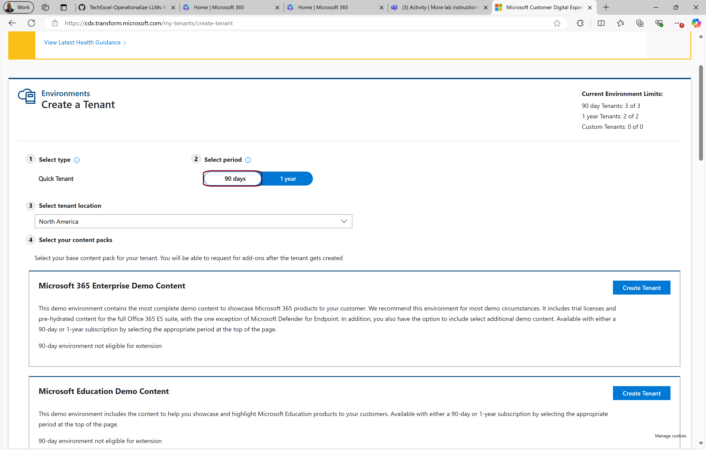
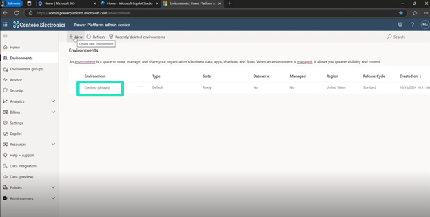
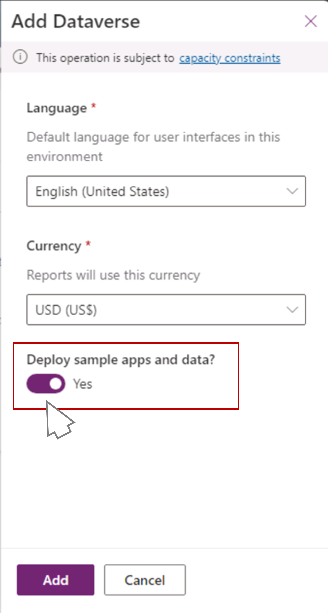
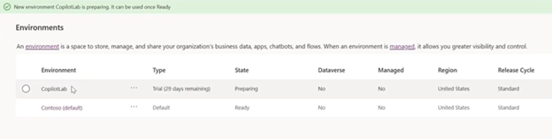

# タスク 01: Power Platform のトライアルを追加する

> [!IMPORTANT]
> CDX を使ってデモ環境を構築する場合は、90日間の M365 トライアルから始めることができます。まず **[CDX](https://cdx.transform.microsoft.com)** にアクセスし、**My Environments** を選択します。最初のオプション *Microsoft M365 Enterprise demo content* で **Create Tenant** を選択し、免責事項に同意してプロビジョニングが完了するまで待ちます。その後、**My Environments** に新しい M365 テナントが表示されます。In Private ブラウザーで *Office.com* に新しい資格情報でサインインし、多要素認証 (MFA) を有効化してください。サポートが必要な場合はインストラクターに相談してください。


 


1. In Private ブラウザーウィンドウのまま、新しいタブを開き、次の URL を入力します:
    
    ```
    aka.ms/ppac
    ```

1. **Contoso(default)** Power Platform 環境を選択します。

    

> [!NOTE]
> これにより、M365 アカウントの ID が保持され、Copilot Studio の基盤となる Power Platform に引き継がれます。
>
> また、Copilot Studio で作成したカスタム Copilot のデータもここに保存されます。

1. 左上の **Add Dataverse** を選択します。

1. **Add Dataverse** 画面で **Deploy sample apps and data** をオンにします。

     

1. 緑色のステータスバーが表示され、環境が構築されたことを示す *ready* ステータスになるまで待ちます。

> [!NOTE]
> これには数分かかる場合があります。



> [!IMPORTANT]
> Copilot で利用できるフローやアクションも作成できます。Power Platform コネクタを使えば、Copilot が顧客アプリやドキュメントソース、自社データベースなど外部データにアクセスすることも可能です。

1. In Private ブラウザーウィンドウのまま、新しいタブで [MS Power Apps](https://make.powerapps.com/) を開きます。

[次のページへ → 2. Copilot Studio のトライアルを追加する](0002.md)


