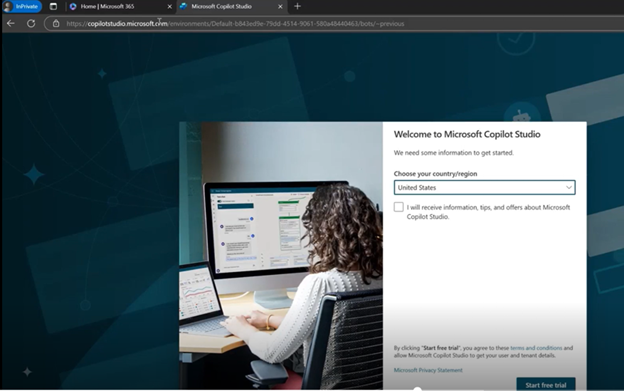
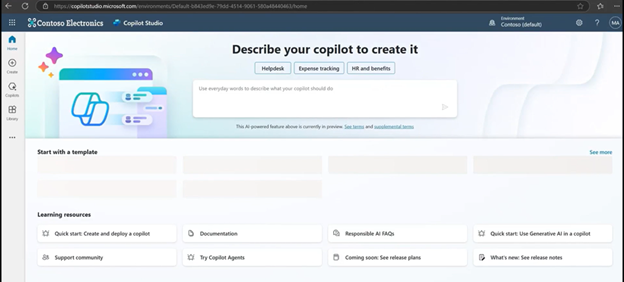

# タスク 02: Copilot Studio のトライアルを追加する

1. In Private ブラウザーウィンドウのまま、新しいタブで **[Copilot Studio](copilotstudio.microsoft.com)** にアクセスします。

     

2. 地域を選択し、免責事項に同意して「Start Free Trial」をクリックします。Copilot Studio のホームページに移動します。右上で異なるローコード環境を選択できるオプションが表示されます。先ほど作成した新しい環境を選択してください。

    

[次のページへ → 3. (オプション) 事前構築済み Copilot のアップロード](0003.md)