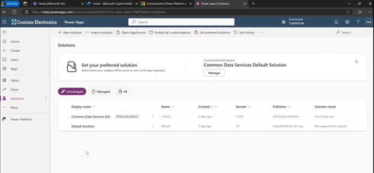
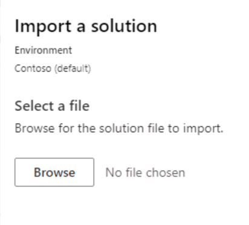
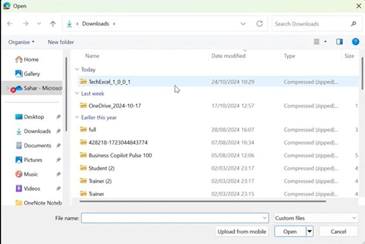
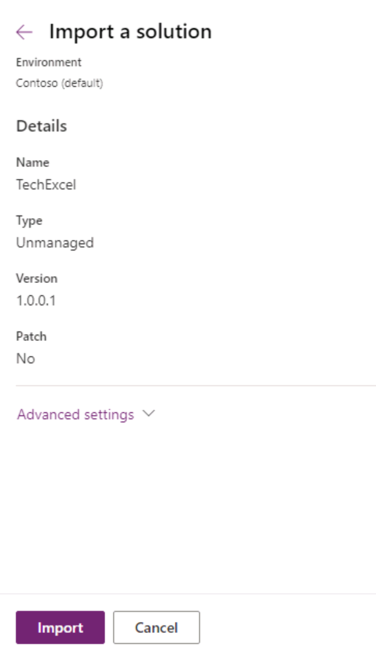
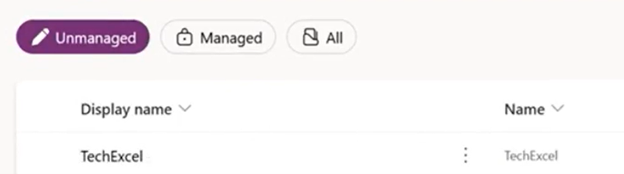
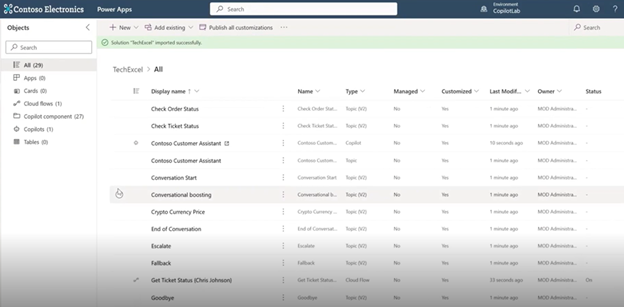

# タスク 03: (オプション) Power Apps で事前構築済み Copilot をアップロードする

1. **[MS Power Apps](make.powerapps.com)** で、ラボ演習の出発点として Copilot をインポート（任意）できます。**TechExcel_1.0.0.1.Zip** という Zip ファイルが必要です（別途ダウンロード可能）。このリポジトリのルートから .zip ファイルをダウンロードできます。Copilot をインポートするには、左ペインで **Solutions** を選択します。

    <a href="https://github.com/microsoft/TechExcel-Designing-your-own-copilot-using-copilot-studio/blob/main/TechExcel_1_0_0_1.zip">TechExcel_1.0.0.1.Zip<a>

    

    {: .important }
    > .zip ファイルをダウンロードするには、リンクを開いて **View raw** を選択してください。
    >
    > 

1. 上部リボンの **Import Solution** を選択します。

     

1. **browse** を選択し、ダウンロードした **TechExcel_1.0.0.1.zip** ファイルを指定します。

     

1. この zip ファイルには Copilot を定義するすべてのオブジェクトが含まれています。

     

1. 数分後、新しい Copilot ソリューションを表示できるようになります。

    {: .note }
    > これは Copilot の定義のみであり、実行中のバージョンではありません。

     

1. **TechExcel** の名前を選択すると、Copilot とその内部コンポーネントの一部を確認できます。

     

1. この手順を使うと、演習 1 から 4 までのすべてのステップが完了した状態からラボを始められるため、時間を節約できます。

[次のページへ → 演習 00: セットアップ サマリー](Ex00.md)
