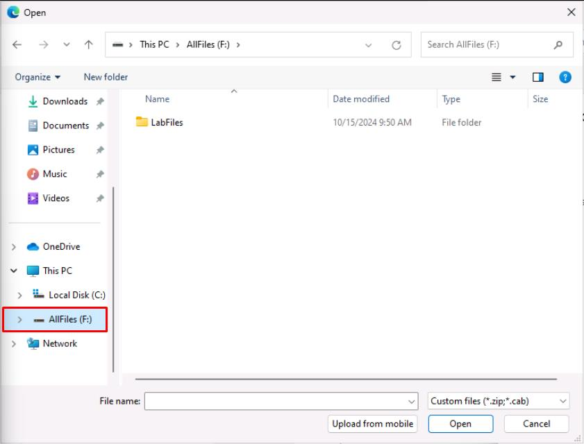

# タスク 01: セットアップ

## はじめに

Contoso は、顧客からの需要増加とカスタマーサービス担当者の負担軽減のため、AI 駆動のカスタマーサポートソリューションを導入することにしました。このソリューションを実装するため、まず Power Platform 内に必要な環境をセットアップします。このタスクでは、Dataverse などの基盤コンポーネントを準備し、AI エージェントを効果的に構築できるようにします。

## 説明

このタスクでは、Microsoft Dataverse を有効化し、サンプルアプリとデータを展開することで Power Platform 環境を構成します。これらのコンポーネントは、Microsoft Copilot Studio でインテリジェントエージェントを作成・展開するための基盤となります。

## 成功基準

- Power Platform 管理センターに移動し、指定された Microsoft 365 資格情報でサインインできた
- 正しい環境（「Contoso (default)」）を選択し、Dataverse とサンプルアプリ・データを有効化できた

## ラボ環境のナビゲート

**Type Text アイコン**  

手順内のアイコンを選択すると、Type Text 機能が仮想マシンのアクティブウィンドウに指定テキストを自動入力します。  

手順のテキストと仮想マシンに入力されたテキストが一致しているか必ず確認してください。

大きなコードブロックの場合は、**Copy** ボタンを使い、右クリックまたは **CTRL+V** で仮想マシンに貼り付けてください。

---

**ラボ資格情報**  
仮想環境やラボ提供の Microsoft 365 テナントにアクセスするための資格情報は、常にこの手順ペイン上部の **Resources** タブで確認できます。

---

**進捗の保存**  
進捗を保存するには、画面右上の **Exit Lab** を選択し、**Save Progress and Exit** を選択してください。これで作業内容が次回以降のセッションに保存されます。

[!WARNING]] **End Lab** を選択すると、保存せずにラボが終了します。

---

**画像**   

ラボ手順内のすべての画像はクリック可能です。選択することで、別ウィンドウでズームインしたビューを開き、より明確に分析できます。 
 
--- 

**ウィンドウ分割機能**  
複数の画面を持っている場合は、ウィンドウ分割機能を使用してラボ手順を別の画面に配置し、画面スペースをより有効に活用できます。

この機能を有効にするには:  
1. このペインの右上隅にある **歯車** アイコンを選択します。  
2. **設定** ペインの一番下にある **ウィンドウ分割** を選択します。

これにより、仮想マシンと手順を同時に表示し、より効率的なワークフローが実現します。

## 主要タスク

### 01: Power Platform のセットアップ

 
  
<strong>このセクションを展開して解決策を見る</strong>
 

1. Microsoft Edge を開き、[Power Platform](admin.powerplatform.microsoft.com) に移動します。

1. 資格情報でサインインします: 

	| 項目 | 値 |
    |----------|---------------------------------------------------------|
    | **ユーザー名** | `Power Platform の管理者ユーザー名` |
    | **パスワード** | `Power Platform 管理者ユーザーのパスワード` |

1. 様々なダイアログで以下のオプションを選択します: 
 
    | 項目 | 値 | 
    |----------|---------------------------------------------------------| 
    | Microsoft Edge にサインイン | **いいえ、結構です** | 
    | パスワードを保存しますか？ | **保存** | 
    | サインイン状態を維持しますか？ | **はい** | 
 
	

1. Power Platform は新しい管理センターに移行している可能性があります。 

    ページの右上隅で、**新しい管理センター** がオンになっている場合は、オフに切り替えます。

    
	
1. 左側のサービスメニューで **環境** を選択します。

1. **Contoso (default)** 環境を選択します。 

    

    [!NOTE]
    > これにより、Microsoft 365 アカウントの ID が保持され、Power Platform に引き継がれます。これは Copilot Studio の基盤であり、カスタムエージェントに関連するデータが保存される場所でもあります。   

1. 上部バーの **Add Dataverse** を選択します。

	 

1. **Add Dataverse** ペインで、**Deploy sample apps and data?** のトグルを **はい** に変更し、下部の **追加** を選択します。 

    

    [!WARNING]
    > 後の演習のためにサンプルデータを展開する必要があります。

1. **Contoso (default)** 環境の **状態** 列が **準備完了** と表示されるまで待ちます。 

    定期的に上部バーの **更新** オプションを選択します。

    

    [!WARNING]
    > これには約 15 分かかる場合があります。

### 02: Copilot Studio の試用版を追加

 
  
<strong>このセクションを展開して解決策を見る</strong>

1. 新しいブラウザタブを開き、`copilotstudio.microsoft.com` に移動します。 

    [!WARNING]
    > 次のような確認とアカウント作成のプロンプトが表示された場合は、入力せずに閉じてください。新しいタブで再度 `copilotstudio.microsoft.com` を開いてください。  
    > 
    > 
    > 
    > URL に次のステップのスクリーンショットが表示されるはずです。 
 
1. リージョンを選択し、**無料トライアルを開始** を選択します。 
 
	 
 
1. ページの右上部で、**Contoso (default)** が **環境** として設定されていることを確認します。

    

    [!NOTE]
    > 画面の解像度によっては、選択した環境を表示するために地球儀のアイコンを選択する必要があるかもしれません。
    >
    > 
  
 

### 03: (オプション) Power Apps を使用して事前構築されたエージェントをアップロード

 
  
<strong>このセクションを展開して解決策を見る</strong>
 

[!WARNING]
> エージェントをオプションでインポートして、ラボ演習の出発点として使用できます。これにより、**演習 01** のすべてのステップから **演習 04** の最後までが完了します。これにはカスタムソリューションのダウンロードとインポートが必要です。
>
> カスタムソリューションをインポートする場合は、すべての演習を観察して、すべての構成方法を学んでください。また、エージェントのさまざまなテストに従ってください。

1. Copilot Studio の左側のメニューで **エージェント** を選択します。 
 
	
 
1. ページの左上部で **エージェントのインポート** を選択します。 
 
	
	
    [!NOTE]
    これにより、**ソリューション** ページが新しいタブで開きます。 
 
1. 上部バーで **ソリューションのインポート** を選択します。 
 
	
 
1. 新しいペインで **参照** を選択します。 
 
1. 上部のアドレスバーで、**Admin >** の右側にある空白のスペースを選択してファイルパスを変更し、`F:\LabFiles\Solution` と入力します。 
 
	

	 
	
    [!NOTE]
    > 代わりに、フォルダーを手動でナビゲートするために展開することもできます: 
    >1. 左ペインで **この PC** の下に移動し、**AllFiles (F:)** を選択します。 
    >
    >  
    > 
    >1. **LabFiles** をダブルクリックします。
    >1. **Solution** をダブルクリックします。 
	
1. **CopilotFlightCrew_1_0_0_2.zip** を選択し、**開く** を選択します。  
 
	
 
1. ペインの左下隅で **次へ** を選択します。 
 
	
 
1. ペインの左下隅で **インポート** を選択します。  
 
1. 完了時に上部バーの下に黄色の警告バナーが表示されるまで待ちます。警告は無視しても安全です。 
 
    

    
 
    [!WARNING]
    > エージェントのインポートには数分かかる場合があります。  
 
    [!NOTE]
    > これはエージェントの定義であり、実行中のバージョンではありません。内部コンポーネントが含まれており、今後の演習で探求します。 

1. インポートが完了したら、**ソリューション** ページタブを閉じて Copilot Studio に戻ります。

1. 左側のメニューで **ホーム** を選択します。

	

[次のページへ → 2. エージェントの作成](0102.md)