# タスク 02: エージェントの作成

## はじめに

Power Platform 環境の準備ができたら、次は Contoso のカスタマーサポートエージェントを作成します。このタスクでは、エージェントの目的、トーン、制限事項、外部ナレッジソースの指定などを行います。これにより、Contoso のサポートシナリオや顧客対応に最適化されたエージェントを構築できます。

## 説明

このタスクでは、Microsoft Copilot Studio を使って最初の AI エージェントを定義・作成します。エージェントの目的、トーン、会話の範囲、データソースを指定し、初期テストの準備を行います。

## 成功基準

- Microsoft Copilot Studio 内でエージェントが作成されている
- エージェントの目的、トーン、範囲が明確に定義されている
- 外部ナレッジソースが正常に統合されている

## 主なタスク

### 01: エージェントの作成

 
  
<strong>ソリューションを表示するにはこのセクションを展開</strong>
 

1. **Describe your agent to create it** のテキストボックスに、以下のプロンプトを入力し、**Enter** を選択します:

	`I want to create an agent for my customer support. It is an assistant for Contoso customers, helping to answer common questions and helping with common tasks, like checking order status.`

    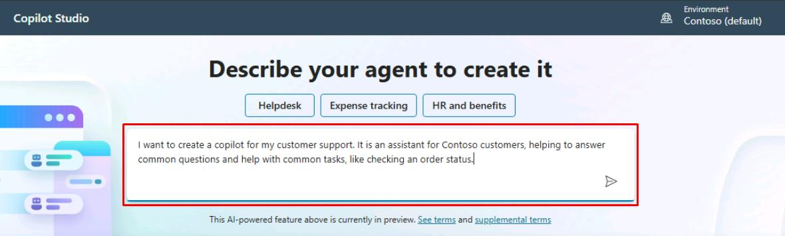

    [!NOTE]
	エージェントのカスタマイズを進めるための会話型画面にリダイレクトされます。

	[!WARNING]
	送信前に待機を促された場合は、数分待ってから再度お試しください。問題が解決しない場合は、以下のドロップダウンを展開して手動作成手順を参照してください。

	

	 
手動でエージェントを作成する手順はこちら

      1. 左端のペインで **Create** を選択します。  
         
		 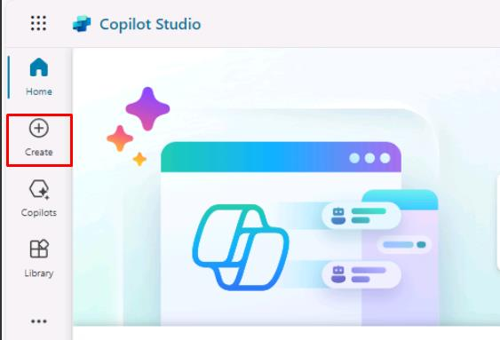

      1. **Create** ページで、ページの左上にある **New agent** を選択します。

         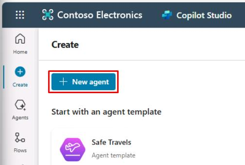
 
      1. ページの右上隅にある **Create** を選択します。

      1. ページの右上隅にある **Skip to configure** を選択します。  

         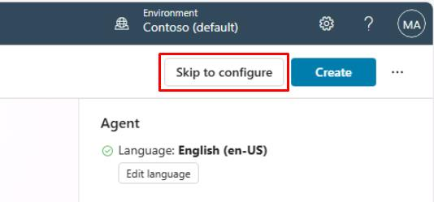

      1. ページの右上隅にある **Create** を選択します。

      1. ページの右上隅にある **Settings** を選択します。  
         
		 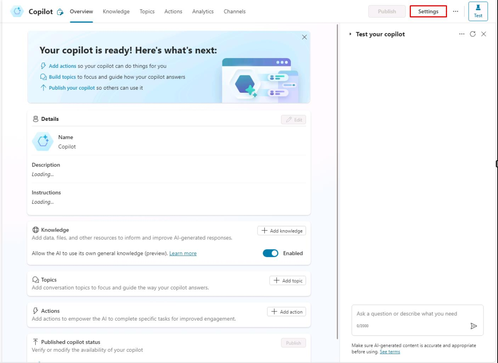

      1. **Settings** ペインで **✨ Generative AI** を選択します。

      1. **How should your agent interact with people?** の下で **Generative** を選択し、**Save** を選択します。  

         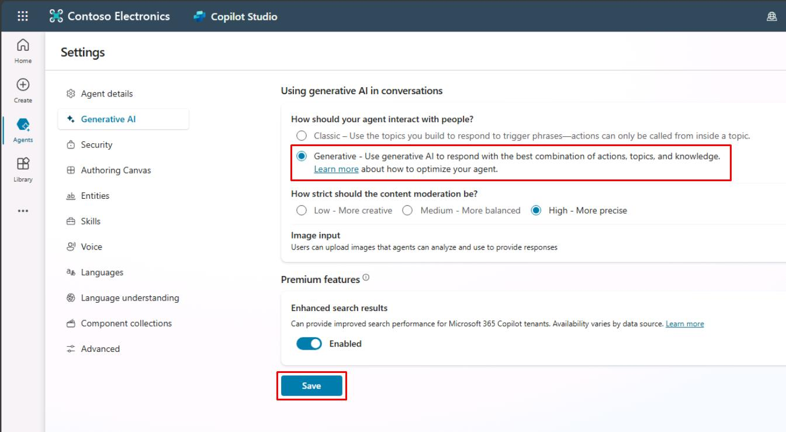

      1. 次のタスクに進みます。

	

1. エージェント名の提案に対して、`OK` と入力します。

	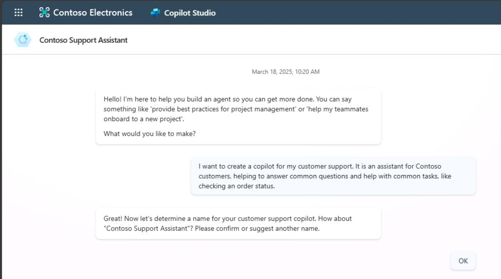

    [!WARNING]
	次の手順は、あなたの環境によって順序が異なる場合があります。エージェントがいくつかの質問をスキップすることもあります。以下の4つのプロンプトは、順序に関係なく必ず入力してください。

1. エージェントの主な目的を再確認するように求められた場合、または以下を再入力します:

	`It is an assistant for Contoso customers, helping to answer common questions and helping with common tasks, like checking order status.`

1. エージェントのトーンを設定するために、以下を入力します:

   	`Playful tone, joyful, customer focused, but definitely professional.`

1. エージェントの境界と制限を設定するために、以下を入力します:

	`We don't want to discuss other brands like Fabrikam. Never provide product comparisons with competitor technologies.`

1. 公にアクセス可能なデータソースを設定するために、以下のプロンプトを入力します: 

	`Information should come from https://learn.microsoft.com/en-us/microsoft-copilot-studio and from https://www.microsoft.com/en-us/microsoft-copilot.`

1. 右ペインの **Get its knowledge** で、両方の URL を確認するチェックボックスを選択します。

	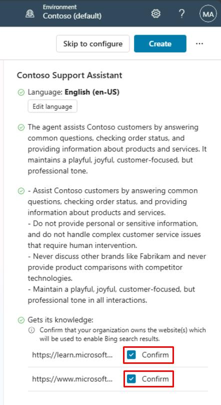

1. ページの右上隅にある省略記号を選択し、**Edit advanced settings** を選択します。

	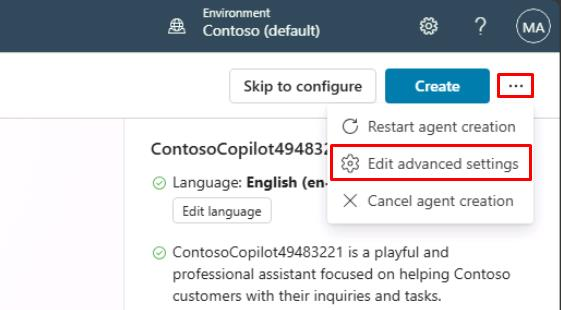

1. **Advanced Settings** ウィンドウで、**Schema Name** の下のアンダースコアの後に `ContosoCopilot@lab.LabInstance.Id` と入力し、**Save** を選択します。

	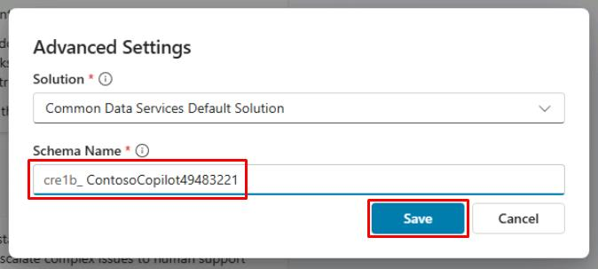

	[!IMPORTANT]
	エージェントの表示名とは異なり、スキーマ名は作成後に変更できない技術的プロパティであり、一意である必要があります。

1. ウィンドウの右上隅にある **Create** を選択します。
	
    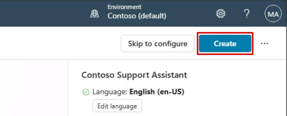

[!IMPORTANT]
会話型の作成体験をスキップするには、**Skip to configure** を選択することもできます。エージェントの主要な言語は **Edit language** メニューで設定できます。ラボでは、英語 (en-US) のままにしておくことを確認してください。エージェントを常に自分のソリューションとパブリッシャーのコンテキストで構成することはベストプラクティスです。これにより、エージェントは希望するパブリッシャープリフィックスで作成され、エージェントを簡単にエクスポートして他の環境に展開できるようになります。

[次のページへ → 3. ユーザーインターフェイスのクイックツアー](0103.md)