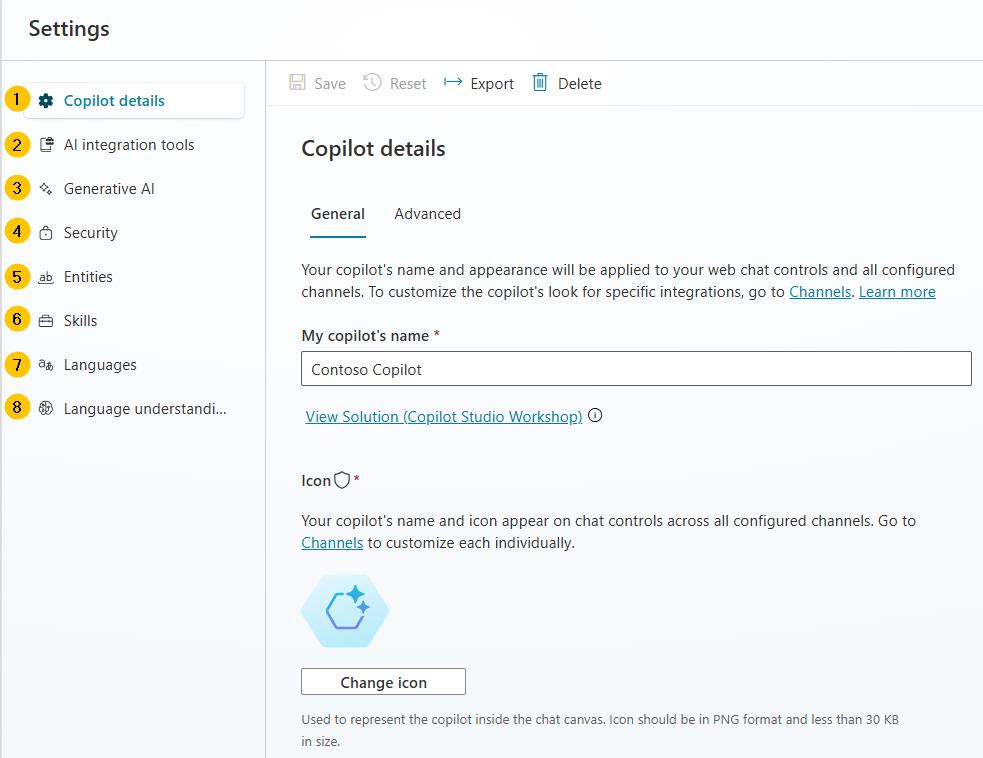

# タスク 03: ユーザーインターフェイスのクイックツアー

## はじめに

カスタマーサポートエージェントを作成したら、次は Microsoft Copilot Studio のユーザーインターフェイス（UI）に慣れましょう。UI を理解することで、トピックの管理やアクションの設定、エージェントのパフォーマンス監視などを効果的に行えます。

## 説明

このタスクでは、Copilot Studio の主要な UI コンポーネント（エージェント作成、トピック管理、アクション、分析、チャネル、設定、テストなど）を確認します。

## 成功基準

- Copilot Studio の主要ページを正しくナビゲートできた
- Copilot Studio UI の主な機能やセクションを理解できた

## 学習リソース

Microsoft Copilot Studio では、基本から高度なエージェントまで簡単に構築できます。以下のセクションでは、Microsoft Copilot Studio のメインページを紹介します。

## 主なタスク

### 01: Copilot Studio のメインページを学ぶ

 
  
<strong>ソリューションを表示するにはこのセクションを展開</strong>
 

 
#### **A**
- **ホーム** - Microsoft Copilot Studio のホームページ。新しいエージェントの作成や最近のエージェント一覧、テンプレート、学習リソースが表示されます。
- **作成** - 会話型エージェント作成体験を提供するメニュー。
- **エージェント** - 環境内でアクセスできるすべてのエージェント一覧。
- **ライブラリ** - Microsoft 製エージェント拡張用コネクタ一覧。

#### **B**
- **概要** - エージェントの説明、指示、構成（ナレッジソース、トピック、アクション、公開状況など）の概要。
- **ナレッジ** - エージェントのナレッジソース（Web サイトやファイルなど）を管理。
- **トピック** - カスタム・システムトピックの管理。トピックはエージェントのコア機能で、会話の流れを定義します。複数のトピックを組み合わせることで自然な会話体験を実現します。
- **アクション** - アクションの管理。アクションは入力・出力を持つロジックで、Power Platform コネクタやクラウドフロー、AI Builder、Bot Framework スキルなどを活用できます。生成 AI を使って必要な入力を促したり、出力を所定の形式で要約することも可能です。
- **分析** - エージェントの利用状況や改善点を把握できるメトリクスを表示。
- **チャネル** - Teams や Web サイトなど、エージェントの公開先を設定。
 
#### **C**
- **環境** - 作業中の Power Platform 環境を確認。通常、開発環境でエージェントを作成・著作し、テストおよび本番環境に展開します。

#### **D**
- **公開** - エージェントの最新バージョンをユーザーに提供。テストペインを除き、エージェントを公開しない限り変更は反映されません。
- **設定** - エージェントの構成（高度な設定、セキュリティ、言語など）を管理。

#### **E**
- **エージェントのテスト** - 保存せずにエージェントやカスタマイズを即座にテスト。

### 02: Copilot Studio の設定インターフェイスについて学ぶ

 
  
<strong>ソリューションを表示するにはこのセクションを展開</strong>
 

1. **Copilot の詳細** - エージェントの表示名、アイコン、Azure Application Insights 統合の構成などの高度な設定を更新。
2. **AI 統合ツール** - 意図認識やエンティティ抽出のための Azure AI for Language、Azure AI Search インデックスと組み合わせた Azure OpenAI、既存の Azure AI Bot Service ボットをスキルとして呼び出すための Bot Framework SDK など、高度な拡張ツールを提供。
3. **生成 AI** - トピックトリガーやエンティティ抽出のための従来の自然言語理解アプローチを、大規模言語モデルに基づくマルチインテント検出や複雑なエンティティ抽出を行うアプローチに置き換える設定。ナレッジソースのコンテンツモデレーション設定（幻覚のリスクを減らすため）もここで構成。
4. **セキュリティ** - エージェントを他のユーザーと共同著作したり、セキュリティグループと共有して使用するための設定。エンドユーザー認証設定（認証の種類や強制の有無）、Web チャネルセキュリティ（Web またはカスタムアプリケーション展開用の Direct Line チャネルをさらに保護）もここで構成。
5. **エンティティ** - ユーザーの発話中の重要な情報（都市、日付、数値など）を特定するための多くのプリビルトエンティティを提供。クローズドリストエンティティや正規表現エンティティを定義することもできる。
6. **スキル** - Copilot Studio エージェントが呼び出す外部 Bot Framework スキルの登録や、既存の Azure Service Bot が Copilot Studio エージェントをスキルとして使用するための設定。
7. **言語** - エージェントが使用できる追加の言語や、ローカライズするための設定。
8. **言語理解** - Azure Conversational Language Understanding (CLU) で開発・訓練されたカスタム言語モデルを構成。これにより、意図検出のための従来の自然言語理解モデル (NLU) を置き換えたり、エンティティ検出や抽出を置き換えることが可能。

[次のページへ → 4. エージェントのテスト](0104.md)