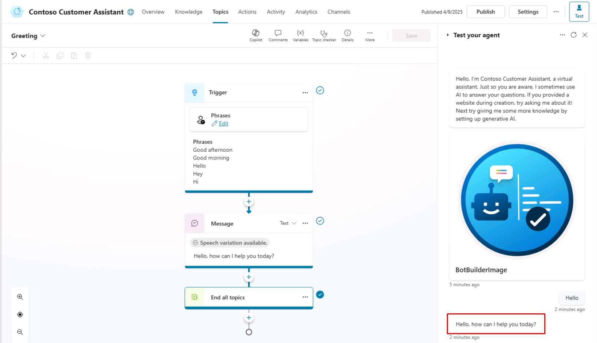

# タスク 04: エージェントのテスト

## はじめに

初期セットアップと構成が完了したら、エージェントが意図通りに応答するかを検証する必要があります。このタスクでは、基本的な対話をテストし、エージェントが一般的なユーザー入力を正しく解釈・応答できるかを確認します。

## 説明

このタスクでは、Microsoft Copilot Studio の組み込みテストツールを使ってエージェントと対話します。さまざまな会話シナリオをテストし、エージェントがユーザーのプロンプトに適切に応答するかを検証します。

## 成功基準

- エージェントとの基本的な会話シナリオを正常にテストできた
- エージェントが定義済み設定通りに正しく応答することを確認できた

## 主なタスク

### 01: エージェントのテスト

 
  
<strong>ソリューションを表示するにはこのセクションを展開</strong>
 

1. 自動的に開かれない場合は、作成したエージェントを選択します。

	

> [!WARNING]
> オプションの事前構築済みエージェントを使う場合:
> 1. 左メニューの **エージェント** を選択
> 1. **Contoso Customer Assistant** を選択

	

1. 画面右上の **テスト** を選択すると、**エージェントのテスト** ペインにアクセスできます。

	

> [!NOTE]
> **エージェントのテスト** ペインには、エージェントから既に送信されたメッセージが表示されます。このメッセージは **Conversation Start** トピックから自動的に送信されたものです。

1. **エージェントのテスト** ペイン下部のテキストボックスに `Hello` と入力し、**Enter** を押します。

	

> [!IMPORTANT]
> テストペイン内のメッセージを選択すると、それが使われた正確なトピックとノードにリダイレクトされます。トピックとノードについては、後ほど説明します！

	

[次のページへ → 5. 最初のトピック作成](0105.md)