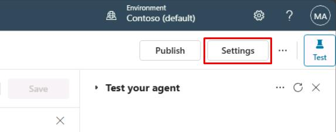

# タスク 05: 最初のトピック作成

## はじめに

Contoso で特定の顧客問い合わせや要望に対応するため、カスタマイズした会話トピックを作成する必要があります。このタスクでは、注文状況の確認など、実際のカスタマーサービスシナリオに対応できるトピックを定義します。

## 説明

このタスクでは、Microsoft Copilot Studio 内で新しいトピックを手動作成し、トリガーフレーズや **質問**・**メッセージ**ノードを設定し、会話フローを検証します。

## 成功基準

- 新しい会話トピックを正常に作成できた
- トリガーフレーズ、**質問**、**メッセージ**ノードを正しく設定できた
- エージェントテストでトピックの動作を検証できた

## 主なタスク

### 01: 新しいトピックを手動作成

 
  
<strong>ソリューションを表示するにはこのセクションを展開</strong>
 

1. 画面右上付近の **設定** を選択します。

    

1. 左側の設定メニューで **生成 AI** を選択します。

1. **エージェントの対話方法** で **クラシック** を選択し、下部の **保存** をクリックします。

    

1. 保存が完了したら、**設定** ページ右上の **X** を選択します。

    

1. 上部バーの **トピック** を選択します。

    

1. **トピックを追加** を選択し、**空白から** を選択します。

    

1. ウィンドウの左上隅にある **無題** を選択し、`注文状況の確認` と入力してトピックタイトルを変更します。

    

1. **トリガー** ノード内の **フレーズ** で **編集** を選択します。

    

1. **フレーズの追加** に、次のフレーズをそれぞれ **Enter** キーまたは **+** ボタンを押して入力します。

    - `order status` 
    - `track my order` 
    - `where is my package` 
    - `check order status` 
    - `has my order shipped`

    

1. メインキャンバスペインの右上にある **詳細** ボタンを選択します。

    

    [!NOTE]
    ここでは、エンドユーザーに表示されるトピックの **表示名** と、作成者が見るトピックの **名前** を異なるものに設定できます。

    [!IMPORTANT]
    > **表示名** は、ユーザーの発話に対して複数のトピックが一致した場合に、ユーザーに選択を促すために使われます（「言い換えれば...」という質問とともに、2 つまたは 3 つの認識されたトピックのいずれかを選択するようユーザーに促されます）。
    >
    > ジェネレーティブ AI オーケストレーションがトピック トリガー用の組み込み自然言語理解の代わりに使われる場合、表示名はモデル表示名と呼ばれ、意図検出プロセスの一部としてモデル説明に追加されます。
    >
    > **詳細** ペインは、トピックが別のトピックによって呼び出されたとき、またはジェネレーティブ AI オーケストレーションがオンになっているときに、トピック入力と出力変数を構成できる場所でもあります。これは、オーケストレーターとしてジェネレーティブ AI を使っている場合に、必要な変数をスロット埋めし、ユーザーに不足している入力を自動的に促すために、大規模な言語モデルを効果的に使うためです。

1. キャンバスの右上にある **保存** を選択してトピックを保存します。

    
   

### 02: トピックユーザーインターフェイスの確認

 
  
<strong>ソリューションを表示するにはこのセクションを展開</strong>
 

最初のトピックを作成したばかりですが、トピックにはトリガーフレーズ以外のコンテンツは含まれていません。これから、作成したトピックを確認するために、著者用ユーザーインターフェイス (UI) を探索します。

1. **トピックタイトル** - 現在編集しているトピックの名前で、**トピック** ページに表示されます。 

1. **生産性バー** - ノード (**メッセージ**、**質問** など) のカット、コピー、ペースト、削除などのツールにアクセスできます。 

1. **Copilot**、**コメント**、**変数**、**トピック チェッカー**、**詳細**、**分析**、**コード エディターを開く**、および **デフォルトにリセット** ボタン - この領域には、説明文を自然言語で入力することでトピックの作成と更新を支援する Copilot や、著者がノードにコメントを残して共同作業できる **コメント**、トピック レベルおよびグローバル変数のリストとテスト タブでの実行時値を確認するための **変数** メニュー、トピックのエラーを検出してチェックするためにいつでもキャンバスから実行できる **トピック チェッカー** などが含まれています (未解決のままにしておくとエージェントの公開を妨げる可能性があります)。また、トピックのプロパティにアクセスするための **詳細** も含まれています。 

1. **その他** - 分析ではトピックの使用状況に関するメトリックが表示され、コード エディターを開くと、開発者が直接編集できるトピックの基になる YAML 構成のプロ コード ビューにユーザー インターフェイスが切り替わります。一部のシステム トピックでは、デフォルトにリセット オプションを使用して、トピック コンテンツを元の状態に戻すことができます。 

1. **保存** ボタンはトピックの変更を保存します。 

1. **トピックの詳細** メニューでは、エージェントの作成者がトピックの名前、表示名、説明、およびステータス (アクティブ/非アクティブ) を更新できます。ジェネレーティブ AI オーケストレーションが有効になっていると、表示名はモデル表示名に置き換えられ、モデル説明が利用できるようになります。このメニューでは、入力と出力の構成も可能です。入力は、ジェネレーティブ AI をオーケストレーターとして使用する場合に自動的にスロット埋めされます。 

1. **トリガースイッチャー** ボタンは、すべてのトピックの **トリガー** ノードに表示されます。デフォルトでは、新しいトピックには **フレーズ** トリガー (または、ジェネレーティブ AI オーケストレーションが有効な場合は Copilot によってトリガーされる) が設定されていますが、これを **メッセージ受信**、**イベント受信**、**アクティビティ受信**、**会話の更新受信**、**呼び出し受信**、**リダイレクト**、**非アクティブ** に切り替えることができます。 

1. **新しいノードの追加** - エージェントの作成者が、メッセージの送信、質問の追加、条件の追加など、トピックにアクティビティを追加してダイアログ ロジックを構築できます。 

1. **著作権キャンバス コントロール** - 大規模なトピックでは著作権キャンバスが大きくなる可能性があるため、これらのコントロールを使用して著作権キャンバスをナビゲートできます。含まれるコントロールには、キャンバスのマップ、ズーム、手、選択、リセットがあります。 

### 03: トピックへのコンテンツの追加

 
  
<strong>ソリューションを表示するにはこのセクションを展開</strong>
 

このタスクでは、トピックに大量のコンテンツを追加する方法は説明しません。むしろ、トピックを作成し、テストし、Microsoft Copilot Studio で公開するという全体的なプロセスに慣れるために、単一の **質問** ノード、**メッセージ** ノード、およびトピックのリダイレクトを追加する手順を示します。この後の演習では、Microsoft Copilot Studio における作成機能の詳細情報を提供します。

このタスクの次のセクションでは、Microsoft Copilot Studio の中心的なコンポーネントとトピック作成に関する基礎知識を説明します。

エージェントの作成者として、ユーザーからの応答を期待し、その情報に基づいて何かを行う場合は **質問** ノードを使用する必要があります。ユーザーの応答は変数に保存され、**質問** ノードはエンティティとスロット埋め機能も使用できます。これらの概念は、この演習の後の方で説明されます。

**質問** ノードは、リッチ テキスト、スピーチ作成、リッチ テキスト応答タイプ (画像、ビデオ、アダプティブ カードなど) など、**メッセージ** ノードと同様の多くの機能を使用します。

1. キャンバスの **トリガー** ノードの下にある **+** ボタンを選択し、**質問をする** を選択して新しい **質問** ノードを追加します。

	

1. テキストボックスに次のように入力します。

	`ご注文について何を知りたいですか？`

1. **識別** の下にあるエントリを選択し、次に **ユーザーの応答全体** を選択します。 

	

	[!IMPORTANT]
	> このノードは、トピックがトリガーされた後にユーザーに何をしたいかを尋ねる質問をしています。エンティティとスロット埋めを使用するようにこのタスクを拡張する演習が後にあります。

1. **ユーザー応答を変数として保存** の下で、ユーザー応答はデフォルトで **Var1** という名前の変数に保存されます。 

	**Var1** を選択し、**変数名** に `OrderRequest` と入力します。

    

	[!IMPORTANT]
	> 変数を参照するときに明確に識別できるように、常に変数に適切な名前を付けることがベスト プラクティスです。これにより、テストを実行したり、実行時に変数の値を確認したりする際に明確さが増します。
    >
    > 顧客やパートナーは、一貫性と保守の容易さのために、変数に対して命名規則を定義して従うことができます。

	[!IMPORTANT]
	> 質問の動作は、3 点リーダー、**プロパティ**、および **質問の動作** を選択することでカスタマイズできます。ここから、質問をスキップできるかどうか、ユーザーに再度プロンプトを表示する回数、検証ルール、ユーザーが期待どおりに回答しなかった場合に何が起こるかを定義できます。  
    >
    > ユーザーが質問に答えずに別のトピックにジャンプできるかどうかを定義することもでき、割り込みが発生した場合に許可されるトピックのリストを定義できます。ユーザーに期待される回答を正しく理解してもらうために、再試行プロンプトを定義することがベスト プラクティスです。ユーザーに質問に正しく回答してもらうために、より明示的に説明することが適切になります。
	>
	> **基本的な知識: メッセージノード**
	> - **メッセージ** ノードを使用して、ユーザーにメッセージを表示できます。このメッセージは、会話のトピックに基づいて単純なものである場合と、複雑なものである場合があります。対照的に、**メッセージ** ノードはユーザーからの応答を期待したり保存したりしません。**メッセージ** ノードには、テキストやカード、画像、ビデオ、アダプティブ カードなどの高度なオプションで表示できるリッチ テキスト オプションもあります。

	[!IMPORTANT]
	> エージェントをより自然で人間らしく聞こえさせるために、メッセージのバリエーションを構成して、エージェントが構成されたメッセージの 1 つを送信できるようにします。同じメッセージの厳密な繰り返しを避けることができます。
	>
	> また、ユーザーに表示されるテキストの本文内で変数を使うこともでき、変数に格納されているデータに基づいて動的に変化します。この機能により、メッセージをより個人的なものにすることができます。たとえば、「こんにちは {System.User.FirstName}、ご注文の詳細をお調べしますので、もうしばらくお待ちください」のように表示されます。
    >
    > 変数は、データの自動化や計算を実行するためにも使用できます。後の演習で、変数の詳細が説明されます。
    >
    > 最後に、Power Fx フォーミュラを追加して、さらに動的なコンテンツを作成することもできます。

1. **質問** ノードの下にある **+** ボタンを選択し、**メッセージを送信** を選択して **メッセージ** ノードを作成します。 

	

1. 次のように、顧客の質問を確認するメッセージを入力します。 

	`ご質問ありがとうございます！`

1. **メッセージ** ノードの下にある **+** ボタンを選択し、**トピック管理** を選択し、**別のトピックに移動** を選択し、**会話の終了** を選択します。
	
	

	[!NOTE]
	> これは、質問に対する回答を確認し、顧客満足度調査への記入を提案するチャット セッションを終了するためのトピックにリダイレクトします。

	[!IMPORTANT]
	> 明示的な対話パスの最後には、必ず **会話の終了** トピックを設定することがベスト プラクティスです。そうすれば、エンドユーザーは自分の質問が解決されたことを確認できます。ユーザーが確認すると、顧客満足度 (CSAT) 調査が表示されます。解決率と CSAT スコアの両方がエージェント分析に表示されます。

1. キャンバスの右上にある **保存** を選択してトピックを保存します。

	

1. **エージェントをテスト** ペインで、ペインの右上隅にある更新アイコンを選択して新しい会話を開始します。 

	

1. 次のプロンプトを 2 回入力して、エージェントが期待どおりに動作することを確認します。 

	`注文状況を確認したいのですが`

	

[!IMPORTANT]
> トリガーフレーズは、ユーザーが言う可能性のあるすべての発話と正確に一致する必要はありません。

### 04: Copilot を使用してトピックを作成する

 
  
<strong>ソリューションを表示するにはこのセクションを展開</strong>
 

Microsoft Copilot Studio でのトピックの作成は、以前よりも簡単になりました。これで、自然言語を使用してトピックの目的を説明することで、Microsoft Copilot Studio でトピックを作成できるようになりました。**Copilot による説明からの作成** 機能を使用すると、トピックを自動的に構築できるため、この演習の最初のタスクで経験したいくつかの手動ステップを減らすことができます。このタスクでは、Copilot を使用してトピックを簡単かつ迅速に作成する方法を学びます。

1. 上部バーの **トピック** を選択します。

	

1. **トピックを追加** を選択し、次に **Copilot による説明から作成** を選択します。 

	

1. 新しいウィンドウに次のように入力します。

    | 項目 | 値 |
    |----------|---------------------------------------------------------|
    | **トピックに名前を付ける** | `サポート チケット` |
    | **次の操作を実行するトピックを作成** | `タイトル、重大度 (高/中/低)、説明、および更新通知を送信するメールアドレスを含むサポート チケットを作成します。次の命名パターンに従って変数を定義します: Topic.TicketTitle.` |

1. ペインの右下隅にある **作成** を選択します。
 	
	

	{: .note }
	> Copilot は、トリガーフレーズ、**質問** ノード、エンティティの選択、変数の命名、**メッセージ** ノードの確認を含むトピックを作成します。

1. **Copilot で編集** ペインがまだ開いていない場合は、キャンバスの上部にある **Copilot** を選択します。 

	

1. **Copilot で編集** ペインの **何をしますか?** の下に、次の追加指示を追加し、**更新** を選択します。

	`最後のメッセージの前に、メール、電話、SMS のいずれかのユーザーの希望する連絡方法を尋ねえる質問を追加します。`

	

	{: .note }
	> Copilot は、自動的にキャンバスの下部に **質問** ノードを追加し、顧客に連絡方法を尋ね、その選択肢を変数に保存します。

	

	[!WARNING]
	次のエラーが表示された場合は、このステップをスキップします。

	

	[!IMPORTANT]
	> Microsoft Copilot Studio の Copilot 機能を使用すると、作成時間が大幅に短縮され、自然言語を使って新しいトピックを作成および編集できるようになります。
    >
    > さらに、**Copilot で編集** パネルには、作成された更新内容が表示され、トピックの更新に関する提案が表示されます。

1. キャンバスの右上にある **保存** を選択してトピックを保存します。

[次のページへ → 6. Copilot をデモサイトに公開](0106.md)
