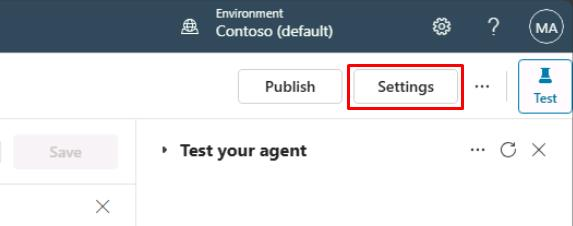
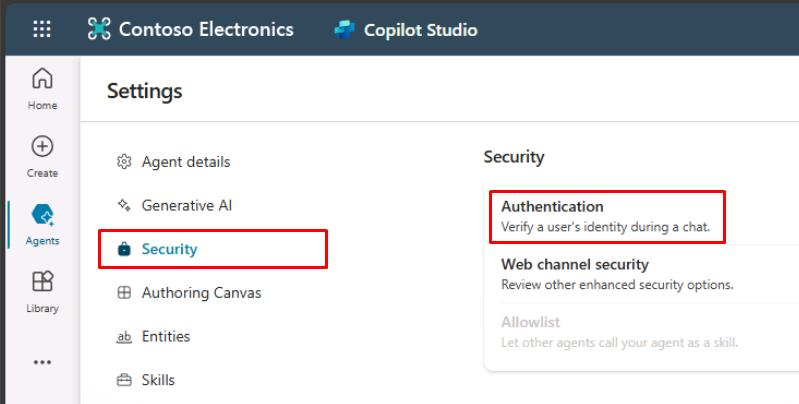
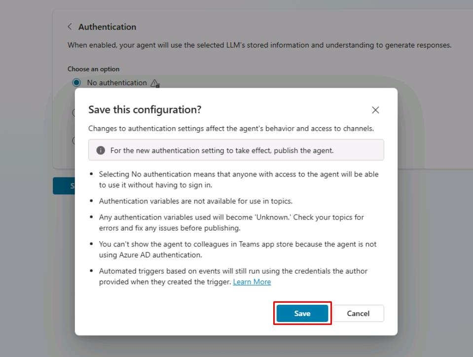
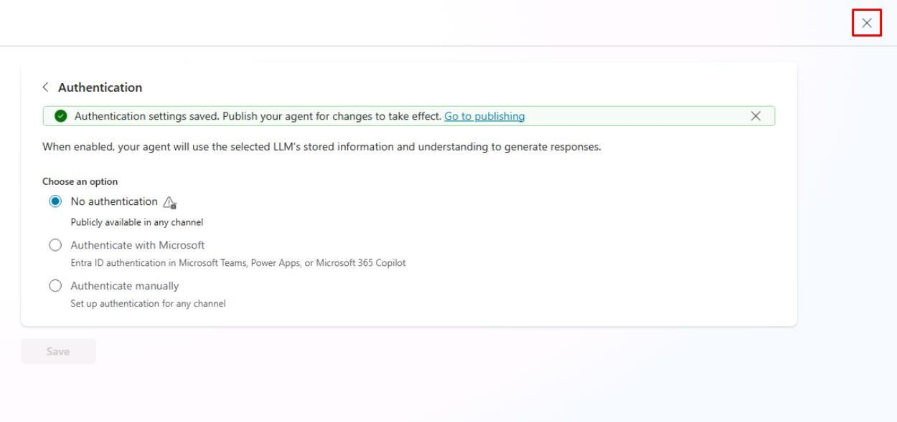
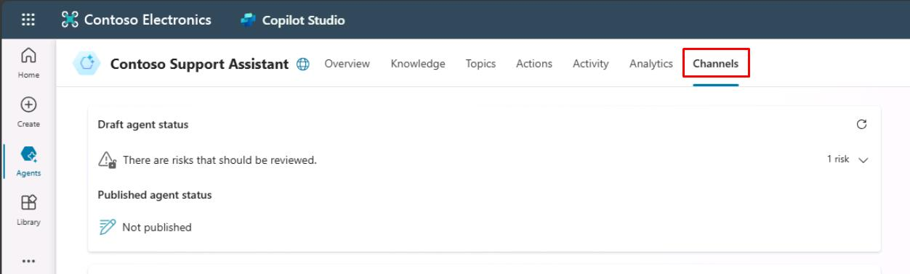
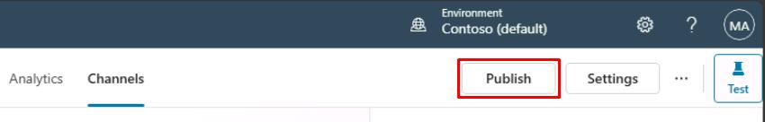
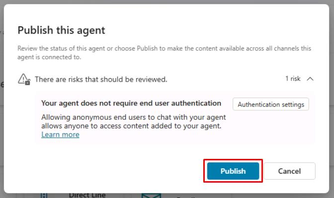
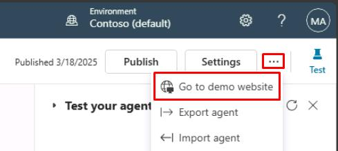
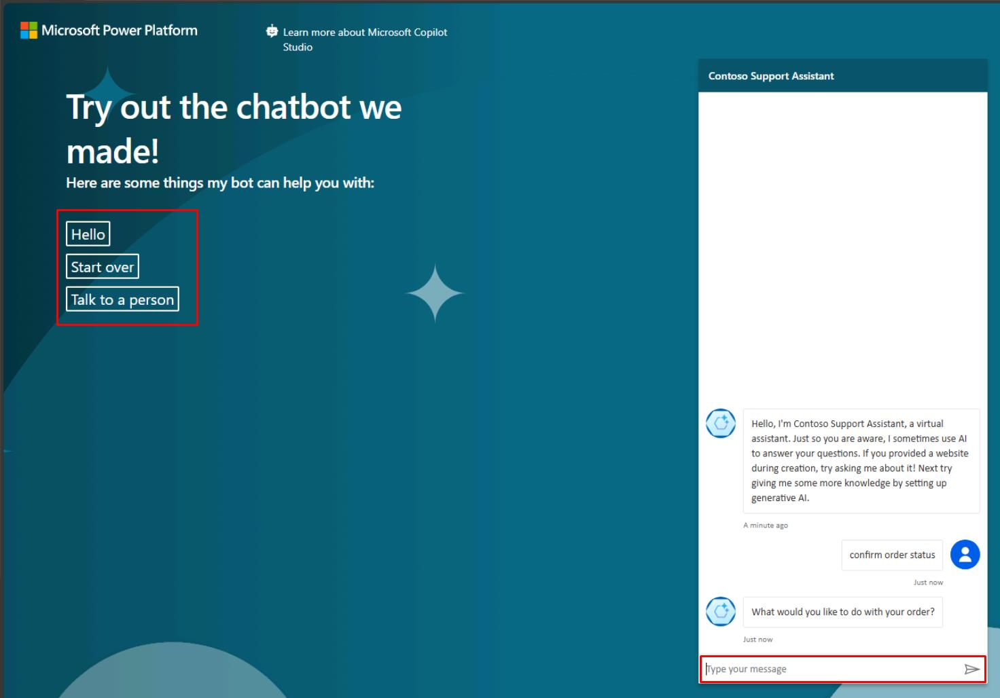

# タスク 06: エージェントをデモサイトに公開してテスト

## はじめに

Contoso の関係者から初期フィードバックを得てエージェントの準備状況を検証するため、新しく作成したエージェントをデモ用ウェブサイトに公開します。このステップにより、シミュレーション環境での実践的なテストが可能となり、カスタマーサービス要件を満たしているか確認できます。

## 説明

このタスクでは、Microsoft Copilot Studio エージェントをデモサイトに公開します。認証設定の構成、公開操作、デモサイトでの動作確認を行います。

## 成功基準

- デモ環境用の認証設定を正常に構成できた
- エージェントをデモサイトに公開できた
- デモサイト経由でエージェントにアクセスし、正しく応答することを確認できた

## 主なタスク

### 01: エージェントの認証設定を変更

 
  
<strong>ソリューションを表示するにはこのセクションを展開</strong>
 

このデモでは、リンクを知っている人なら誰でもテストできるよう、認証不要に設定します。

1. 画面右上付近の **設定** を選択します。

	

1. 左側の設定メニューで **セキュリティ** を選択します。

1. **認証** を選択します。

	

1. **認証なし** を選択し、**保存** をクリックします。

1. **この構成を保存しますか?** ダイアログで **保存** を選択します。
	
    

1. **設定** ページ右上の **X** を選択し、キャンバスに戻ります。

	

### 02: エージェントを公開

 
  
<strong>ソリューションを表示するにはこのセクションを展開</strong>
 

Microsoft Copilot Studio では、エージェントをテストするための URL を送信することで誰でも招待できるデモサイトが提供されます。このデモサイトは、実際のエンドユーザーに対してエージェントを有効化する前に、コンテンツを改善するためのフィードバックを収集するのに役立ちます。

1. エージェントの上部にある **チャネル** を選択します。

	

> [!IMPORTANT]
> エージェントを少なくとも 1 回公開した後に、チャネルを追加して顧客がアクセスできるようにします。

1. 画面右上の **公開** を選択して、最新のトピック更新をデモサイトにプッシュします。

> [!NOTE]
> 初めてデモサイトを使用する前や、ユーザーにテストしてもらいたいトピックに変更を加えた後は、この操作を完了する必要があります。

	

> [!IMPORTANT]
> **プロのヒント**:
> - 実際のエージェントを作成する際は、展開したチャネルで更新されたトピックを利用可能にするために公開を行います。
> - 公開プロセスでは、ステータスが **オン** になっているトピックのエラーがチェックされます。
> - 公開には数分しかかからないはずです。

1. 開いたダイアログで再度 **公開** を選択します。エンドユーザー認証の欠如によるリスクは無視して構いません。

	

> [!NOTE]
> 公開が完了すると、画面上部に緑色のバナー通知が表示されます。

> [!IMPORTANT]
> デモサイトへの公開は迅速なプロセスですが、実際の使用 (たとえば Microsoft Teams で) のためにエージェントを公開するには時間がかかる場合があります。 
>
> Teams の場合、エージェントが Teams チャネルのユーザーに利用可能になる前に、管理者として承認ワークフローを開始する必要があるかもしれません。公開プロセスでは、すべての更新が適切に検証され、環境全体に展開されることが保証されます。 
> 
> 詳細はこちらをご覧ください: [Publication fundamentals for publishing channels](https://learn.microsoft.com/en-us/microsoft-copilot-studio/publication-fundamentals-publish-channels?tabs=web)

1. エージェントページの右上隅にある **設定** の隣にある省略記号を選択し、**デモ** ウェブサイトに移動を選択します。
 	
    

1. チャットウィンドウに入力するか、左側に表示されているスタートフレーズのオプションから選択することで、エージェントと対話できます。
 	
    

## サマリー

演習 01 の完了おめでとうございます！ 次のことに成功しました。

 - Power Platform 環境をセットアップし、Dataverse を有効にしました。
 - 正しい環境で Copilot Studio の無料トライアルを開始しました。
 - カスタマーサポートエージェントを作成またはオプションでインポートしました。
 - Copilot Studio UI と主要設定を調査しました。
 - エージェントをデモサイトに公開し、基本的な会話を検証しました。

[次のページへ → 演習 02: 基本的なオーサリングを学ぶ](../Ex02/Ex02.md)