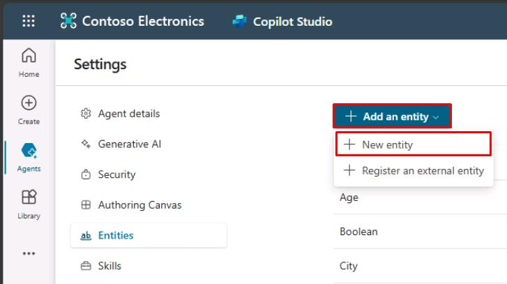
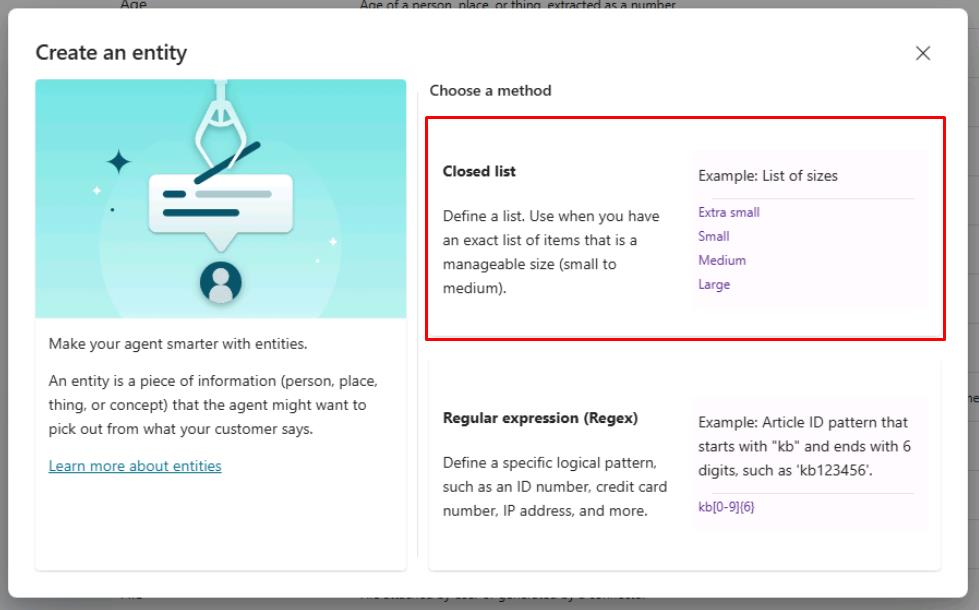
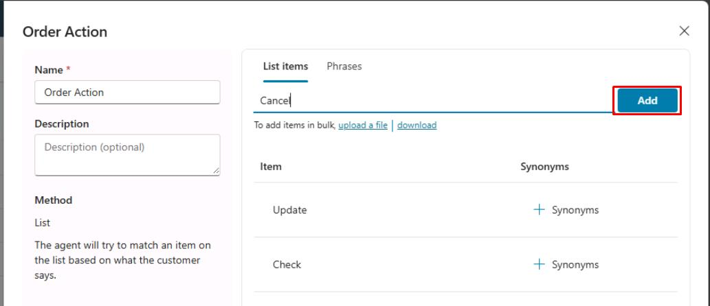
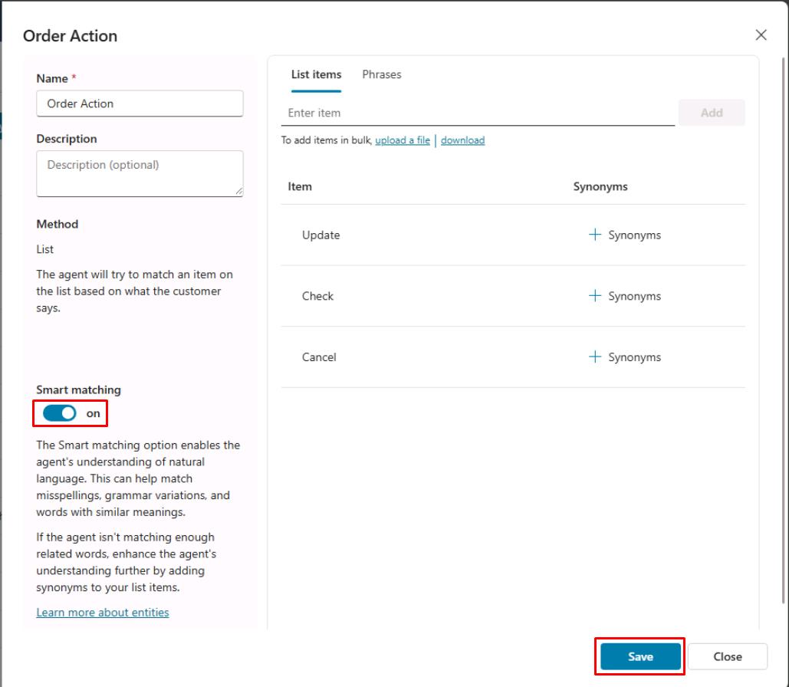
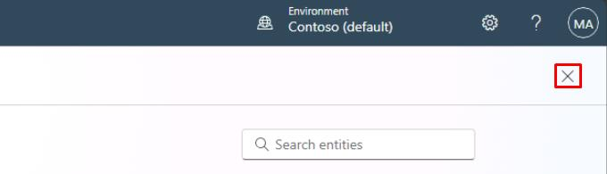
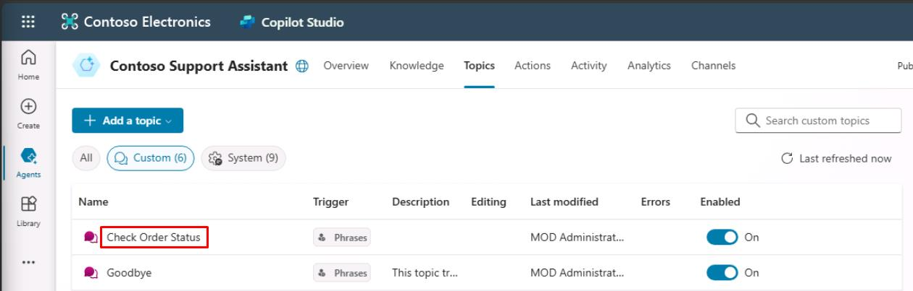
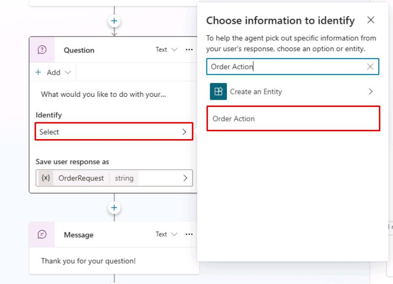
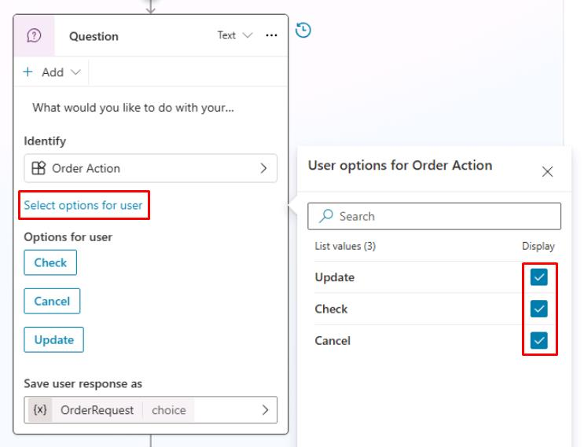

# タスク 01: エンティティとスロットフィリングの利用

## はじめに

Contoso の顧客からの一般的な問い合わせに効率的に対応できるよう、既存の Web サイトからコンテンツを直接インポートします。このタスクにより、エージェントは正確で一貫性のある、既に承認されたカスタマーサービス情報を活用でき、よくある問い合わせへの対応が効率化されます。

## 説明

このタスクでは、Microsoft Copilot Studio を使って Web サイトからコンテンツをインポートします。Copilot Studio は Web ページの内容を分析し、会話トピックの候補を自動生成するため、手動でのコンテンツ作成作業が削減されます。

Microsoft Copilot Studio は自然言語理解 (NLU) を使って、ユーザーの発話内容を解釈し、既存トピックとマッチさせようとします。

ユーザーが「ギフトカードを使おうとしたけど使えなかった」と言った場合、エージェントはその発話がギフトカードの不具合に関するトピックへ誘導すべきだと判断できます（たとえトリガーフレーズにそのままの文がなくても）。この概念は **インテント認識** とも呼ばれます。

NLU はまた、ユーザー入力から **エンティティ** を特定するのにも役立ちます。エンティティとは、文から抽出したい重要な情報（電話番号、郵便番号、都市名、ケースID、氏名など）を指します。エージェントはユーザー入力から該当情報を認識し、後で利用できるよう保存できます。

エンティティには 2 種類あります:

- **組み込み**: 年齢、色、数値、名前など、よく使われる情報を表します。Microsoft Copilot Studio はこれらを自動認識できます。
- **カスタム**: ユーザーが独自に作成するエンティティです。組み込みエンティティでカバーできない業務固有の知識をエージェントに教える場合に使います。たとえば、すべての製品タイプのリストや、「INC-921279」のような IT サポートチケット番号のパターン認識などです。

## 例

ユーザーが「赤いコーヒーメーカーを50台ほしい」と入力した場合、AI は次のように理解します:

- 「**50台**」は数値「50」で、購入台数を表す
- 「**赤い**」は色で、購入する製品の色を表す
- 「**コーヒーメーカー**」は購入希望の製品を指す

Microsoft Copilot Studio では、数値や色など一部の項目はすでに AI によってエージェントに教えられています。エージェントの作者は、「コーヒーメーカー」のような他のエンティティを指定する必要があります。

## 成功基準

-   提供された Web サイトからトピックを正常にインポートできた。
-   インポートしたコンテンツから作成されたトピックを確認し、承認できた。

## 主なタスク

### 01: エンティティとスロットフィリングの利用

 
  
<strong>このセクションを展開して解決策を見る</strong>
 

1. **Microsoft Copilot Studio** タブに戻ります。

1. ウィンドウの右上近くにある **設定** を再度選択します。

	

1. 左側の設定メニューから **エンティティ** を選択します。

1. 上部にある **エンティティの追加** を選択し、次に **新しいエンティティ** を選択します。
 	
     

1. **エンティティの作成** ダイアログで **クローズドリスト** を選択します。

	

1. **名前** フィールドに `Order Action` と入力します。

1. 右ペインの **リスト項目** に、次の項目を入力し、各項目について **Enter** または **追加** を選択します。

	- `Update`
    - `Check`
    - `Cancel`

	

	[!NOTE]
	> オプションで、各オプションの同義語を追加することもできます（このタスクでは任意）。

1. **スマートマッチング** トグルを **オン** に設定し、ウィンドウの右下隅にある **保存** を選択します。
 	
    

	[!NOTE]
	> これにより、**Order Action** という新しいエンティティが作成され、トピックの **Question** ノードで **ユーザーの全応答** を **Order Action** として配置できるようになります。

1. ペインの **閉じる** を選択し、次に設定ページの右上隅にある **X** を選択してエージェントに戻ります。

	

1. 上部バーの **トピック** を選択します。

1. 作成した **注文状況の確認** トピックを選択します。

	

1. **Question** ノード内で、**識別** の下にあるエントリを選択し、新しい `Order Action` エンティティを検索して選択します。 

	

1. **ユーザーにオプションを選択させる** を選択し、すべてのチェックボックスを選択してユーザーに表示します。

	

1. キャンバスの右上隅にある **保存** を選択してトピックを保存します。

---

これで、**Question** ノード用にカスタムエンティティが正常に構成されました。デフォルトでは、質問の応答を格納するように割り当てられた変数にすでに値が含まれている場合、その質問はスキップされ、表示されません。

[次のページへ → 2. テストと曖昧性の解消](0202.md)