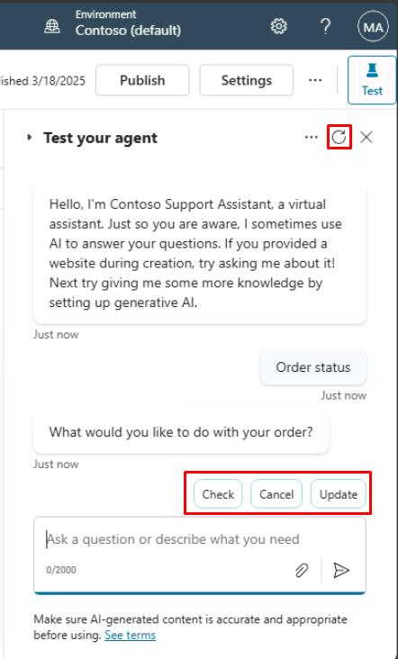
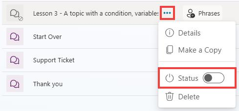

# タスク 02: (オプション) テストと曖昧性の解消

## はじめに

顧客との会話が曖昧になることがあり、エージェントの応答に混乱を招く場合があります。このオプションタスクでは、曖昧なケースをテストし、エージェントが顧客入力を明確化できるように調整し、応答精度を向上させます。

## 説明

曖昧な会話シナリオをテストし、エージェントがユーザーの意図を解釈できない箇所を特定し、必要に応じて明確化や追加情報を促す設定を行います。

## 成功基準

- 曖昧な入力をテストできた
- 顧客意図を明確化する応答をエージェントが返せるよう改善できた

## 主なタスク

### 01: 曖昧性のテストと解消

 
  
<strong>ソリューションを表示するにはこのセクションを展開</strong>
 

{: .warning }
> エージェントを自分で作成した場合はこのタスクをスキップしてください。事前構築済みソリューションをインポートしたユーザー向けです。

**Test** ペインを使い、トリガーフレーズを入力してエンティティやスロットフィリングの動作を確認します。

1. **Test your agent** ペインで右上のリフレッシュアイコンを選択し、新しい会話を開始します。

1. 次のトリガーフレーズを入力します。

   `Order status`

1. オプションのいずれかを選択してみてください。

   

	{: .note }
	> 事前構築済みエージェントの場合、曖昧性解消の質問（例: *"Did you mean..."* など、最も関連するトピックを選択するよう促す）が表示されます。これは **orders** に関連するトリガーフレーズが複数設定されているためです。

	{: .important }
	> **プロのヒント**: エージェントでこの曖昧性を避けるには、 
	> - 重複するトピックのいずれかを非アクティブにする。 
	> - 重複するトピックのトリガーフレーズを更新する。 
	> - 特定のトピックを曖昧性解消メカニズムから除外するには、目的のトピックのフレーズプロパティに移動し、詳細設定で **Include in multiple topic matches** のチェックを外します。
	> - キャッチオール親トピックを設定し、その後リダイレクトを使用して適切な子トピックを呼び出すようにトピック戦略を微調整し、自分自身の曖昧性解消質問を適用します。

1. **Topics** に移動します。

1. **Lesson 3** の省略記号を選択し、**Status** トグルを選択してトピックをオフにします。

	

	{: .note }
	> トピックのリストでは、無効にされているトピックが視覚的に示されます。

[次のページへ → 3. スロットフィリングのテスト](0203.md)