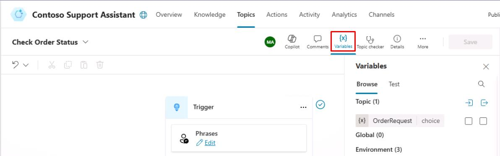

## はじめに

顧客からの情報収集の正確性を確認するため、エージェントのスロットフィリング機能をテストします。これにより、Contoso のサービスリクエストに必要な重要情報をエージェントが正しく特定・保存できるかを検証します。

## 説明

スロットフィリングを活用した会話を体系的にテストし、エージェントがユーザーからの情報を正確に促し、収集できるかを確認します。

## 成功基準

- スロットフィリングを使った対話をテスト・検証できた
- 必要な顧客情報の正確な収集・保存を確認できた

## 主なタスク

### 01: スロットフィリングのテスト

 
  
<strong>ソリューションを表示するにはこのセクションを展開</strong>
 

1. **Test your agent** ペインで再度リフレッシュアイコンを選択し、新しい会話を開始します。

1. トリガーフレーズに合致する文を入力し、エンティティやスロットフィリングの動作を確認します。

	`Can I check on an order?`

1. キャンバス上部の **Variables** を選択します。

	

1. **Variables** ペインで **Test** タブを選択し、**Topic** を展開します。

	
 	
> [!NOTE]
> このプロセスが動作していることが確認できます。ユーザーが「注文を確認したい」という意図でトピックをトリガーし、エンティティがフォローアップ質問から変数にスロットフィリングされています。
>
> その結果、質問はスキップされます。これは、ユーザーの発話からエンティティとスロットフィリングで情報を取得できたため、すでに提供された情報について再度質問する必要がなくなったためです。

[次のページへ → 4. 変数型について学ぶ](0204.md)