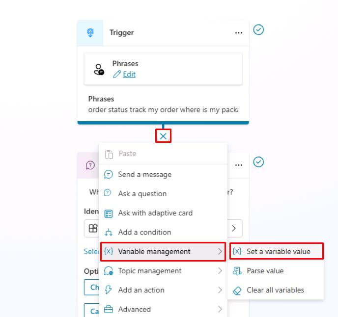
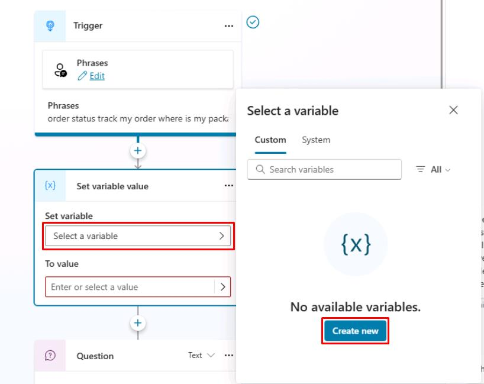
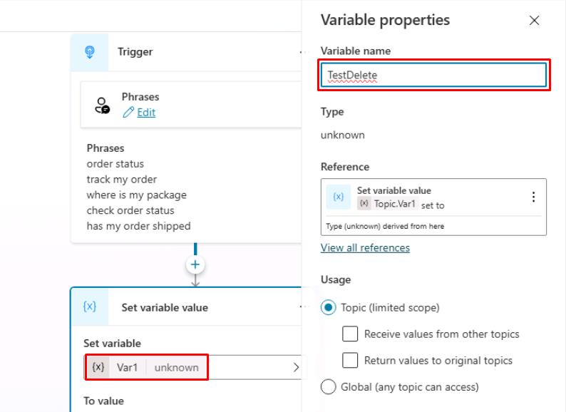
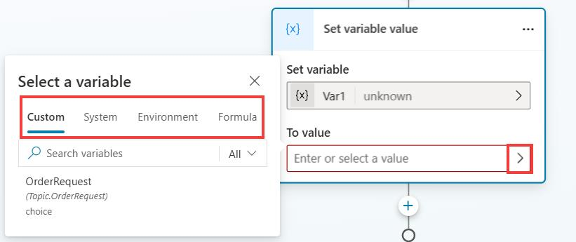
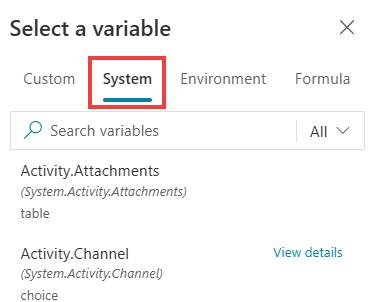
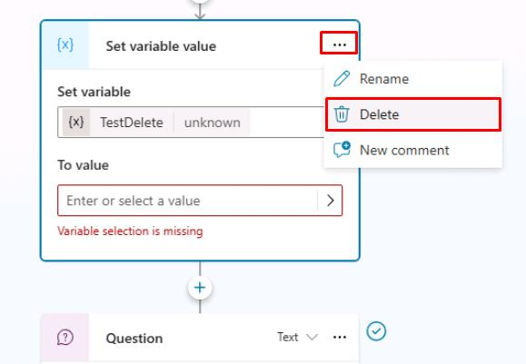
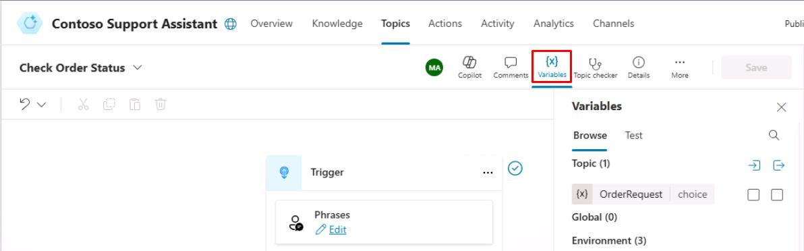

# タスク 04: 変数の利用
 
## はじめに

Contoso のカスタマーサービスシナリオでは、会話中に一時的な情報を保存する必要がよくあります。

## 説明

このタスクでは、会話変数を設定し、エージェントが顧客から提供された情報を会話中に効果的に保持・活用できるようにします。Copilot Studio 内で会話変数を作成・利用し、顧客から受け取った情報を一時的に保存・再利用します。

## 成功基準

- 会話トピック内で変数を作成・実装できた
- 会話中の変数データの正しい取り扱い・保存を確認できた

### 変数型について学ぶ

変数を使うことで、エンドユーザーの回答を保存し、会話をガイドできます（例: 商品の購入価格によって返品手順を分岐させるなど）。また、エージェントの応答内で変数値を直接利用できます（例:「{Topic.ProductName} の返品をお手伝いします」など）。

デフォルトでは、変数値はその変数が作成されたトピック内でのみ利用できますが、他のトピックでも同じ値を参照したい場合はグローバル変数に設定できます。つまり、会話が別トピックに移っても、以前のトピックで入力された変数値をエージェントが記憶・利用できます。Microsoft Copilot Studio では、Power Fx の数式や関数を使って **質問** ノード以外でも **Set a Variable Value** ノードで変数を設定できます。

Microsoft Copilot Studio で利用できる変数の種類:

- **システム**: システムデータで自動的に設定される変数。ユーザーが作成するものではなく、プラットフォームの一部です。たとえば、エージェントがエンドユーザー認証を必要とする場合、ユーザーIDやメールアドレス、氏名などがシステム変数として利用できます。オーサリングキャンバスの変数選択で System 配下からアクセス可能です。

- **トピック**: トピックの入力、**Set a Variable Value** ノード、**質問**ノード、他ノードやアクション（クラウドフロー、HTTPリクエスト、コネクタ、カスタムプロンプト、プラグインアクションなど）の出力から作成されるユーザー作成変数。デフォルトでは作成したトピック内のみ有効ですが、他トピックから値を受け取ったり返したりできるように設定可能です。オーサリングキャンバスの変数選択で **Custom** 配下からアクセス可能です。

- **グローバル**: どのトピックからも利用できるユーザー作成変数。複数トピックで共通利用するデータの保存に便利です。Web サイトやアプリにエージェントを埋め込む場合、ページ情報やユーザー言語などのコンテキストデータをグローバル変数として渡すことも可能です。オーサリングキャンバスの変数選択で **Custom** 配下からアクセス可能です。

変数は **質問**、**条件**、**Set variable value** ノードなど様々な場所で利用できます。変数値は Power Fx、ユーザー入力、質問の回答、システム変数値などを利用できます。

## 主なタスク	
前セクションで作成したトピック（エンティティとスロットフィリングでユーザー文からデータを自動検出し、特定データを変数に保存）を拡張します。今回は、質問で取得したデータを変数に格納し、メッセージ内で表示する方法を学びます。

### 01: 変数の確認

 
  
<strong>ソリューションを表示するにはこのセクションを展開</strong>
 

**Set variable value** ノードの使い方や変数型の違いを確認します。このタスクでは新しいノード・変数の作成、変数名の変更、システムレベルで利用できる他の変数の確認を行い、最後にこのノードを削除します。

1. **Trigger** ノードの下にある **+** ボタンを選択し、**Variable management** を選択してから **Set a variable value** を選択します。

	

	[!NOTE]
	> このタスクは変数オプションを調査するためのものであり、特定の場所に変数を追加することが重要ではありません。後で削除します。

1. **Set variable** の下で **Select a variable** を選択し、フライアウトペインで **Create new** を選択します。

	

	[!NOTE]
	> 新しい変数が作成され、デフォルトでは **Var1** と呼ばれます（すでにこの名前の変数が作成されている場合は、Var2 や Var3 など別の番号が付けられます）。
 	
	 
1. **Var1** を選択し、**Variable name** に `TestDelete` と入力します。

	

    [!IMPORTANT]
    > 変数には、保存するデータに基づいて説明的な名前を付けることがベストプラクティスです。このアプローチは、将来的に自分自身や他のエージェント作成者に役立ちます。
    >
    > 変数のスコープを **Topic** または **Global** に変更することもできます。 

1. **Variable properties** ペインの右上隅にある **X** を選択して閉じます。 

	[!IMPORTANT]
	> 変数に保存するデータを確認します。自分がオーサリングキャンバス内で作成した他の変数や、システム変数、数式を使用できます。 

1. **To value** の下で、**(>)** を選択します。 

	

	[!NOTE]
	> フライアウトペインが表示され、**Custom**、**System**、**Environment**、および **Formula**（Power Fx を使用、これは後でラボで説明）のタブが含まれます。

1. **System** タブを選択します。

	

	[!NOTE]
	> Microsoft Copilot Studio が使用するすべての変数を表示できます。これらの変数には Microsoft Copilot Studio によってデータが自動的に設定されます。また、このデータを自分の変数でも使用できます。利用可能なオプションを確認して、デフォルトで何が利用できるかを把握してください。

1. **Set variable value** ノードを削除します。これで、利用可能なオプションを確認しました。

	ノードの右上隅にある省略記号を選択し、**Delete** を選択します。

	

1. オーサリングキャンバス内の任意の場所から、上部にある **Variables** を選択して、トピック内のすべての変数（グローバル変数を含む）を確認できます。 

	

	[!IMPORTANT]
	> 特に大きなトピックでは、トピック内のすべての変数を確認することが有益です。

[次のページへ → 5. グローバル変数の利用](0205.md)