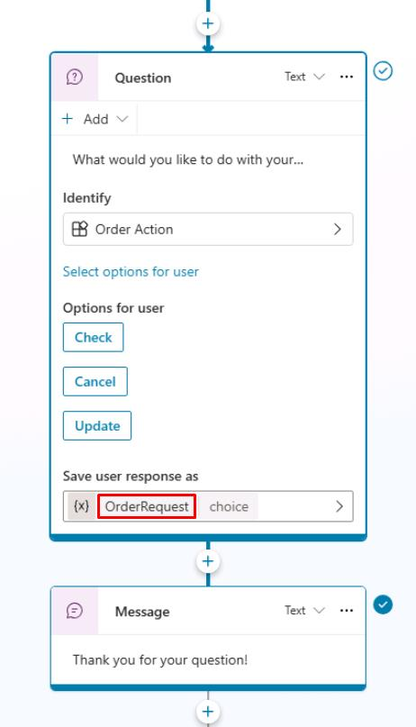
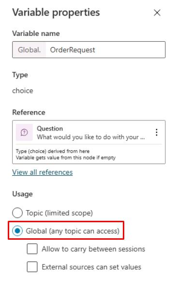
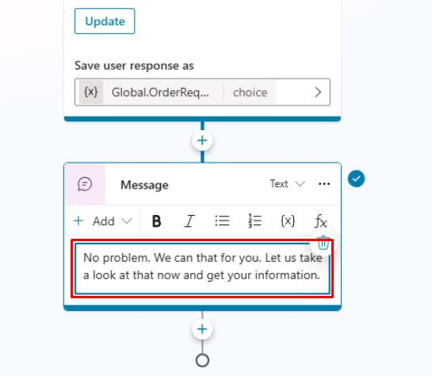
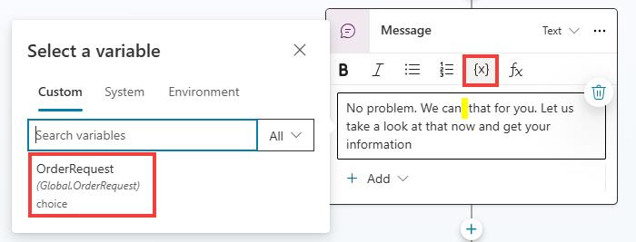
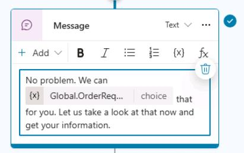
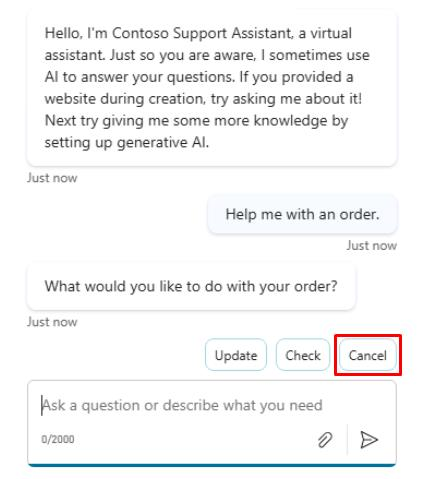
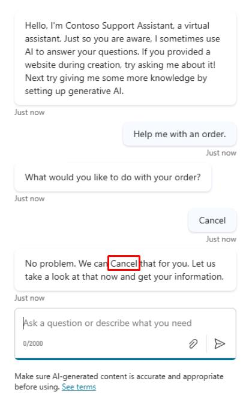
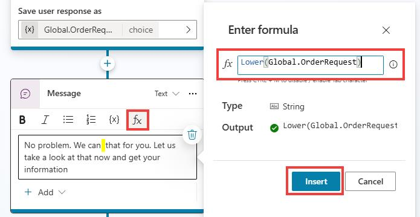
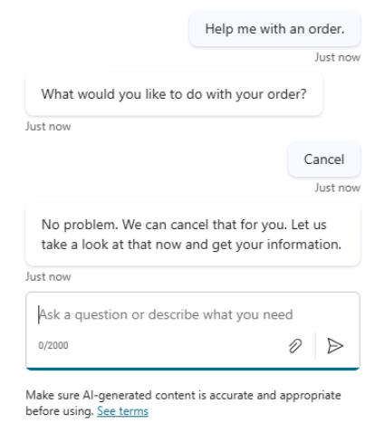

# タスク 05: グローバル変数の利用

## はじめに

顧客識別子や共通情報など、複数の会話トピックで共有する必要がある情報があります。グローバル変数を使うことで、Contoso のエージェント間で重要なデータをシームレスに共有できます。

## 説明

このタスクでは、Copilot Studio でグローバル変数を定義し、異なる会話トピックやセッション間で情報を保持・参照できるようにします。

## 成功基準

- グローバル変数を定義・設定できた
- 複数トピック間でグローバル変数の参照性を検証できた

## 主なタスク

### 01: グローバル変数の利用

<details markdown="block"> 
  <summary><strong>ソリューションを表示するにはこのセクションを展開</strong></summary> 

このタスクでは、前タスク「注文状況の確認」で使ったデータを活用します。ここまでで、トピック内の **質問** ノードがエンティティに紐付いているはずです。

1. **質問** ノードで **OrderRequest** 変数を選択します。

	

1. **Variable properties** ペインの **Usage** で **Global** を選択し、他トピックからも参照できるようにします。

	

1. **質問** または **トリガー** フレーズで設定した変数を、**メッセージ** ノード内で動的データとして利用します。**メッセージ** ノードのテキストを次のように変更します:
	```
	No problem. We can that for you. Let us take a look at that now and get your information.
	```

	

1. メッセージ内の「**can**」と「**that**」の間にカーソルを置き、**{x}** 変数アイコンから **OrderRequest** 変数を選択します。

	

    

> [!IMPORTANT]
> 変数は単語の代わりに挿入することが一般的で、エンドユーザーから提供されたデータに基づいてテキストが動的に変化します。

1. 変数の値がわかっている場合は、次のようにテキストを入力します。

	```
	No problem. We can {Global.OrderRequest} that for you. Let us take a look at that now and get your information.
	```

> [!NOTE]
> これにより、前のステップでの変数と周囲の単語との間のスペースの問題も修正されます。

1. トピックを保存するには、キャンバスの右上隅にある **保存** を選択します。

1. 変更をテストするには、ウィンドウの右上隅にある **テスト** を選択し、トリガーフレーズでトピックを起動します。

1. **エージェントをテスト** ペインの右上隅にある更新アイコンを選択して、新しい会話を開始します。

1. 次のように入力します。

	```
	Help me with an order.
	```

1. **キャンセル** を選択します。

	

    

> [!NOTE]
> **OrderRequest** の値の最初の文字が大文字のままであることに注意してください。この文法上の問題に対処するには、変数の値を直接参照するのではなく、数式を使用して小文字に変換できます。

1. **メッセージ** ノードで変数値 **{Global.OrderRequest}** を削除し、**fx** ボタンを選択します。

1. 次の **Lower()** Power Fx 数式を入力し、**挿入** を選択します。

   	`Lower(Global.OrderRequest)`

    

> [!NOTE]
> 数式内で変数の値を参照できることに注目してください。

> [!IMPORTANT]
> **変数管理** オプションには **すべての変数をクリア** オプションがあり、すべての変数値をクリアできます。このオプションは、同じトピックを再度開始またはループバックさせたい場合に特に便利です。新しい値を取得するために、質問の動作プロパティを設定している場合は、質問をスキップすることもできます。

1. 変更を確認するために、新しい会話で再度テストします。

	```
	Help me with an order.
	```

	

1. トピックを保存するには、キャンバスの右上隅にある **保存** を選択します。

> [!IMPORTANT]
> **変数** は、動的データを保存したり、条件やチェックを実行して会話の動作を特定の方法で駆動したりするための最良の方法です。次のタスクでその様子を観察します。

</details>

このタスクを完了しました。Microsoft Copilot Studio での変数のレビューが完了しました。

[次のページへ → 6. 条件で変数を使う](0206.md)