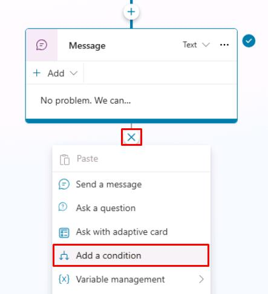
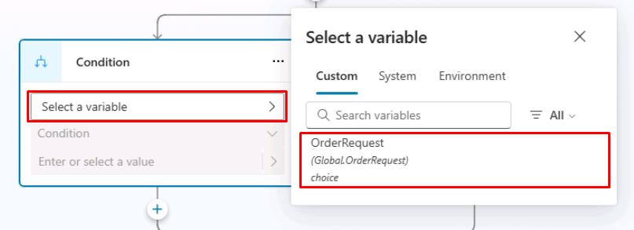
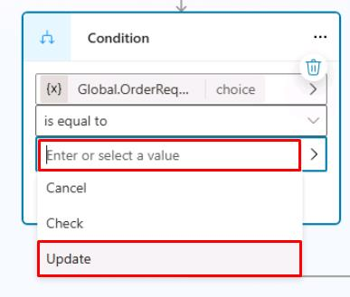
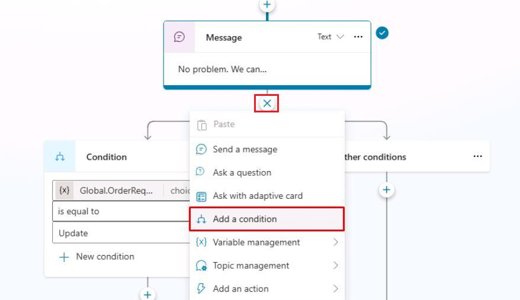
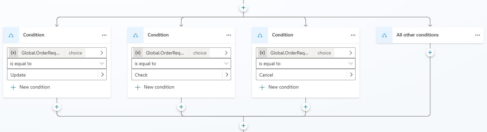
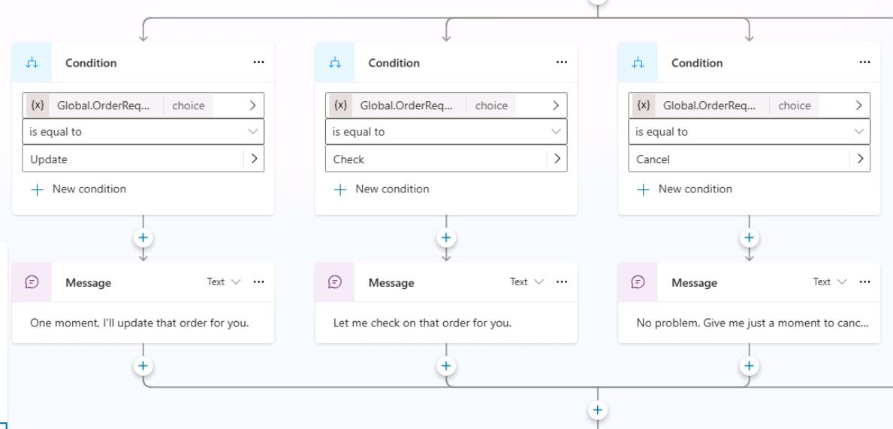
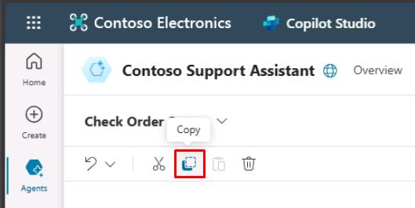
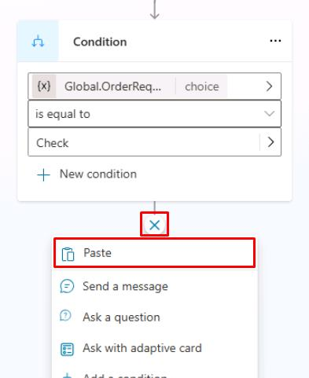

# タスク 06: 条件で変数を使う

## はじめに

顧客入力に応じて最適な応答を返すため、Contoso のエージェントは保存済みデータに基づく条件分岐を活用する必要があります。このタスクでは、変数を使った会話条件を設定し、特定シナリオごとに会話フローを動的に制御します。

## 説明

このタスクでは、変数値に基づいて会話トピック内で条件分岐を設定し、ユーザー入力や収集済み情報に応じて会話の流れを適切に誘導します。

## 成功基準

- 変数値に基づく条件ロジックを作成できた
- 変数による会話分岐の動作をテスト・確認できた

## 学習リソース

> [!IMPORTANT]
> 条件分岐の詳細は [条件を使ったオーサリング](https://learn.microsoft.com/ja-jp/microsoft-copilot-studio/authoring-using-conditions) を参照してください。

## 主なタスク

### 01: 条件で変数を使う

 
  
<strong>ソリューションを表示するにはこのセクションを展開</strong>
 

1. **メッセージ** ノードの下で **+** ボタンを選択し、**Add a condition** を選択します。
 	
    
> [!NOTE]
> 2つの新しいノードが表示されます。1つは **Condition**、もう1つは **All other conditions** 例外です。

1. **Condition** ノードで **Select a variable** を選択し、**OrderRequest** グローバル変数を選択します。
 	
    

1. 条件演算子は **is equal to** のままにします。

1. **Enter or select a value** のテキストボックスで **Update** を選択します。
 	
    

1. **メッセージ** ノードと分岐する **Condition** ノードの間にある **+** ボタンを選択し、もう 1 つの分岐を追加するために **Add a condition** を選択します。

	

1. 新しい **Condition** ノードで、手順 2 と 3 を繰り返し、値を **Check** に設定します。

1. 同じ手順を繰り返して **Cancel** 用の **Condition** ノードを追加します。 

	

1. 各 **Condition** ノードの下で **+** ボタンを選択し、**Send a message** を選択して **Message** ノードを追加します。

1. 条件に応じて異なるメッセージを設定します。

	`One moment while I update that order.`

    `Let me check on that order for you.`

    `No problem. Give me just a moment to cancel that order.`
 
	

> [!IMPORTANT]
> ノードを選択してコピーし、左上の生産性ツール メニューを使用して貼り付けることで、作業をより迅速に行えます。ノードをコピーすると、同じツール メニューを使用するか、新しいノードを追加するために **+** ボタンを使用すると、ノードを貼り付けることができます。
>
> 
>
> 

1. トピックを保存するには、キャンバスの右上隅にある **Save** を選択します。

1. **Test your agent** ペインの右上隅にある更新アイコンを選択して、新しい会話を開始します。

1. 異なるトリガーフレーズと条件を試して、ユーザーが異なるメッセージ結果を表示するまでの流れを確認します。

> [!IMPORTANT]
> 条件は、ユーザーが以前の質問で選択または回答した内容に基づいて、カスタマイズされたエクスペリエンスを作成するのに役立つ基本的なツールです。より複雑なロジックの場合は、他の条件内に条件をネストできます。

おめでとうございます。これで、条件の基本的な使い方と、それらの中でパラメーターとして変数を使用する方法を習得しました。

[次のページへ → 7. トピック型ノードに慣れる](0207.md)