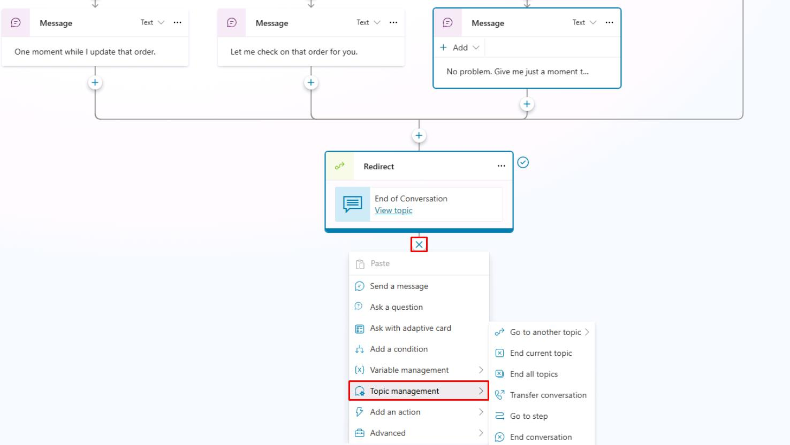

# タスク 07: トピックノードの利用

## はじめに

会話を効果的に構造化することは、顧客との明確なやり取りに不可欠です。

## 説明

このタスクでは、トピックノードを使ってエージェントの会話ロジックを明確に整理し、Contoso の顧客が分かりやすく一貫した応答を受けられるようにします。

## 成功基準

- トピックノードを効果的に作成・整理できた
- テストで正しい会話フローを確認できた

## 主なタスク

### 01: トピック型ノードに慣れる

 
  
<strong>ソリューションを表示するにはこのセクションを展開</strong>
 

1. **Redirect** ノードの下で **+** を選択し、**Topic management** を選択してオプションを確認します。

	

1. キャンバスの空白部分を選択してメニューを閉じます。

1. **Topic management** メニューには次のオプションがあります:

    - **他のトピックへ移動** - このノードには拡張フライアウトメニューがあり、移動先のトピックを選択できます。

	    {: .important }	
	    > **ヒント**:  
	    >	- 大きなトピックを少数作るより、小さなトピックを多数作る方が管理しやすい場合が多いです。この方法はトリガーフレーズとトピックを明確に対応させやすく、トリガー精度も向上します。
	    >	- 大きなトピックは保守や更新が難しくなるため、可能な限りエージェントロジックを分割し、複数トピックで共有できる部分は再利用トピックとして切り出すのがおすすめです。
	    >	- トピックは必ずしもトリガーフレーズを持つ必要はありません。他トピックからリダイレクトし、変数情報を受け渡すこともできます。

    - **現在のトピックを終了** - このオプションを選択すると現在のトピックが終了します。通常は他トピックから呼び出された場合に使います。分岐条件でこのオプションを使うと、その分岐のトピック全体を終了できます。**すべてのトピックを終了** ノードと似た動作です。

    - **すべてのトピックを終了** - このノードはすべてのアクティブなトピックを終了します。次のユーザー発話は新しい会話として扱われ、最も適切なトピックがトリガーされます。
