# タスク 08: **他トピックへの移動**ノードの利用

## はじめに

Contoso の複雑な顧客シナリオでは、複数の関連トピック間で会話をシームレスに遷移させる必要があります。

## 説明

**他トピックへの移動**ノードを実装・テストし、エージェント内で関連する複数トピック間をスムーズに遷移できるようにします。

## 成功基準

- **他トピックへの移動**ノードを正しく設定できた
- トピック間のスムーズな遷移を検証できた

## 主なタスク

このタスクでは、**他トピックへの移動**ノードの使い方を学びます。

### 01: 注文キャンセル用の新規トピック作成

<details markdown="block"> 
  <summary><strong>ソリューションを表示するにはこのセクションを展開</strong></summary> 

1. 上部バーの **Topics** を選択します。

	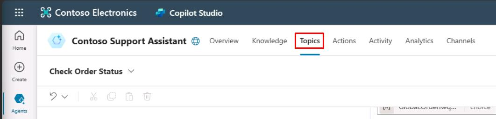

1. 左上の **Add a topic** を選択し、**From blank** を選択します。

	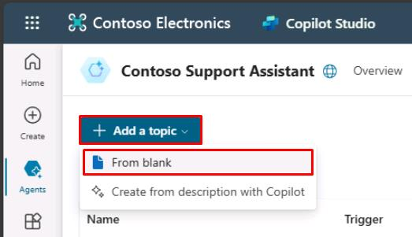

1. 左上の **Untitled** を選択し、トピック名を `Order Cancellation` に変更します。

	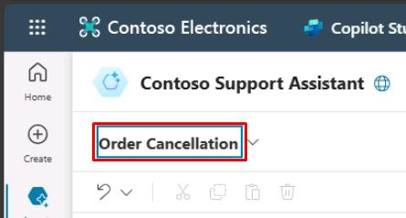

1. **Trigger** ノード内で **Phrases** セクションにカーソルを合わせ、右上の **Change trigger** ボタンを選択します。

	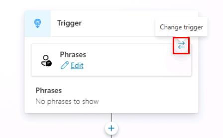

1. フライアウトメニューから **On redirect** を選択します。

	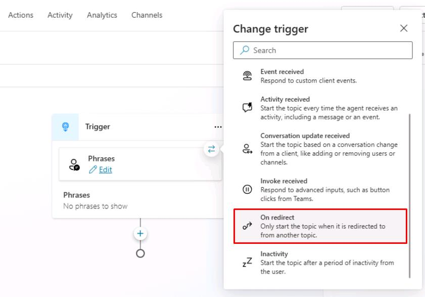

	[!NOTE]
	> このトピックにはトリガーフレーズは必要ありません。

1. **Trigger** ノードの下にある **+** ボタンを選択し、**Send a message** を選択します。

1. キャンセルを確認するメッセージを追加します。

	```
	Your order has been canceled, thank you.
	```

	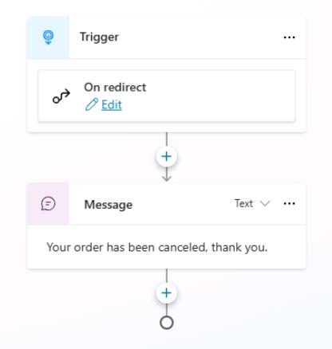

1. キャンバスの右上にある **Save** を選択してトピックを保存します。

</details>

### 02: 他のトピックへの移動を構成するノード

<details markdown="block"> 
  <summary><strong>ソリューションを表示するにはこのセクションを展開</strong></summary> 

1. 上部バーの **Topics** を選択します。

	

1. **Check Order Status** トピックを選択します。

1. **Cancel** の **Condition** ブランチ内で、**Message** ノードの下にある **+** ボタンを選択し、**Topic management** を選択してから **Go to another topic** を選択します。

	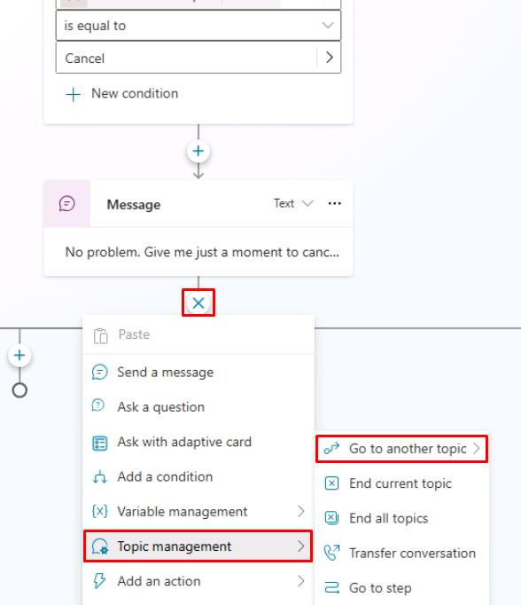

1. リストから **Order Cancellation** トピックを選択します。

    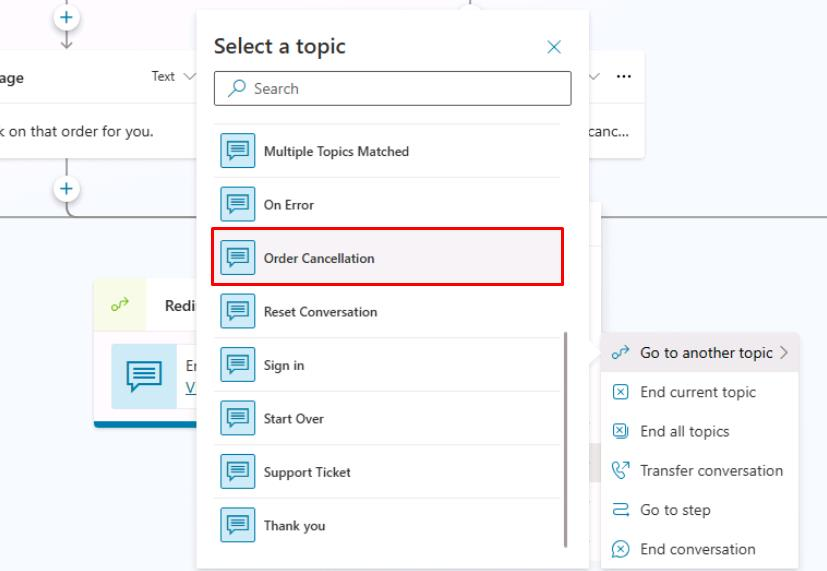

	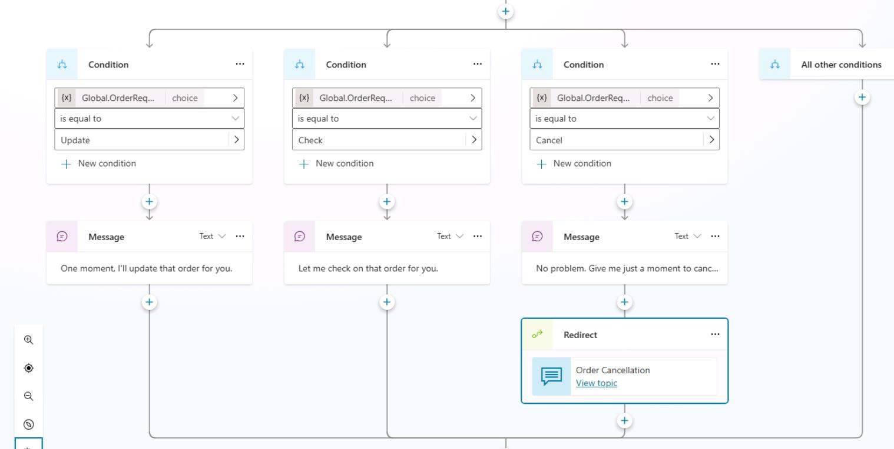

1. キャンバスの右上にある **Save** を選択してトピックを保存します。

1. **Test your agent** ペインの右上にある更新アイコンを選択して新しい会話を開始します。

1. 次のプロンプトを入力してテストします。

	```
	I'd like to cancel my order.
	```

	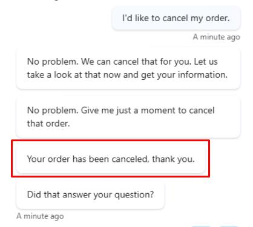

おめでとうございます。これで **Topic management** メニューの利用可能なアクションに精通しました。続行する前に、他の **Topic management** オプションを確認しておくと役立ちますが、次のタスクに進むために必須ではありません。

</details>

### 03: **Question** ノードの動作

<details markdown="block"> 
  <summary><strong>ソリューションを表示するにはこのセクションを展開</strong></summary> 

これまでのラボでは、**Question** ノードの基本と、エンティティやスロットフィリングを使用したこの概念の構築について説明しました。 **Question** ノードには、ユーザーの応答を保存するだけでなく、設定できるいくつかの動作オプションがあります。

1 つのオプションは、リンクされている変数にすでに値が含まれている場合に質問をスキップできる機能です。このプロセスは、エージェントに注文を確認するように指示したときに観察されました。質問は、エンティティとスロットフィリングを使用して、ユーザーが要求した文からデータを取得し、そのデータを変数に格納できるようにしたため、スキップされました。 Microsoft Copilot Studio によって **Question** ノードに到達したとき、すでにデータが含まれていたため、質問を再度行う必要はありませんでした。このアプローチは、ユーザーや顧客がエージェントと対話しているときに、同じ質問に何度も答える必要がなくなるため、より効率的です。

1. **Check Order Status** トピック内で **Question** ノードを選択します。次に、**Question** ノードの右上隅にある省略記号を選択してメニューを展開し、メニューから **Properties** を選択します。

	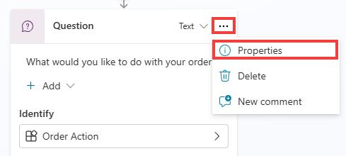

1. 表示された **Question properties** パネルから **Question behavior** を選択します。

	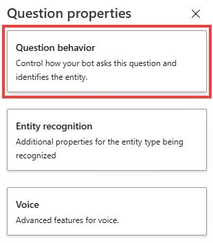

	**Question** ノードには、ユーザーの応答をより適切に特定できるようにするためのいくつかの構成可能なオプションがあります。このコンポーネントは、会話型アプリケーションを開発する際に重要です。なぜなら、背後で自然言語応答を管理している AI の種類に関係なく、ユーザーが予期しないまたは識別不可能な回答を提供する可能性があるからです。そのような状況でエージェントの動作を処理する機能は、顧客体験を向上させるのに役立ちます。このシナリオは、実際に誰かに質問をしたときに、相手が質問を理解しないときにも発生します。最良の体験と会話を得るには、同じ質問を繰り返すのではなく、質問を言い換えたり、異なる行動をとったりすることが重要です。

	**Question behavior property** ウィンドウで選択できる質問動作コントロールは次のとおりです。

  	- **Skip behavior/Skip question** - エージェントの作成者は、変数にすでに値がある場合は質問をスキップできます。質問の変数には、トピック内の別の場所、別のトピック、またはスロットフィリングとエンティティを使用して設定された値が含まれている可能性があります。この動作により、エージェントの作成者は、質問の変数に値がある場合に質問をスキップしたり、質問を行ったりできます。他の利用可能なオプションには、Power Fx を使用して条件を作成し、その条件が真である場合に質問をスキップすることが含まれます。

  	- **Reprompt/How many reprompts** - 質問を特定の回数繰り返すように動作を設定でき、ドロップダウン メニューから **not repeat**、**repeat once**、または **repeat up to two times** を選択できます。スキップ質問オプションと同様に、この動作が発生する条件を設定するために Power Fx を使用することもできます。質問を繰り返すために再試行が選択されている場合にのみ発生する **Retry prompt** オプションを変更できます。 **Retry prompt** オプションを選択すると、質問の言い回しを変更するための別のメッセージを追加でき、質問をより自然に聞こえさせ、顧客やユーザーにとってより役立つようにメッセージの検証を追加できます。

  	- **Additional entity validation/Condition** - この動作は、エンティティがスロットフィリングできるかどうかを検証するために使用する特定の条件があり、エンティティタイプに依存関係がある場合に重要です。また、条件が満たされない場合にプロンプトを変更して、ユーザーに別の入力を提供するように促すために、同じプロンプト動作を使用できます。

  	- **No valid entity found/Action if no entity found** - エンティティが見つからない場合、質問をスキップするのではなく、変数を空のままにする、変数に特定の値または動的な値 (Power Fx を使用) を設定する、またはエスカレーション システム トピックを呼び出すなどの動作を指定できます。

 	- **Interruptions** - 顧客が **Question** ノードがある現在のトピックから別のトピックに切り替えることができるかどうかを示すことができます。このオプションは、顧客が質問に対して別の質問で応答する可能性が高く、その後の会話を続行したい場合に便利です。このオプションを使用すると、単一の **Question** ノード内のすべての例外を処理する必要がなくなります。

		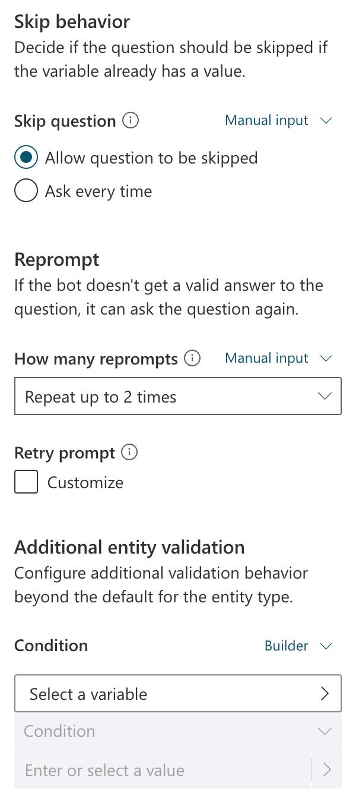

**Question** ノードのコア機能と関連する動作について理解したので、メッセージノードと **Question** ノードのリッチテキストレスポンスを探索できます。

</details>

[次のページへ → 9. メッセージノードのリッチテキスト機能](0209.md)