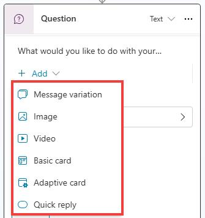
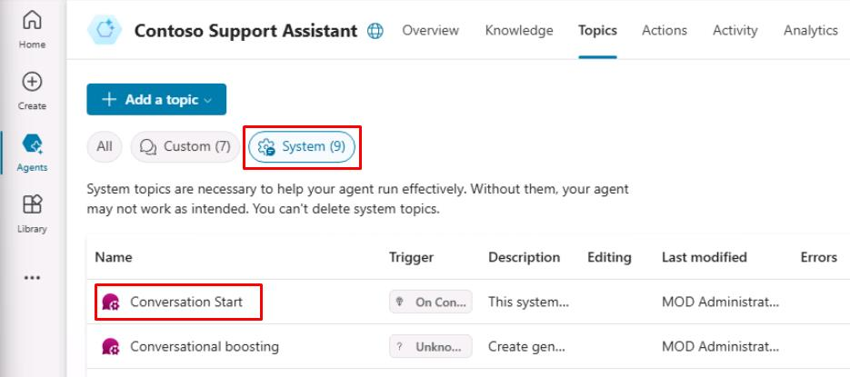
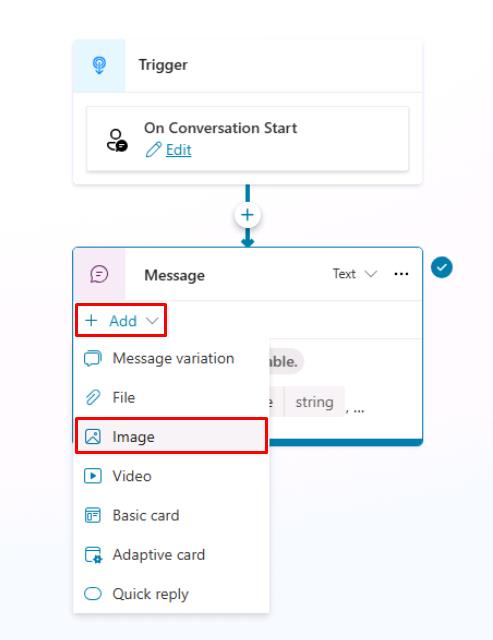
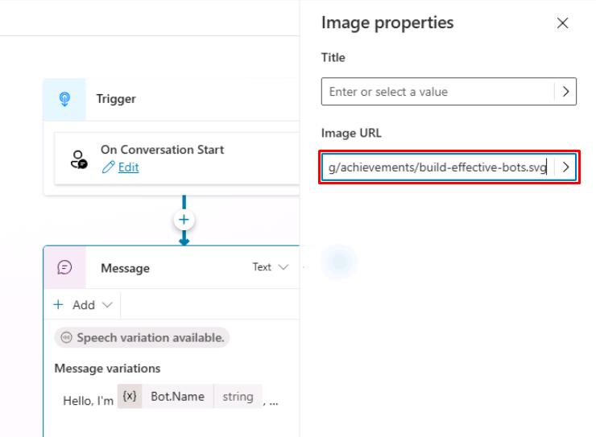
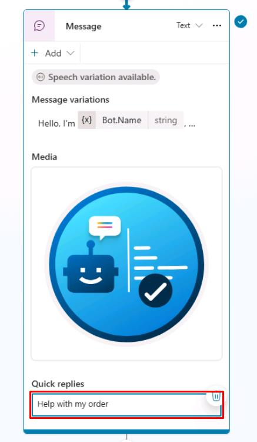
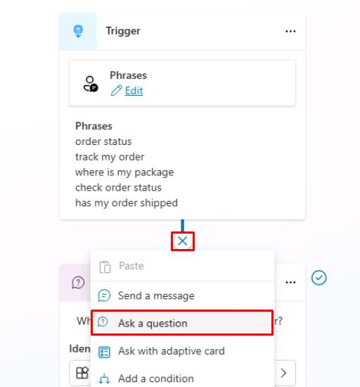
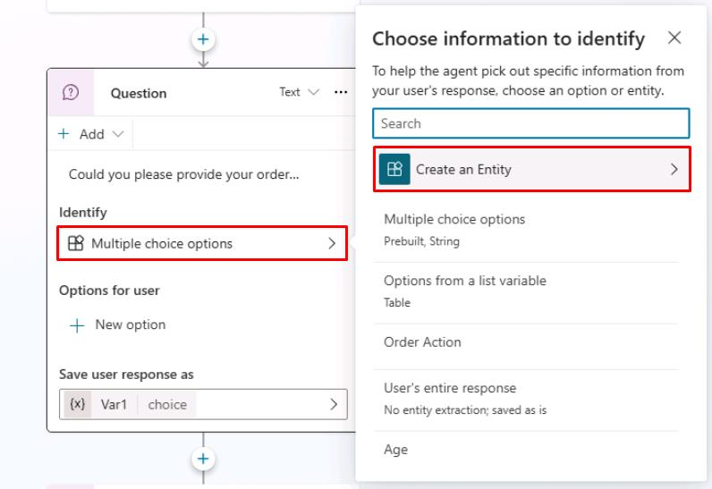
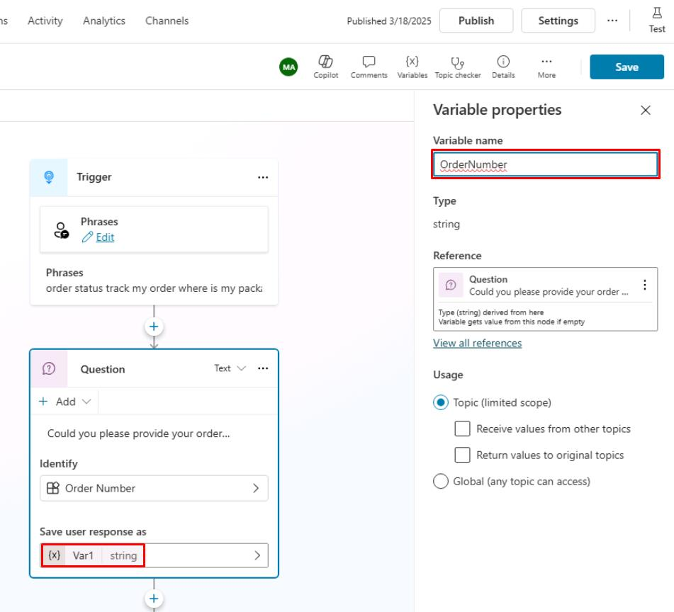

# タスク 09: **メッセージ**ノードのリッチテキスト機能

## はじめに

明確なコミュニケーションは、指示や重要情報を伝える際に不可欠です。

## 説明

リッチテキスト形式を活用し、エージェントのメッセージを分かりやすく表現できるようにします。これにより、Contoso の顧客が受け取る情報の明瞭さが向上します。

## メッセージ・**質問**ノードのリッチテキストオプション

Microsoft Copilot Studio には、エージェント作成時に活用できる拡張機能が多数あり、顧客にポジティブな会話体験を提供できます。中心的な機能の1つが、メッセージ・**質問**ノードで利用できるリッチテキストオーサリング機能です。



利用可能なリッチテキストオプション例:

- **画像**: 画像を追加できます。カード上に表示され、画像URLとタイトル（任意）を指定します。
- **動画**: 公開されている MP4 または YouTube 動画URLを追加できます。
- **ベーシックカード**: シンプルなカードで、タイトル・メッセージ・ボタンなど基本的なアクションを追加できます。
- **アダプティブカード**: 柔軟な情報表示やアクション依頼などに使えるプラットフォーム非依存のカード。執筆時点で Microsoft Copilot Studio は Adaptive Cards v1.5 をサポートしています。
- **クイックリプライ**: ユーザーが特定の選択肢から選べるオプション。テキスト入力の代わりに利用でき、よくある回答例やヒントを提示できます。

## 成功基準

- メッセージにリッチテキスト形式を適用できた
- エージェント対話時に明確で整ったテキスト表示を確認できた

## 主なタスク

### 01: Conversation Start へのリッチテキスト追加

<details markdown="block"> 
  <summary><strong>ソリューションを表示するにはこのセクションを展開</strong></summary> 

1. 上部バーの **Topics** を選択します。
    
1. 左上の **System** フィルターを選択し、次に **Conversation Start** トピックを選択します。

    

1. **Message** ノードを選択し、**Add** を選択してから **Image** を選択します。 

	

1. **Image URL** テキストボックスに、次の URL を入力します。

	```
	https://learn.microsoft.com/en-us/training/achievements/build-effective-bots.svg
	```

    

	{: .note }
	> オプションとして、**Title** フィールドを使用して画像の名前を追加することもできます。

1. **Message** ノードで再度 **Add** を選択し、次に **Quick reply** を選択します。

1. **Quick replies** に次の内容を入力します。

	```
	Help with my order
	```

    

	{: .important }
	> クイックリプライは、ユーザーが選択できるオプションを提案する優れた方法であり、最も一般的なアクションを積極的に提案することで、会話を成功に導くのに役立ちます。

1. トピックを保存するには、キャンバスの右上隅にある **Save** を選択します。

</details>

### 02: 正規表現エンティティの追加

<details markdown="block"> 
  <summary><strong>ソリューションを表示するにはこのセクションを展開</strong></summary> 

1. 上部バーの **Topics** を選択します。 

1. **Check Order Status** トピックを選択します。

1. **Trigger** ノードの下にある **+** ボタンを選択し、次に **Ask a question** を選択して新しい **Question** ノードを追加します。

	
	
1. 次の内容を入力します。

  	```
	Could you please provide your order number?
	```

1. **Identify** の下にあるエントリを選択し、次に **Create an Entity** を選択します。

	

1. **Regular expression (Regex)** を選択します。

1. 新しいエンティティに次の値を入力します。

    | 項目 | 値 |
    |---------|-------------|
    | **Name** | `Order Number` |
    | **Pattern** | `ORD-[0-9]{6}` |

	{: .note }
	> このパターンは、ORD-123456 のような ID を自動的に検出します。

1. パネルの下部にある **Save** を選択します。

1. 同じ **Question** ノード内で **Var1** を選択し、**Variable name** に `OrderNumber` と入力します。

	

1. トピックを保存するには、キャンバスの右上隅にある **Save** を選択します。

</details>

--- 

次の異なるリッチレスポンスタイプを使って、プロパティに慣れるまでこのプロセスを繰り返してください。

- 動画
- ベーシックカード
- アダプティブカード
- クイックリプライ

{: .important }
>   Adaptive Cards のサンプルやオーサリング体験については、次のサイトを訪問してください:
>   - <https://adaptivecards.io/samples/>
>   - <https://adaptivecards.io/designer/>
>   - https://amdesigner.azurewebsites.net

[次のページへ → 10. メッセージバリエーションの追加](0210.md)
