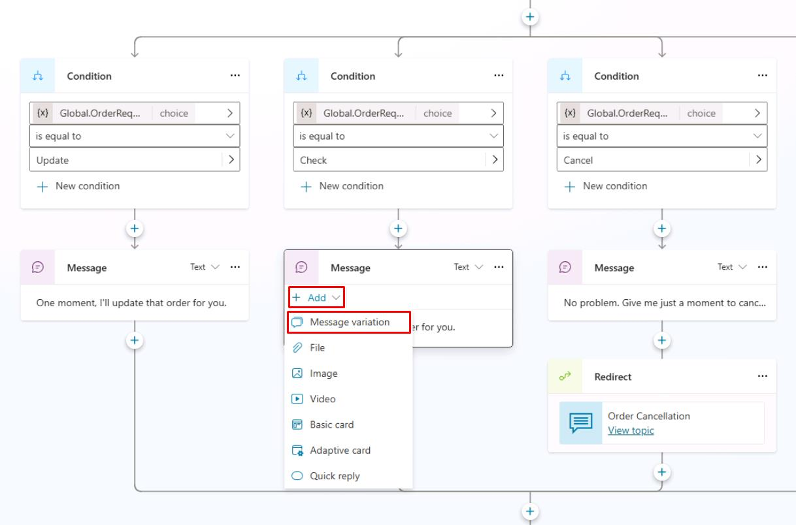

# タスク 10: メッセージバリエーションの追加

## はじめに

Contoso の顧客により自然な会話体験を提供するため、メッセージバリエーションを導入します。これにより、エージェントが繰り返し感のない、より魅力的な応答を実現できます。

## 説明

Copilot Studio でメッセージバリエーションを作成し、エージェントが複数の類似応答からランダムに選択できるようにします。これにより、会話の冗長性が減り、より自然なやり取りが可能となります。

## 成功基準

- エージェントメッセージのバリエーションを複数作成できた
- テスト時にランダムなメッセージ選択を確認できた

## 主なタスク

メッセージ・**質問**ノードは最大15種類のバリエーションを設定でき、エージェントはトリガー時にランダムで1つを選択します。これにより、ユーザーに動的で多様な体験を提供できます。

### 01: メッセージバリエーションの追加

<details markdown="block"> 
  <summary><strong>ソリューションを表示するにはこのセクションを展開</strong></summary> 

このタスクでは、既存ノードに **Message variation** を追加します。

1. **Check Order Status** キャンバスを進み、**Check** 条件分岐下の **Message** ノードを選択します。

1. **Add** を選択し、**Message variation** を選択します。

	

1. エージェントが使うメッセージバリエーションを追加します:

	```
	Sure thing. Give me a moment to check on that.
	```

1. **Update** 条件パス下の **Message** ノードにもバリエーションを追加します:

	```
	I'll get that updated right away.
	```

1. トピックを保存するために、キャンバスの右上にある **Save** を選択します。

</details>

---

おめでとうございます。これで **Message** ノードの基本的な使い方は完了です。条件をトリガーしてメッセージバリエーションをテストするには、**Test** オプションを選択します。

**Message** ノードには、この演習の文脈ではカバーされていない追加の高度な機能があります。


## スピーチオーサリング

Microsoft Copilot Studio 内で、エージェントのオーサーはメッセージおよび **質問** ノードにスピーチ合成マークアップ言語 (SSML) タグを使用して、音声対応エージェントの動作を拡張できます。Microsoft Copilot Studio を使用して、テキストオーサリングとスピーチオーサリングの両方を行うことができます。既定では、音声対応チャネルでは、**Message** ノードに入力されたメッセージテキストが音声とテキスト表示の両方に使用されます。この動作は、テキストとスピーチに対して異なる動作を指定することにより、オーバーライドできます。たとえば、文の特定の部分に強調を置きたい場合や、画像メッセージの場合に、音声で読み上げられる代替説明を提供したい場合などです。

SSML を使用すると、テキストが合成音声に変換される方法を制御して、より自然に聞こえるようにできます。Audio、Break、Emphasis、および Prosody などの SSML タグを使用すると、文の読み上げ方を変更できます。

- **Audio** - 録音済みの音声を追加します。
- **Break** - 単語の間にポーズやブレークを挿入します。
- **Emphasis** - 単語やフレーズにストレスのレベルを追加します。
- **Prosody** - ピッチ、音程、範囲、速度、音量の変更を指定します。

{: .important }
> 詳細については、[Speech Synthesis Markup Language](https://learn.microsoft.com/en-us/azure/cognitive-services/speech-service/speech-synthesis-markup/) を参照してください。

[次のページへ → 11. コードビューと Power Fx の利用](0211.md)
