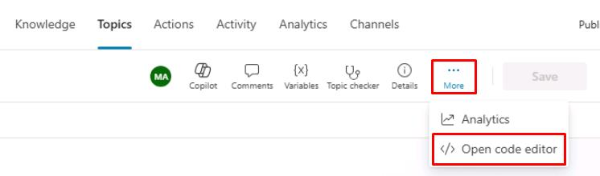
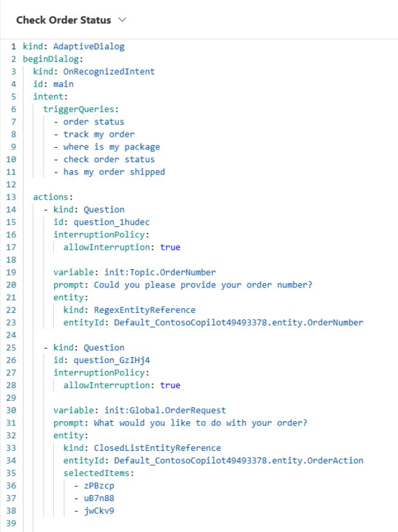

# タスク 11: コードビューと Power Fx の利用

## はじめに

Contoso のカスタマーサービスシナリオで特定の要件を満たすため、高度なカスタマイズが必要になる場合があります。

## 説明

Copilot Studio のコードビューと Power Fx 数式を使い、標準ノード機能を超えた高度な会話ロジックを実装します。

## 成功基準

- コードビューと Power Fx 数式を正しく活用できた
- 高度な会話ロジックが意図通り動作することを確認できた

## 主なタスク

Copilot Studio のオーサリング基礎に慣れたら、エージェント体験をさらにカスタマイズできる拡張機能を試しましょう。ここでは **コードビュー**（プロ開発者向け）と **Power Fx**（Power Platform の開発者・プロ開発者向け）の2つを紹介します。

Microsoft Copilot Studio ではトピックの裏側のコードを表示できます。これは上級者やプロ開発者にとって非常に便利な機能で、Web ブラウザ上で直接構文を編集・保存でき、グラフィカルなオーサリングキャンバスにも即時反映されます。複数アクションのコピーや編集も効率的に行えます。

一部の操作はコードエディタビューでのみ利用可能です。

### 01: コードエディタへのアクセス

 
  
<strong>ソリューションを表示するにはこのセクションを展開</strong>
 

1. **Check Order Status** で、キャンバス右上の **More**（三点リーダー）を選択し、**Open code editor** を選択します。

	

1. ダイアログが YAML コードビューで表示されます。

	

1. 機能を確認したら、右上の **Close code editor** を選択して閉じます。

> [!WARNING]
> オプションが利用できない場合は、ページをリフレッシュしてキャンバスに戻ってください。

[次のページへ → 12. Power Fx の全体活用](0212.md)