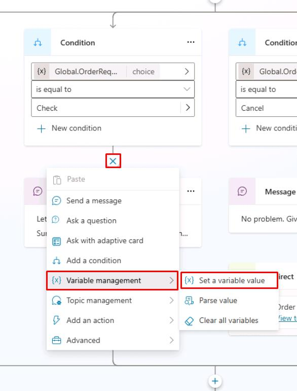

# タスク 12: Microsoft Copilot Studio での Power Fx 活用

## はじめに

標準的な会話ロジックを超えて Contoso エージェントの機能を拡張するには、より深い統合が必要です。そのために、Microsoft Copilot Studio 全体で Power Fx 式を活用し、Contoso の顧客対応をカスタマイズします。

## 説明

Copilot Studio 全体で Power Fx 式を活用し、エージェントが複雑なシナリオややり取りに包括的に対応できるようにします。

## 成功基準

- さまざまな会話トピックで Power Fx 式を効果的に実装できた
- エージェントの動作が意図した高度なロジックと一致することを確認できた

## 主なタスク

Power Fx は Microsoft Copilot Studio で利用可能です。Power Fx を使うことで、Microsoft Power Apps や Dataverse のキャンバスアプリと同様に、Microsoft Copilot Studio のオーサリングキャンバス内で関数を追加できます。Power Fx はメッセージ・**質問**ノード、**Set a variable value** ノード、条件、アクション、質問動作設定、アダプティブカードなど様々な場所で利用できます。

この機能により、会話インターフェイスで顧客やユーザーに表示するデータを柔軟に制御でき、Microsoft Copilot Studio のランタイムで一般的な操作も実行できます。

以下のタスクでは、Power Fx を使って変数の値を加工し、ユーザーに表示する基本的なシナリオを紹介します。

### 01: Power Fx で日付表示を加工する

1. **Check** 条件ノード下で **+** ボタンを選択し、**Variable management** → **Set a variable value** を選択します。

    

1. **Set variable** で **Create a new variable** を選択します。

1. **Var1** 変数を選択し、**Variable name** を `OrderDeliveryDate` に設定します。

1. **To Value** でシェブロン **(>)** を選択し、**Formula** タブで次の関数を入力します。

	[!WARNING]
    > コードブロック右上の **Copy** オプションを使い、**Ctrl+V** で貼り付けると効率的です。

	```
	Text(
		DateAdd(
			Now(),
			5
		),
		"dddd, mmmm d, yyyy"
	)
	```

1. これで、現在の日付から5日後の日付が「曜日, 月 日, 年」の形式で表示されます。

1. 変数 `OrderDeliveryDate` をメッセージノードや質問ノードで利用し、ユーザーに納品予定日などを案内できます。

</details>

[次のページへ → 演習 03: エージェントから Power Automate クラウドフローを構築・呼び出す](../Ex03/Ex03.md)