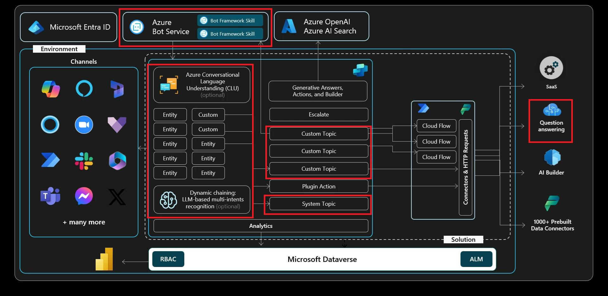

# 演習 02: 基本的なオーサリングを学ぶ

## シナリオ

Copilot Studio エージェントの基本セットアップが完了した Contoso は、今度はエージェントに機器注文に関する特定の顧客問い合わせへ対応させる必要があります。

この演習では、エージェントの機能を拡張し、さまざまな顧客リクエストを認識できるようにします。カスタムエンティティの定義、スロットフィリング技術の実装、変数の設定による動的な会話管理を学びます。これにより、Contoso のサービスリクエスト対応が効率化され、担当者の手作業が大幅に削減されます。

## 目標

この演習では以下のトピックを扱います:

- メッセージおよび **質問** ノードの基本を学ぶ
- エンティティとスロットフィリングの基本を理解する
- Microsoft Copilot Studio で変数を使う方法を学ぶ
- Power Fx や拡張ノードプロパティなど拡張性機能を体験する

## アーキテクチャ

## 所要時間

目安時間: *60分*

[次のページへ → 1. エンティティとスロットフィリングの利用](0201.md)