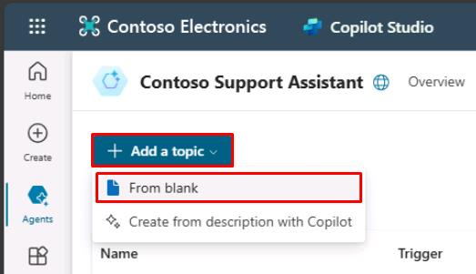

# タスク 01: 新しいトピックの作成

## はじめに

Contoso では、既存のサービスチケットや機器の状況、保守スケジュールに関する顧客からの問い合わせが頻繁にあります。これらのリクエスト対応を効率化するため、AI エージェントは顧客から必要な詳細情報を直接収集できる必要があります。

## 説明

このタスクでは、Microsoft Copilot Studio で新しい会話トピックを作成します。顧客が情報をリクエストする際に使うトリガーフレーズや、チケット番号など必要な情報を収集する質問を含めます。

## 成功基準

- 新しい会話トピックを作成し、名前を付けた
- 適切なトリガーフレーズを定義した
- 必要な顧客情報を収集する **質問** ノードを追加した

## 主なタスク

### 01: 新しいトピックの作成

<details markdown="block"> 
  <summary><strong>ソリューションを表示するにはこのセクションを展開</strong></summary> 

1. 上部バーの **Topics** を選択します。

> [!NOTE]
> 以前のタスクで作成した **Support Ticket** トピックと混同しないよう、ここで無効化します。
	
1. **Support Ticket** の行で **Enabled** 列のトグルを **Off** にします。

	

1. 左上の **Add a topic** を選択し、**From blank** を選択します。

	

1. 左上の **Untitled** を選択し、トピック名を `Check Ticket Status` に変更します。

1. **Trigger** ノード内の **Phrases** で **Edit** を選択します。

	

1. **Add phrases** に次のフレーズを入力し、それぞれのフレーズのために **Enter** または **+** ボタンを選択します。

	- `What is the status of my ticket INC0008001`
	- `Can you get me information on my ticket status`
	- `Could you check the status of my ticket`
	- `Status update on ticket INC0009005`
	- `What's happening with my ticket INC1234567`

1. **Trigger** ノードの下に新しい **Question** ノードを追加し、次のように入力します。 

	```
	Absolutely. Could you provide me with your ticket number?
	```

1. **Identify** の下のエントリを選択し、**Create an Entity** を選択します。

	

1. **Regular expression (Regex)** を選択します。

1. 新しいエンティティに次のように入力します:

    | 項目 | 値 |
    |----------|-----------------|
    | **Name** | `Ticket Number` |
    | **Pattern** | `INC[0-9]{7}` |

1. ペインの下部にある **Save** を選択します。

1. **Var1** 変数を選択し、**Variable name** に `TicketNumber` と入力します。

1. キャンバスの右上隅にある **Save** を選択してトピックを保存します。


</details>

[次のページへ → 2. Power Automate クラウドフローの作成](0302.md)