# タスク 02: Power Automate クラウドフローの作成

## はじめに

Contoso は、サービス関連情報の取得を自動化し、顧客に迅速かつ正確な応答を提供したいと考えています。Power Automate クラウドフローを使うことで、外部システムと連携し、必要なデータを素早く取得できます。

## 説明

このタスクでは、Power Automate クラウドフローを作成し、外部ソースからのデータ取得をシミュレートします。Copilot Studio エージェントからの入力を受け取り、自動処理で必要なデータを返すフローを構築します。

## 成功基準

- Power Automate クラウドフローを正常に作成できた
- 入力パラメータを正しく設定できた
- クラウドフロー内でデータ取得アクションをシミュレートできた

## 主なタスク

### 01: Power Automate クラウドフローの作成

<details markdown="block"> 
  <summary><strong>ソリューションを表示するにはこのセクションを展開</strong></summary> 

このタスクでは、ServiceNow 連携をシミュレートしてチケット詳細を取得します。

> [!WARNING] 
> ステップ7以降で実際の ServiceNow 連携を使うか、シミュレート応答を使うかはコーチに確認してください。
>
> 以降のタスクのスクリーンショットはシミュレートされたチケット詳細を示しています。

1. **質問** ノードの下で **+** ボタンを選択し、**Add a tool** → **New Agent flow** を選択します。
	
	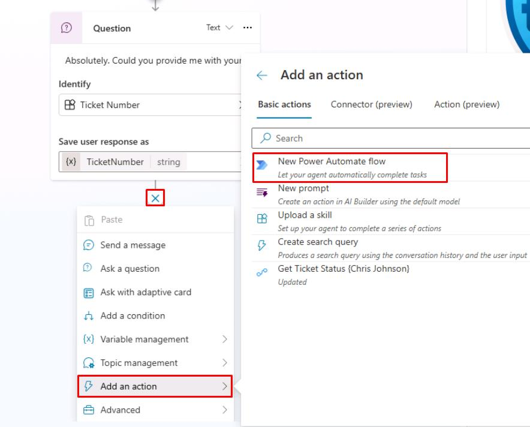

> [!NOTE]
> これで **Power Automate** が新しいタブで開き、Copilot Studio 連携用の前後処理が自動で用意されます。

1. Power Automate 右上で **New designer** が有効になっていることを確認します。

	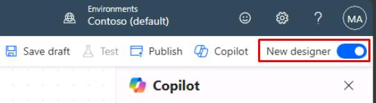

1. **When an agent calls the flow** ノードを選択します。

1. 新しいペインで **Add an input** を選択し、次に **Text** を選択します。

	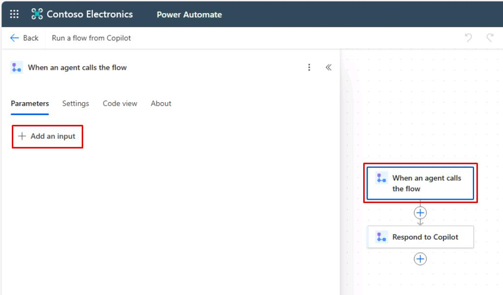

1. **Input** の名前の値を `TicketNumber` に置き換えます。

	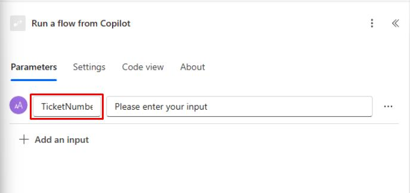

1. **When an agent calls the flow** ノードの下にある **+** ボタンを選択します。

	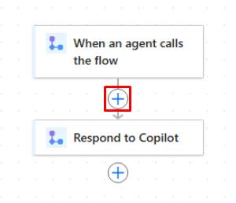

1. 検索バーに `ServiceNow List Records` と入力し、次に **List Records** を選択します。

	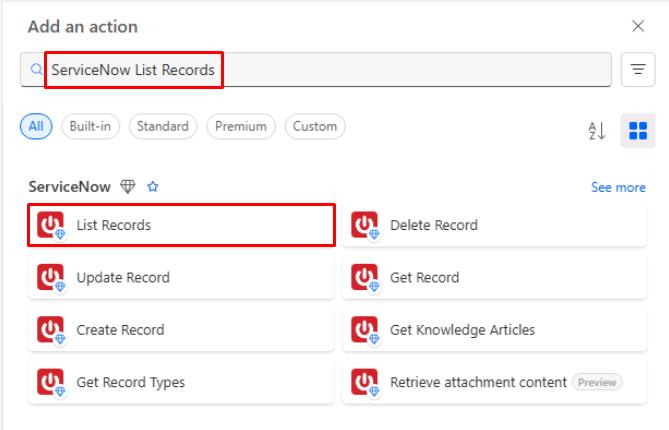

> [!WARNING]
> コーチが ServiceNow 環境を提供する場合は、ここを展開してこのタスクの詳細を確認してください。提供されない場合は、次のステップに進んでください。
> 
> - コーチから提供された接続の詳細をすべて入力します。
> - **Create New** を選択します。
> - **Record Type** の下にあるドロップダウンメニューを選択し、`Incident` を検索して選択します。
> - **Advanced parameters** の下で **Show all** を選択します。
> - **Display System References** を **Yes** に設定して実際の値を表示します。
> - **Query** の下に `numberCONTAINS` と入力し、動的コンテンツ (⚡) から **TicketNumber** 入力を選択します。
>
> - **numberCONTAINS** と参照する **TicketNumber** 変数の間にスペースがないことを確認してください。 
>	または、次の内容を **Query** フィールドに貼り付けることもできます。
>	```
>	numberCONTAINS@{triggerBody()?['text']}
>	```
> - **Limit** の下に `1` と入力します。
>
>	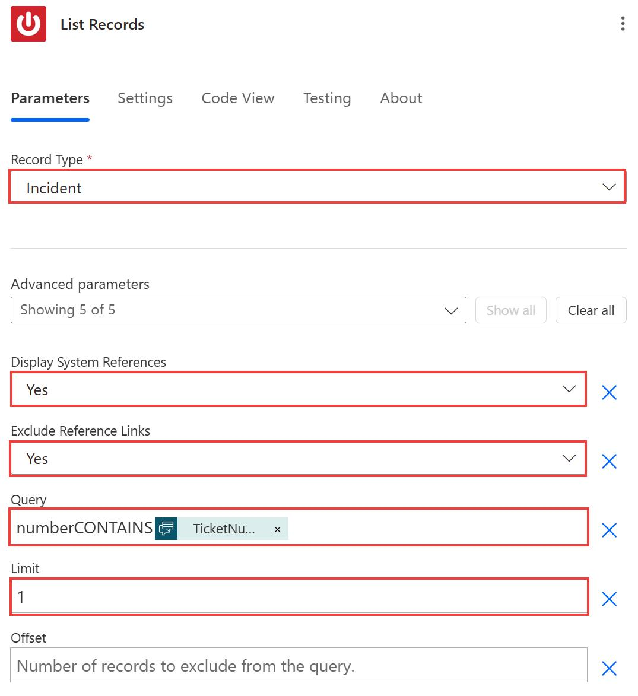
>
> - クラウドフロー内の **Respond to Copilot** ノードを選択します。
> - **Add an output** を選択し、次に **Text** を選択します。
> - 名前を `SNTicketInfo` に設定します。
> - **SNTicketInfo** の右側にあるテキストボックスを選択し、次に数式ボタン (**fx**) を選択します。
>
>	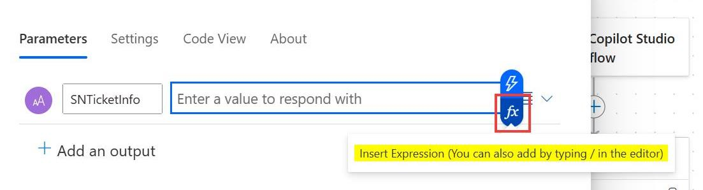
>
> - 次の数式を入力し、次に **Add** を選択します。これにより、**List Records** 本体からの結果配列の最初の返されたレコードの文字列が取得されます。
>
>	```
>	string(first(outputs('List_Records')?['body/result']))
>	```
>
>	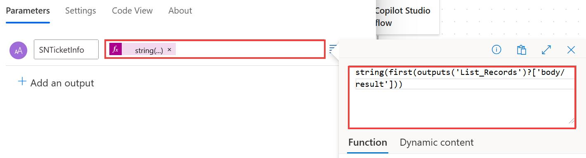
>
> - このタスクのステップ 16 にスキップして、フローの名前を変更し、公開します。

1. **Create connection** ステップで、次のように入力します。

    | 項目 | 値 |
    |----------|-----------------|
    | **Connection name** | `@lab.User.FirstName @lab.User.LastName ServiceNow` |
    | **Authentication Type** | Basic Authentication |
    | **Instance** | `https://dev261120.service-now.com` |
    | **Username** | `CopilotStudioServiceAccount` |
    | **Password** | `F@k3Pw29@9%92` |

1. **Create new** を選択します。

	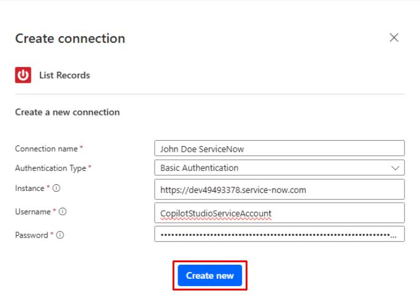

1. このシナリオでは、代わりにこの接続からの応答をシミュレートします。

	**List Records** ノードを選択して削除キーを押すか、ノードを右クリックして **Delete** を選択します。

	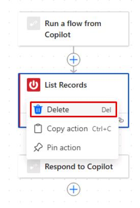

1. フロー内の **Respond to Copilot** ノードを選択します。

1. **Add an output** を選択し、次に **Text** を選択します。

1. 名前を `SNTicketInfo` に設定します。

1. **SNTicketInfo** の右側にあるテキストボックスを選択します。

	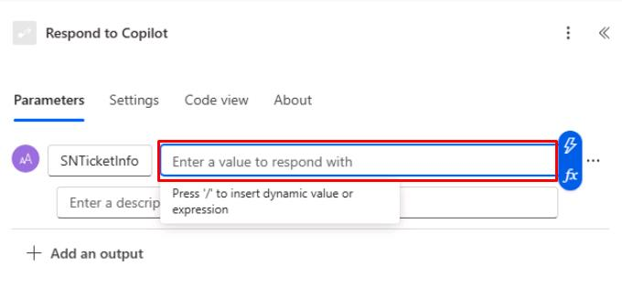

1. このシミュレートされた ServiceNow 応答のために、次のペイロードサンプルをテキストボックスに貼り付けます。

> [!WARNING]
> 次のコードブロックの **Copy** オプションを使用してコピーし、**Ctrl+V** で貼り付ける方が、**Type** を使用するよりも速くなります。

	```json
	{
		"parent": "",
		"made_sla": "true",
		"caused_by": "",
		"watch_list": "",
		"upon_reject": "Cancel all future Tasks",
		"sys_updated_on": "2018-12-12 23:18:55",
		"child_incidents": "0",
		"hold_reason": "",
		"origin_table": "",
		"task_effective_number": "INC0009005",
		"approval_history": "",
		"number": "INC0009005",
		"resolved_by": "",
		"sys_updated_by": "admin",
		"opened_by": "System Administrator",
		"user_input": "",
		"sys_created_on": "2018-08-31 21:35:45",
		"sys_domain": "global",
		"state": "New",
		"route_reason": "",
		"sys_created_by": "admin",
		"knowledge": "false",
		"order": "",
		"calendar_stc": "",
		"closed_at": "",
		"cmdb_ci": "",
		"delivery_plan": "",
		"contract": "",
		"impact": "1 - High",
		"active": "true",
		"work_notes_list": "",
		"business_service": "",
		"business_impact": "",
		"priority": "1 - Critical",
		"sys_domain_path": "/",
		"rfc": "",
		"time_worked": "",
		"expected_start": "",
		"opened_at": "2018-08-31 21:35:21",
		"business_duration": "",
		"group_list": "",
		"work_end": "",
		"caller_id": "David Miller",
		"reopened_time": "",
		"resolved_at": "",
		"approval_set": "",
		"subcategory": "Email",
		"work_notes": "2018-12-12 23:18:42 - System Administrator (Work notes)\nupdated the priority to high based on the criticality of the Incident.\n\n",
		"universal_request": "",
		"short_description": "Email server is down.",
		"correlation_display": "",
		"delivery_task": "",
		"work_start": "",
		"assignment_group": "",
		"additional_assignee_list": "",
		"business_stc": "",
		"cause": "",
		"description": "Unable to send or receive emails.",
		"origin_id": "",
		"calendar_duration": "",
		"close_notes": "",
		"notify": "Do Not Notify",
		"service_offering": "",
		"sys_class_name": "Incident",
		"closed_by": "",
		"follow_up": "",
		"parent_incident": "",
		"sys_id": "ed92e8d173d023002728660c4cf6a7bc",
		"reopened_by": "",
		"incident_state": "New",
		"urgency": "1 - High",
		"problem_id": "",
		"company": "",
		"reassignment_count": "0",
		"activity_due": "2018-12-13 01:18:55",
		"assigned_to": "",
		"severity": "3 - Low",
		"comments": "",
		"approval": "Not Yet Requested",
		"sla_due": "UNKNOWN",
		"comments_and_work_notes": "2018-12-12 23:18:42 - System Administrator (Work notes)\nupdated the priority to high based on the criticality of the Incident.\n\n",
		"due_date": "",
		"sys_mod_count": "3",
		"reopen_count": "0",
		"sys_tags": "",
		"escalation": "Normal",
		"upon_approval": "Proceed to Next Task",
		"correlation_id": "",
		"location": "",
		"category": "Software"
	}
	```

	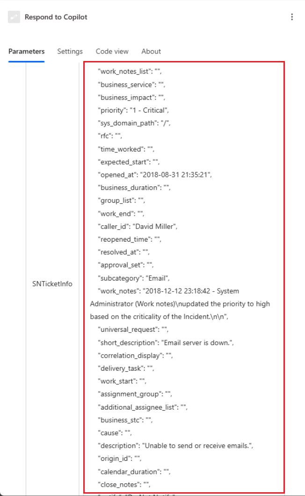

> [!NOTE]
> これは、ServiceNow が通常返すものの例です。

> [!IMPORTANT]
> 実際のシナリオでは：
>
> 値フィールドのために表示される **fx** 数式ボタンを選択できます。
>
> 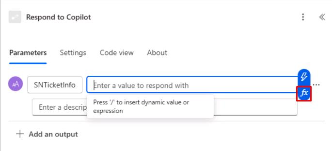
>
> その後、上部のテキストボックスに数式を入力し、**Add** を選択できます。
>
> ```
>	string(first(outputs('List_Records')?['body/result']))
>	```
>
> 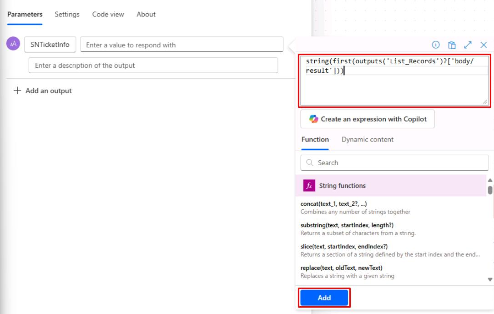
>
> これにより、ServiceNow **List Records** 本体からの結果配列の最初の返されたレコードの文字列バージョンが取得されます。

1. ページの左上で、**Run a flow from Copilot** を選択してフローの名前を変更し、`Get Ticket Status (@lab.User.FirstName @lab.User.LastName)` に設定します。

	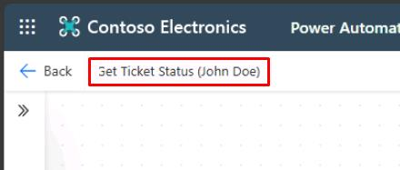

> [!NOTE]
> 適切な名前を付けることで、Copilot Studio や管理者によってフローが簡単に見つけられるようになります。

1. ページの右上で **Publish** を選択します。公開されると、緑の成功バナーが表示されるまで待ちます。

	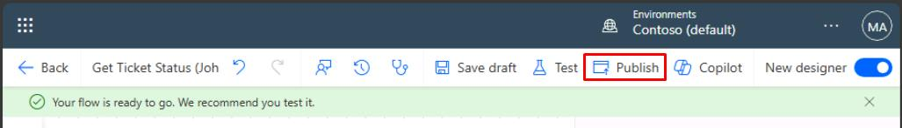

</details>

[次のページへ → 3. Copilot Studio からクラウドフローを呼び出す](0303.md)
