# タスク 03: Copilot Studio からクラウドフローを呼び出す

## はじめに

Contoso の顧客対応を強化するため、エージェントは自動化プロセスとシームレスに連携する必要があります。会話トピックと Power Automate クラウドフローを接続することで、エージェントはリアルタイムで顧客に関連情報を動的に取得・提供できます。

## 説明

このタスクでは、前の手順で作成した Power Automate クラウドフローを Microsoft Copilot Studio の会話トピックに統合します。フロー呼び出しの設定や、収集した顧客入力をフローに渡して情報取得を自動化します。

## 成功基準

- 会話トピックと Power Automate クラウドフローを連携できた
- トピック変数を正しく設定し、フローに入力を渡せた
- テストで連携が正しく動作することを確認できた

## 主なタスク

### 01: Copilot Studio からクラウドフローを呼び出す

<details markdown="block"> 
  <summary><strong>ソリューションを表示するにはこのセクションを展開</strong></summary> 

1. Copilot Studio のタブに戻ります。

1. **Save and refresh** ダイアログで **Done** を選択し、作成したフローをリストに反映させます。手動でページをリフレッシュしてもOKです。

	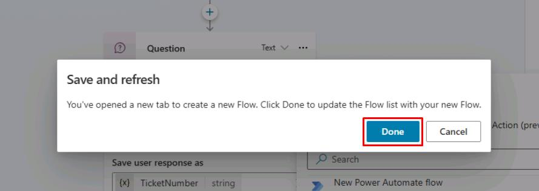

1. 必要に応じて再度 **質問** ノード下の **+** ボタン → **Add an Action** → **Get Ticket Status (@lab.User.FirstName @lab.User.LastName)** フローを選択します。

	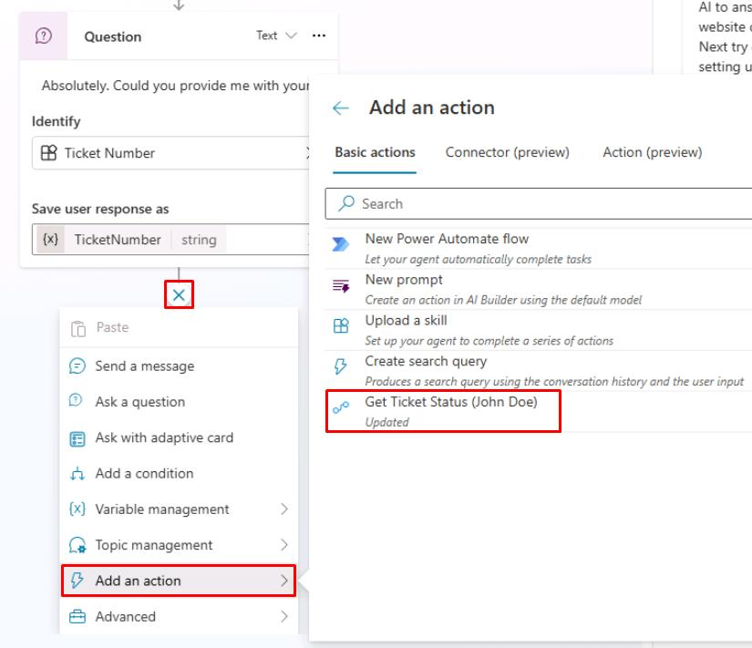

> [!NOTE]
> 新しい **Action** ノードが追加されます。
>
> フローに入力が必要な場合、値の選択を求められます。前手順で作成したフローは **TicketNumber** 入力が必要なので、ユーザーから取得した **TicketNumber** 変数を指定します。

> [!WARNING]
> 作成したフローが表示されない場合は、トピックを **Save** し、ページをリフレッシュして再試行してください。

1. **Power Automate inputs** で **Enter or select a value** のシェブロン **(>)** を選択し、**TicketNumber** 変数を指定します。

	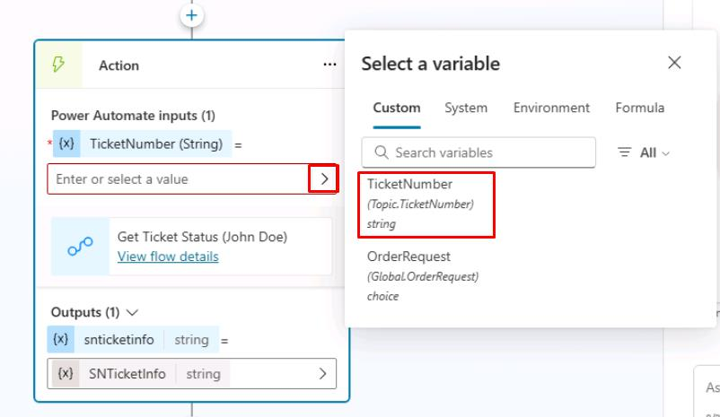
	
> [!NOTE]
> これで Power Automate フローに接続され、Power Automate からの結果が **SNTicketInfo** 変数に出力されます。

> [!IMPORTANT]
> **プロのヒント**: 
> - 統合に遅延が予想される場合は、アクションのプロパティに遅延メッセージを追加します。例: `I'm getting these details for you. Hold on...` 
> - Power Automate でクラウドフローを呼び出して実行する際の遅延を回避するために、Microsoft Copilot Studio で HTTP リクエストやコネクタを直接使用することを検討してください。

1. ServiceNow はインシデントの詳細を **JSON** 形式で返すため、その内容を Copilot Studio がスキーマに基づいて完全に理解できるように解析する必要があります。

	**Action** ノードの下にある **+** ボタンを選択 → **Variable Management** → **Parse value** を選択します。

	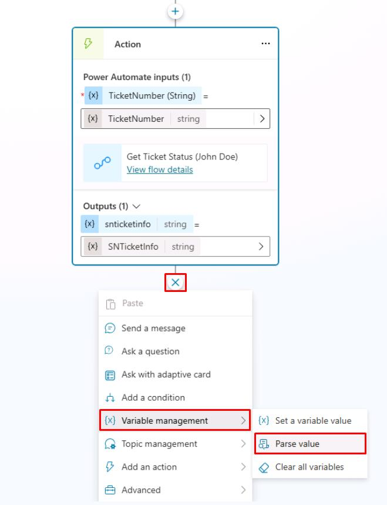

> [!NOTE]
> JSON を解析するには、ServiceNow の Rest API Explorer を使用してボディの構造を取得するか、サンプルペイロードからスキーマを取得できます。演習用にサンプルの ServiceNow データを提供しています。

1. **Parse value** の下でシェブロン **(>)** を選択し、**SNTicketInfo** 変数を選択します。

	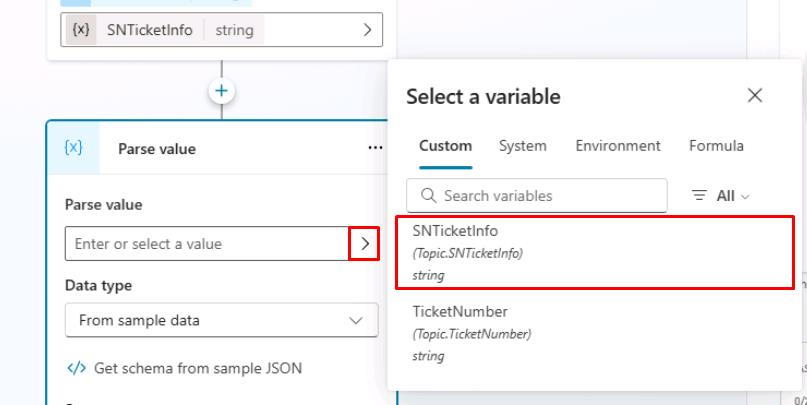

1. **Data type** でドロップダウンメニューから **From sample data** を選択します。

1. **Get schema from sample JSON** を選択します。

	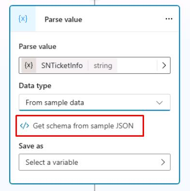

1. 以下のスキーマを貼り付けます。

> [!WARNING]
> 次のコードブロックの **Copy** オプションを使用してコピーし、**Ctrl+V** で貼り付けてください。**Type** を使用しないでください。

	```json
	{
		"parent": "",
		"made_sla": "true",
		"caused_by": "",
		"watch_list": "",
		"upon_reject": "Cancel all future Tasks",
		"sys_updated_on": "2018-12-12 23:18:55",
		"child_incidents": "0",
		"hold_reason": "",
		"origin_table": "",
		"task_effective_number": "INC0009005",
		"approval_history": "",
		"number": "INC0009005",
		"resolved_by": "",
		"sys_updated_by": "admin",
		"opened_by": "System Administrator",
		"user_input": "",
		"sys_created_on": "2018-08-31 21:35:45",
		"sys_domain": "global",
		"state": "New",
		"route_reason": "",
		"sys_created_by": "admin",
		"knowledge": "false",
		"order": "",
		"calendar_stc": "",
		"closed_at": "",
		"cmdb_ci": "",
		"delivery_plan": "",
		"contract": "",
		"impact": "1 - High",
		"active": "true",
		"work_notes_list": "",
		"business_service": "",
		"business_impact": "",
		"priority": "1 - Critical",
		"sys_domain_path": "/",
		"rfc": "",
		"time_worked": "",
		"expected_start": "",
		"opened_at": "2018-08-31 21:35:21",
		"business_duration": "",
		"group_list": "",
		"work_end": "",
		"caller_id": "David Miller",
		"reopened_time": "",
		"resolved_at": "",
		"approval_set": "",
		"subcategory": "Email",
		"work_notes": "2018-12-12 23:18:42 - System Administrator (Work notes)\nupdated the priority to high based on the criticality of the Incident.\n\n",
		"universal_request": "",
		"short_description": "Email server is down.",
		"correlation_display": "",
		"delivery_task": "",
		"work_start": "",
		"assignment_group": "",
		"additional_assignee_list": "",
		"business_stc": "",
		"cause": "",
		"description": "Unable to send or receive emails.",
		"origin_id": "",
		"calendar_duration": "",
		"close_notes": "",
		"notify": "Do Not Notify",
		"service_offering": "",
		"sys_class_name": "Incident",
		"closed_by": "",
		"follow_up": "",
		"parent_incident": "",
		"sys_id": "ed92e8d173d023002728660c4cf6a7bc",
		"reopened_by": "",
		"incident_state": "New",
		"urgency": "1 - High",
		"problem_id": "",
		"company": "",
		"reassignment_count": "0",
		"activity_due": "2018-12-13 01:18:55",
		"assigned_to": "",
		"severity": "3 - Low",
		"comments": "",
		"approval": "Not Yet Requested",
		"sla_due": "UNKNOWN",
		"comments_and_work_notes": "2018-12-12 23:18:42 - System Administrator (Work notes)\nupdated the priority to high based on the criticality of the Incident.\n\n",
		"due_date": "",
		"sys_mod_count": "3",
		"reopen_count": "0",
		"sys_tags": "",
		"escalation": "Normal",
		"upon_approval": "Proceed to Next Task",
		"correlation_id": "",
		"location": "",
		"category": "Software"
	}
	```

1. **Confirm** を選択します。

	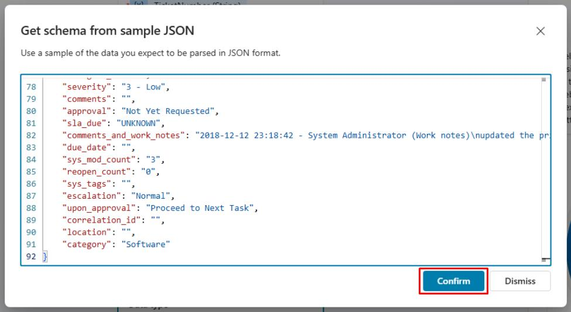

1. まだ **Parse value** ノード内で、**Save as** の下で **Select a variable** を選択し、**Create a new variable** を選択します。

	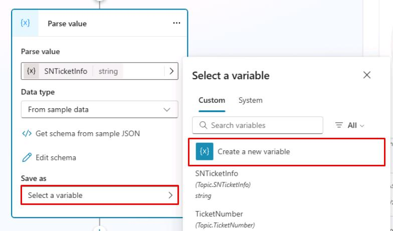

1. 新しい **Var1** 変数を選択し、**Variable name** に `SNTicketInfoParsed` と入力します。

> [!NOTE]
> 変数の型はスキーマに基づいて自動的に設定されます (**record**)。

1. **Parse value** ノードの下に新しい **Message** ノードを追加し、次のメッセージを入力します。

	```
	The status of ticket {Topic.TicketNumber} ({Topic.SNTicketInfoParsed.short_description}) is {Topic.SNTicketInfoParsed.state}.
	```

	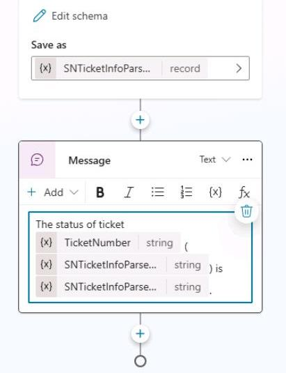

> [!IMPORTANT]
> 重要な情報はコマンドバーを使って太字にするか、** で囲んで太字にできます。
>
> Copilot Studio と一部のチャネルでは、シンプルな書式設定のために [Markdown](https://www.markdownguide.org/) がサポートされています。

> [!NOTE]
> 上記のサンプル JSON を参照して、どの値にどのデータが返されるかを確認できます。

1. **Message** ノードの下で **+** ボタンを選択し、**Topic management** → **Go to another topic** を選択し、**End of Conversation** を選択します。

	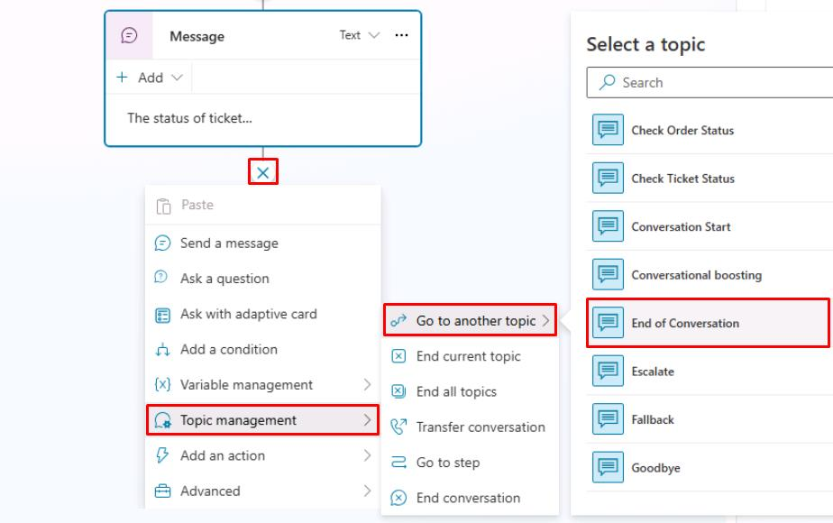

1. キャンバスの右上で **Save** を選択してトピックを保存します。

1. **Test your agent** ペインの右上にあるリフレッシュアイコンを選択して新しい会話を開始します。

1. 次のプロンプトを入力してテストします。

    ```
	What is the status of my ticket INC0007001?
	```

    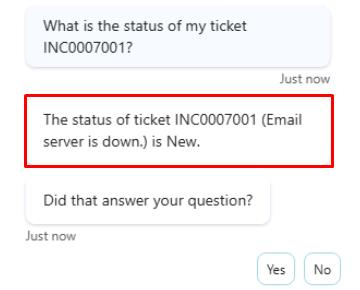

</details>

Power Automate クラウドフローと、外部サービスからのリアルタイムデータをユーザーに提供するためにフローを使用する Copilot Studio の新しいトピックを正常に作成しました！

[次のページへ → 4. ServiceNow チケット情報をアダプティブカードで表示](0304.md)
