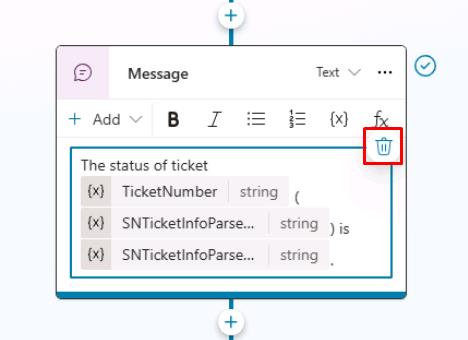
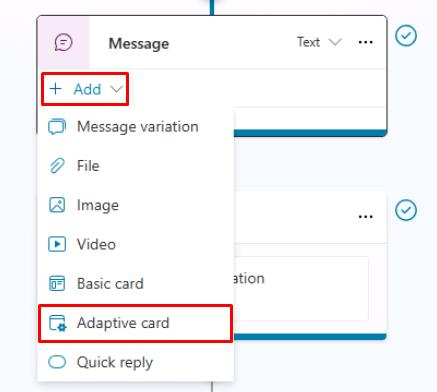
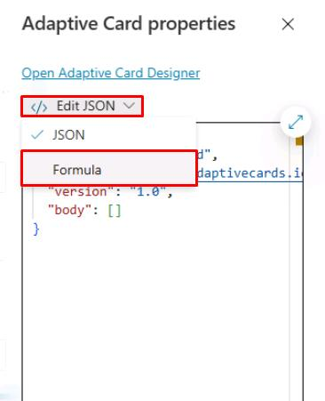
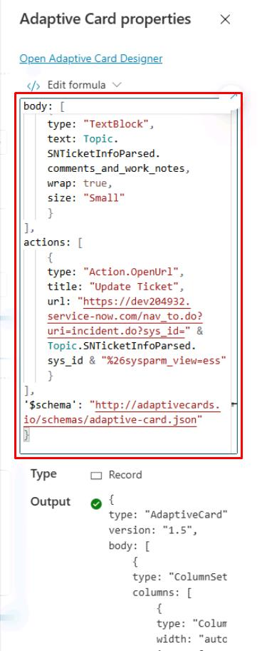
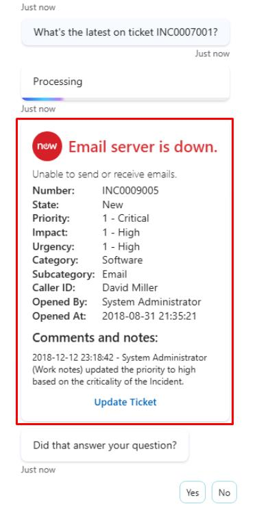

# タスク 04: ServiceNow チケット情報をアダプティブカードで表示

## はじめに

顧客対応をさらに向上させるため、Contoso は外部システムから取得したチケット情報をエージェントが分かりやすく提示できるようにしたいと考えています。

## 説明

このタスクでは、ServiceNow から取得した情報をアダプティブカードで表示するよう会話トピックを設定します。カードレイアウトの設計や、クラウドフローから返されたデータの統合を行い、会話内で効果的に表示できるようにします。

## 成功基準

- 会話トピック内でアダプティブカードを作成・設定できた
- Power Automate クラウドフローで取得した ServiceNow チケットデータをアダプティブカードに統合できた
- テストで正しくデータが表示されることを確認できた

## 主なタスク

### 01: ServiceNow チケット情報をアダプティブカードで表示

<details markdown="block"> 
  <summary><strong>ソリューションを表示するにはこのセクションを展開</strong></summary> 

1. **Message** ノードのメッセージを選択し、右上の削除アイコンでテキストを削除します。

	

1. **Message** ノードで **Add** → **Adaptive card** を選択します。

	

1. **Edit JSON** を選択し、**Formula** を選択して Power Fx で動的なアダプティブカードを作成します。

	

1. テキストボックスの内容を、ServiceNow チケット情報参照を含む次の Power Fx 式に置き換えます。

	```json
	{
	type: "AdaptiveCard",
	version: "1.5",
	body: [
		{
		type: "ColumnSet",
		columns: [
			{
			type: "Column",
			width: "auto",
			items: [
				{
				type: "Image",
				url: "https://www.servicenow.com/community/s/legacyfs/online/avatars_servicenow/1f66cb9fdb3ee3c0107d5583ca961942.jpg",
				size: "Small",
				style: "Person"
				}
			]
			},
			{
			type: "Column",
			width: "stretch",
			items: [
				{
				type: "TextBlock",
				text: Topic.SNTicketInfoParsed.short_description,
				weight: "Bolder",
				size: "Large",
				wrap: true,
				color: "Attention",
				horizontalAlignment: "Left"
				}
			],
			verticalContentAlignment: "Center",
			horizontalAlignment: "Center"
			}
		]
		},
		{
		type: "TextBlock",
		text: Topic.SNTicketInfoParsed.description,
		weight: "Lighter",
		wrap: true
		},
		{
		type: "FactSet",
		facts: [
			{
			title: "Number:",
			value: Topic.SNTicketInfoParsed.number
			},
			{
			title: "State:",
			value: Topic.SNTicketInfoParsed.state
			},
			{
			title: "Priority:",
			value: Topic.SNTicketInfoParsed.priority
			},
			{
			title: "Impact:",
			value: Topic.SNTicketInfoParsed.impact
			},
			{
			title: "Urgency:",
			value: Topic.SNTicketInfoParsed.urgency
			},
			{
			title: "Category:",
			value: Topic.SNTicketInfoParsed.category
			},
			{
			title: "Subcategory:",
			value: Topic.SNTicketInfoParsed.subcategory
			},
			{
			title: "Caller ID:",
			value: Topic.SNTicketInfoParsed.caller_id
			},
			{
			title: "Opened By:",
			value: Topic.SNTicketInfoParsed.opened_by
			},
			{
			title: "Opened At:",
			value: Topic.SNTicketInfoParsed.opened_at
			}
		],
		spacing: "Small"
		},
		{
		type: "TextBlock",
		text: "Comments and notes:",
		weight: "Bolder",
		size: "Medium",
		wrap: true
		},
		{
		type: "TextBlock",
		text: Topic.SNTicketInfoParsed.comments_and_work_notes,
		wrap: true,
		size: "Small"
		}
	],
	actions: [
		{
		type: "Action.OpenUrl",
		title: "Update Ticket",
		url: "https://dev204932.service-now.com/nav_to.do?uri=incident.do?sys_id=" & Topic.SNTicketInfoParsed.sys_id & "%26sysparm_view=ess"
		}
	],
	'$schema': "http://adaptivecards.io/schemas/adaptive-card.json"
	}

	```

	

1. 画面右上の **Save** を選択してトピックを保存します。

1. **Test your agent** ウィンドウの右上にある更新アイコンを選択して新しい会話を開始します。

1. 次のプロンプトを入力してテストします。

	```
	What's the latest on ticket INC0007001?
	```

	

</details>

## サマリー

演習 03 の完了おめでとうございます！ 次のことを成功させました。

- 新しい Power Automate クラウドフローを作成した
- Power Automate クラウドフローをトピックに呼び出した
- 入力および出力変数を設定した
- Copilot Studio で動的データをユーザーに表示した

[次のページへ → 演習 03 サマリー](Ex03.md)