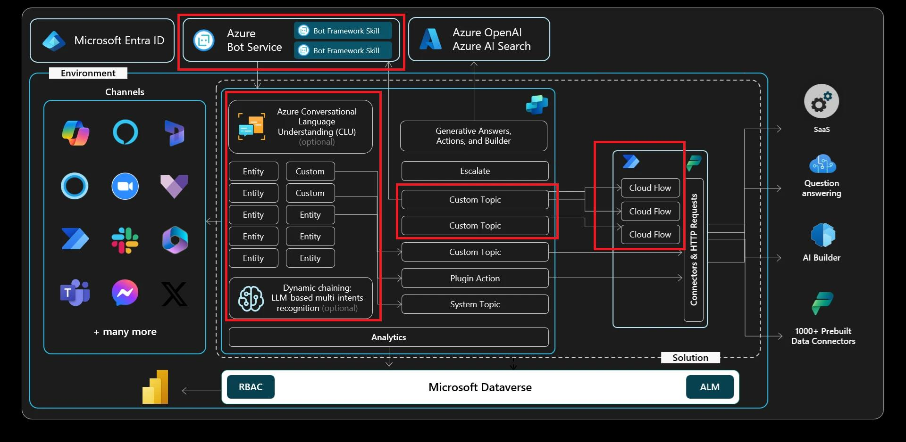

# 演習 03: エージェントから Power Automate クラウドフローを構築・呼び出す

## シナリオ
さらなる自動化と応答時間短縮のため、Contoso は Copilot エージェントを既存の業務ワークフローと統合します。

この演習では、Power Automate クラウドフローを使い、エージェントが Contoso のバックエンドシステムとシームレスに連携できるようにします。たとえば、顧客がサービス予約や機器の状況を問い合わせた際、エージェントがリアルタイムで正確なデータを自動取得し、運用効率と応答精度を向上させます。

## 目標
この演習では、新しいトピックを作成し、外部サービスから情報を取得するシンプルな Power Automate アクションを追加し、そのデータをユーザーに会話形式で表示します。

この演習を終えると、次のことができるようになります:

- Power Automate の基本を理解する
- Copilot Studio から Power Automate を使って他のデータソースに問い合わせ、取得したデータを会話で返す

## アーキテクチャ

## 基礎知識: Power Automate の理解

Power Automate は、業務ユーザーがアプリやサービスをまたいで時間のかかる業務タスクやプロセスを自動化するワークフローを簡単に構築できるクラウドサービスです。

Power Automate は Power Apps、Microsoft Dataverse、Dynamics 365、Office 365 などを含む強力で柔軟なビジネスアプリケーションプラットフォームの一部です。このプラットフォームにより、お客様やパートナー、ISV パートナーは自社や業界、職種、地域ごとに最適なソリューションを構築できます。

業務ユーザーは自分たちの業務ニーズに最も詳しいため、データやプロセスを簡単に分析・構成・効率化できます。プロ開発者は Azure Functions、App Services、Logic Apps などの Azure サービスを活用して自動化や分析、業務アプリを拡張できます。API コネクタやゲートウェイ、Microsoft Dataverse により、クラウドやオンプレミスの既存サービス・データも最大限活用できます。

Power Automate でできることの例:

   - 期限超過タスクの自動リマインダー送信
   - 業務データのシステム間スケジュール転送
   - 1000 以上のデータソースや公開 API への接続
   - Excel でのデータ計算などローカルPCのタスク自動化

繰り返しの手作業を自動化することで大幅な時間短縮が可能です。Power Automate の本質は「自動化」です。

Microsoft Copilot Studio は Power Automate と簡単に連携でき、ユーザー応答の変数を渡してさまざまなデータソースからデータを取得し、複雑な処理を行い、その結果を Copilot Studio に返してユーザーと共有できます。API 経由でアクセス可能なほぼすべてのデータソースを操作・取得できるのは Copilot Studio の大きな強みです。

また、Copilot Studio からトピックやプラグインアクション経由で Power Automate と同じコネクタや HTTP リクエスト、カスタムコネクタも直接利用できます。

この演習では Power Automate の詳細な入門は扱いませんが、外部データソースからデータを取得し、Copilot Studio の会話体験で活用する基本シナリオを紹介します。

Power Automate の詳細は [Microsoft Docs on Power Automate](https://learn.microsoft.com/ja-jp/power-automate/) や Power Apps の 'In a Day' 資料もご参照ください。

[次のページへ → 1. 新しいトピックの作成](0301.md)