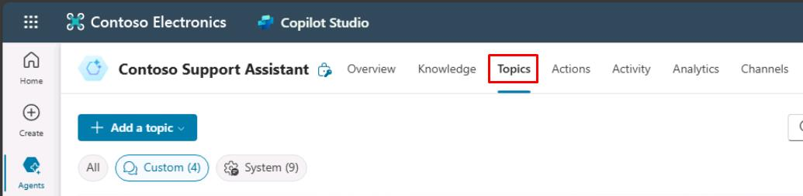

# タスク 01: 新しいトピックの作成

## はじめに

外部データソースを統合したら、Contoso, Inc. はカスタマーサービスエージェントの機能を強化し、エージェントが外部 API からリアルタイムデータを取得できるようにする必要があります。

## 説明

このタスクでは、エージェントが外部 API へ HTTP リクエストを送信して情報を取得できる新しいトピックを作成します。**HTTP Request** ノードの設定とレスポンスデータの解析を行います。

## 成功基準

- トリガーフレーズ付きの新しいトピックを作成できた
- **HTTP Request** ノードで外部 API からデータを取得できた
- レスポンスデータを解析し、ユーザーに表示できた

## 主なタスク

### 01: 新しいトピックの作成

<details markdown="block"> 
  <summary><strong>ソリューションを表示するにはこのセクションを展開</strong></summary> 

1. 上部バーの **Topics** を選択します。

	

1. **Add a topic** を選択し、**From blank** を選択します。

	

1. 左上の **Untitled** を選択し、トピック名を `Crypto Currency Price` に変更します。

1. **Trigger** ノードにユーザーが尋ねそうなフレーズを追加します:

	- `What's the current price of Bitcoin`
	- `Can you tell me the latest crypto prices`
	- `How much does Bitcoin cost now`
	- `What are the prices of digital currencies today`
	- `What's the latest on crypto prices`

	

1. 新しい **質問** ノードを追加し、次の内容を入力します:

	```
	What currency do you want to see the current price of Bitcoin in?
	```

1. **Multiple choice options** は **Identify** のままにします。

1. **Options for user** で **New option** を選択し、以下を個別に入力します:

	- `USD`
	- `EUR`
	- `GBP`

	

1. 追加した **USD** を選択し、**Edit synonyms** アイコンをクリックします。

	

1. **Add synonyms** で `dollars` を入力し、**Enter** または **+** ボタンを押し、下部の **Done** を選択します。

	

1. 他の通貨にも同様にシノニムを追加します:

    | 通貨 | シノニム |
    |------|----------|
    | **EUR** | `euros` |
    | **GBP** | `pounds` |

1. **Save response as** で **Var1** 変数を選択し、**Variable name** を `Currency` に変更します。

1. **質問** ノードの下で **+** ボタン → **Advanced** → **Send HTTP request** を選択します。

	

1. **HTTP Request** ノードの **URL** でシェブロン **(>)** → **Formula** タブで次の Power Fx 式を入力し、**Insert** を選択します。

	```
	Lower(Concatenate("https://api.gemini.com/v2/ticker/btc",Topic.Currency))
	```

	

	{: .note }
	> 入力された URL を小文字にし、ユーザーが選択した通貨を連結して API の URL を正しく生成します。

1. **Response data type** でドロップダウンから **From sample data** を選択します。

	{: .note }
	> API の JSON ペイロードのサンプル出力を指定し、ノードがレスポンスを解析できるようにします。

1. **Get schema from sample JSON** を選択します。

	

1. 以下のサンプルデータを貼り付け、**Confirm** を選択します。

	```json
	{
		"symbol": "BTCUSD",
		"open": "67781.09",
		"high": "68382.33",
		"low": "67293.74",
		"close": "67707.13",
		"changes": [
			"67882.6",
			"67781.09",
			"67805.66",
			"67744.15",
			"67651.01",
			"67863.46",
			"68053.16",
			"68080.11",
			"68186.09",
			"68109.26",
			"67914.8",
			"68079.54",
			"67455.47",
			"67468.58",
			"67712.98",
			"67662.82",
			"67771.15",
			"67680.26",
			"67799.25",
			"67736.21",
			"67653.87",
			"67698.36",
			"67832.24",
			"67707.13"
		],
		"bid": "67837.17",
		"ask": "67843.41"
	}
	```

	

1. **Save response as** で新しい変数を作成し、名前を `CryptoCurrentPrice` に変更します。

	

1. **HTTP Request** ノードの下に新しい **Message** ノードを追加します。

1. 新しい変数を使ってユーザーにビットコイン価格を伝えるメッセージを設定します:

	```
	The current bid price for Bitcoin in {Topic.Currency} is {Topic.CryptoCurrentPrice.bid}
	```

	

1. 価格のフォーマットを通貨記号やカンマ区切りで改善します。

1. 先ほど追加したメッセージの「**{Topic.CryptoCurrentPrice.bid}**」部分を削除します。

	

1. **Message** ノードで **fx** ボタンを選択し、次の式を入力して **Insert** を選択します。

	```json
	Switch(
		Text(Topic.Currency),
			"USD",
			Text(Value(Topic.CryptoCurrentPrice.bid),"$#,#.##"),
			"EUR",
			Text(Value(Topic.CryptoCurrentPrice.bid),"#,#.##€"),
			"GBP",
			Text(Value(Topic.CryptoCurrentPrice.bid),"£#,#.##")           
	)
	```

	

	

	{: .note }
	> 価格を通貨記号やカンマ区切りでフォーマットします。

1. **Message** ノードの下で **+** ボタン → **Topic management** → **Go to another topic** → **End of Conversation** を選択します。

	

1. 画面右上の **Save** でトピックを保存します。

1. **Test your agent** ペイン右上のリフレッシュアイコンで新しい会話を開始します。
 
1. 次のプロンプトでテストします:

	```
	What's the current bid price for Bitcoin in dollars?
	```

    

</details>

**HTTP Request** ノードで外部サービスからリアルタイムデータを取得し、ユーザーに提供できるようになりました！

## サマリー

演習 04 の完了おめでとうございます！

- Copilot Studio の **HTTP Request** ノードで HTTP API 呼び出しを作成した
- Power Fx で GET API コールを構築した
- Copilot Studio で動的データをユーザーに表示した

[次のページへ → 演習 04: API へ HTTP リクエストを送信する](../Ex05/Ex05.md)