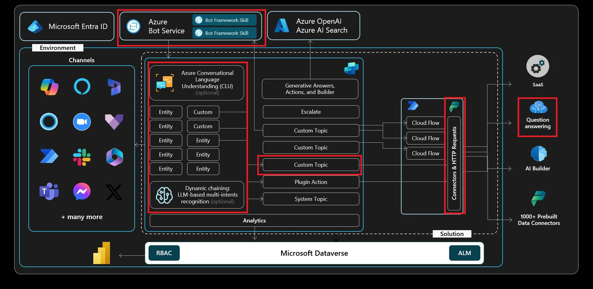

# 演習 04: API へ HTTP リクエストを送信する
 
## シナリオ

Contoso のサポートエンジニアは、社内システムに保存されていないライブ情報（例: 株価や外部サービスの指標）が必要になることがよくあります。顧客にほぼリアルタイムの回答を提供するため、Copilot エージェントは外部 REST API を直接呼び出し、その結果をチャットで表示できる必要があります。この演習では、HTTP GET リクエストを発行し、JSON レスポンスを解析し、ユーザーに分かりやすいメッセージでデータを提示するトピックの構築方法を学びます。

## 目標

この演習では、新しいトピックを作成し、外部サービスから情報を取得するシンプルな **HTTP Request** ノードアクションを追加し、そのデータをユーザーに表示します。

この演習を終えると、次のことができるようになります:

- **HTTP Request** ノードの基本を理解する
- Copilot Studio で **HTTP Request** ノードを使い、他のデータソースに問い合わせてデータを会話で返す

## アーキテクチャ

## 所要時間

目安時間: 20分

[次のページへ → 1. 新しいトピックの作成](0402.md)