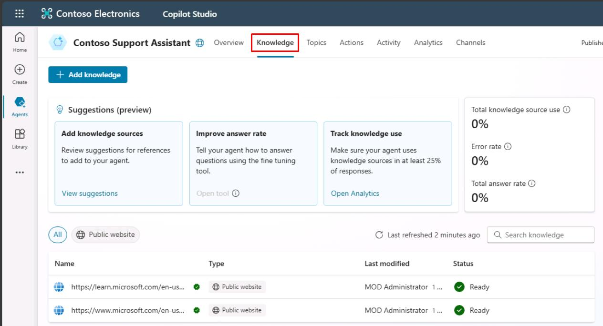
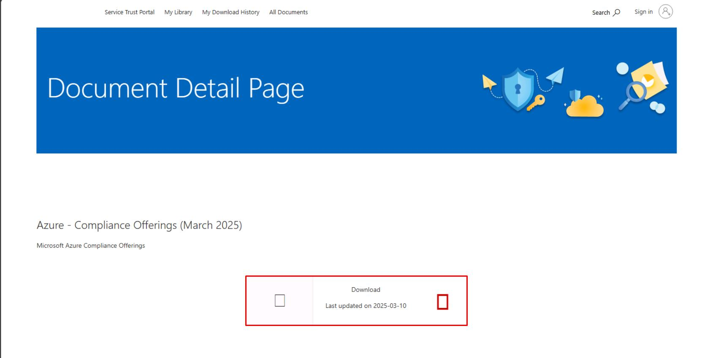

# タスク 01: ファイルのナレッジソースを構成する

## はじめに

Contoso, Inc. は、顧客サービスエージェントを強化するために、さまざまなナレッジソースを統合し、顧客に正確かつタイムリーな情報を提供する必要があります。このタスクでは、ファイルのナレッジソースの構成方法を説明します。

## 説明

このタスクでは、Microsoft Copilot Studio に PDF ファイルをアップロードし、エージェントのナレッジソースとして構成します。これにより、エージェントはファイルから情報を取得し、顧客の質問に関連する回答を提供できるようになります。

## 成功基準

- ファイルを正常にアップロードし、ナレッジソースとして構成できた。
- エージェントがファイルにアクセスし、情報を取得できることを確認した。
- 関連する質問をしてナレッジソースをテストした。

## 主な作業

### 01: ファイルのナレッジソースを構成する

  
<strong>解答を表示するにはこのセクションを展開してください</strong>

{: .warning }
> ラボの最初に .zip ファイルを使って事前構築済み Copilot ソリューションをインポートした場合は、ここから手順を進めてください。

1. 上部バーの **ナレッジ** を選択します。

	

	{: .note }
	> 作成時にナレッジソースとして追加されたウェブサイトが表示されます。
	>
	> - **[https://learn.microsoft.com/ja-jp/microsoft-copilot-studio/](https://learn.microsoft.com/ja-jp/microsoft-copilot-studio/)**
	> - **[https://www.microsoft.com/ja-jp/microsoft-copilot/](https://www.microsoft.com/ja-jp/microsoft-copilot/)**

1. 新しいタブを開き、`https://servicetrust.microsoft.com/DocumentPage/7adf2d9e-d7b5-4e71-bad8-713e6a183cf3` にアクセスします。

1. **ダウンロード** を選択します。

	

1. Copilot Studio のタブに戻ります。

[次のページへ進む → 2. ウェブサイトのナレッジソースを構成する](0502.md)
