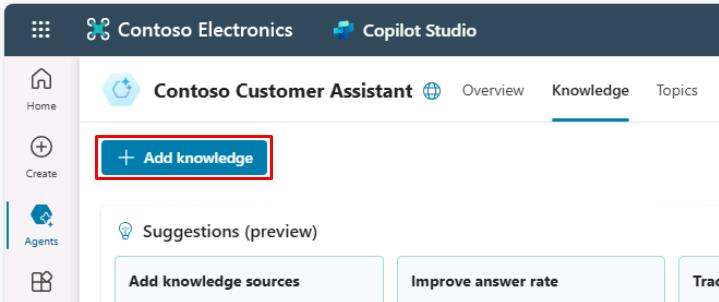
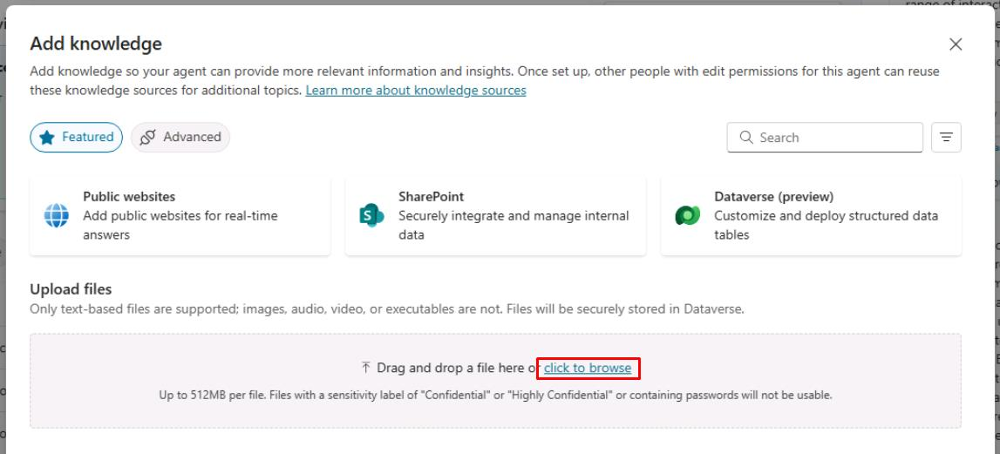
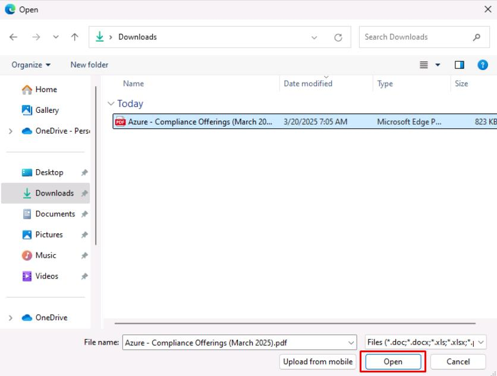
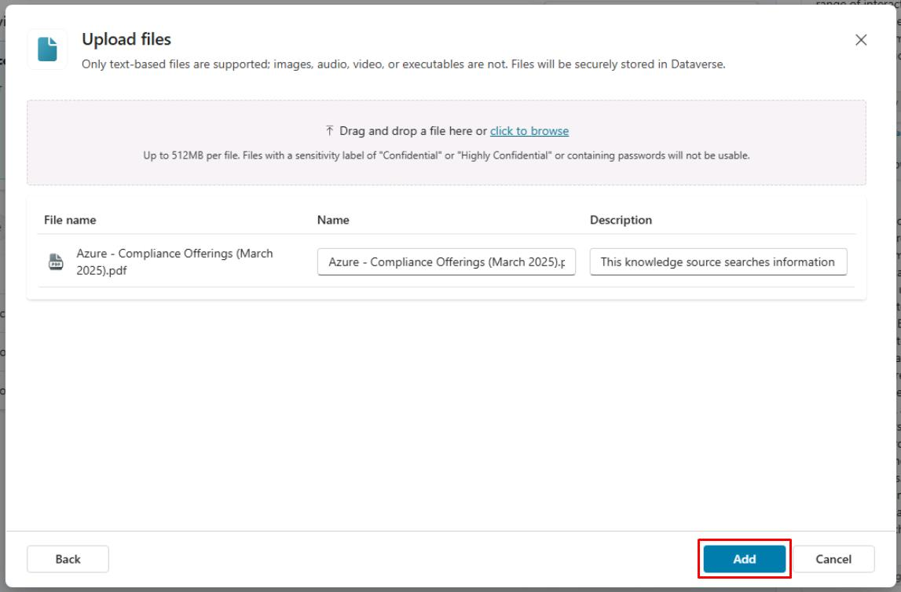

# タスク 01: ファイルナレッジソースの構成

## はじめに

Contoso, Inc. は、さまざまなナレッジソースを統合して顧客サービスエージェントの情報精度と即応性を高める必要があります。このタスクでは、ファイルナレッジソースの構成方法を説明します。

## 説明

このタスクでは、PDFファイルを Microsoft Copilot Studio にアップロードし、エージェントのナレッジソースとして設定します。これにより、エージェントはファイルから情報を取得し、顧客の質問に関連する回答を提供できるようになります。

## 成功基準

- ファイルをアップロードし、ナレッジソースとして構成できた
- エージェントがファイルから情報を取得できることを確認できた
- 関連する質問でナレッジソースをテストできた

## 主なタスク

### 01: ファイルナレッジソースの構成

 
  
<strong>ソリューションを表示するにはこのセクションを展開</strong>
 

> [!WARNING]
> ラボ冒頭で .zip ファイルを使って事前構築済み Copilot ソリューションをインポートした場合は、ここから手順に従ってください。

1. 上部バーの **Knowledge** を選択します。

	

> [!NOTE]
> 作成時に追加されたWebサイトがナレッジソースとして表示されます。
>
> - **[https://learn.microsoft.com/ja-jp/microsoft-copilot-studio/](https://learn.microsoft.com/ja-jp/microsoft-copilot-studio/)**
> - **[https://www.microsoft.com/ja-jp/microsoft-copilot/](https://www.microsoft.com/ja-jp/microsoft-copilot/)**

1. 新しいタブで `https://servicetrust.microsoft.com/DocumentPage/7adf2d9e-d7b5-4e71-bad8-713e6a183cf3` にアクセスします。

1. **Download** を選択します。

	

1. Copilot Studio のタブに戻ります。

1. ウィンドウの左上隅にある **Add knowledge** を選択します。

	

1. **Upload files** の下にある **click to browse** を選択します。

	

1. **Downloads** フォルダーに移動し、**Azure - Compliance Offerings** PDF を選択して、**Open** を選択します。

	

1. パネルの右下隅にある **Add** を選択します。

	

[次のページへ → 2. SharePoint ナレッジソースの構成](0502.md)