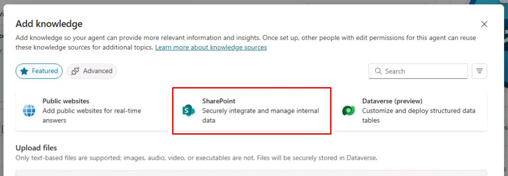
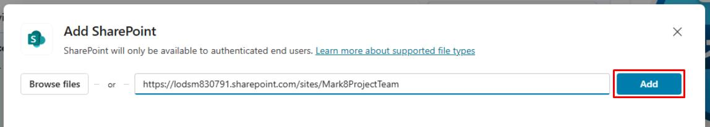
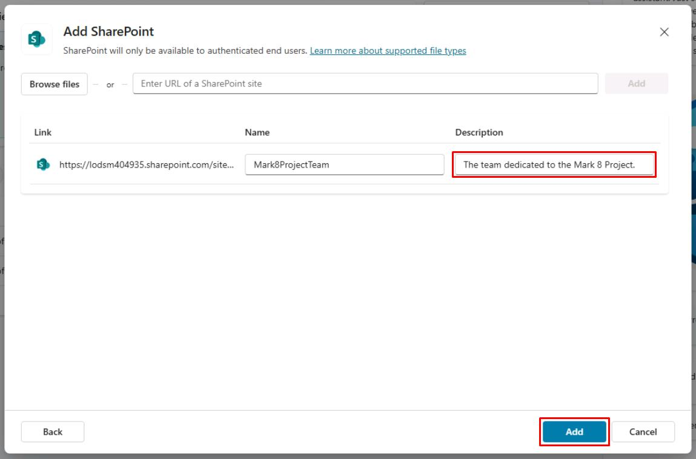

# タスク 02: SharePoint ナレッジソースの構成

## はじめに

ファイルナレッジソースの構成後、SharePoint をナレッジソースとして統合することで、エージェントの情報提供力をさらに高めることができます。

## 説明

このタスクでは、SharePoint ナレッジソースを構成し、エージェントが SharePoint サイトから情報を取得できるようにします。SharePoint の URL 設定やアクセス権限の構成を行います。

## 成功基準

- 正しい URL とアクセス権限で SharePoint ナレッジソースを構成できた
- エージェントが SharePoint サイトから情報を取得できることを確認できた
- 関連する質問でナレッジソースをテストできた

## 主なタスク

### 01: SharePoint ナレッジソースの構成

1. 画面左上の **Add knowledge** を選択します。

1. **SharePoint** を選択します。

	

1. テキストボックスに次の URL を入力し、**Add** を選択します。

	```
    https://@lab.CloudCredential(WWLM365Enterprise201920SStakeholderKimFrank).TenantPrefix.sharepoint.com/sites/Mark8ProjectTeam
    ```

	 

1. **Description** フィールドに `The team dedicated to the Mark 8 Project.` と入力し、右下の **Add** を選択します。

	

[次のページへ → 3. Dataverse ナレッジソースの構成](0503.md)