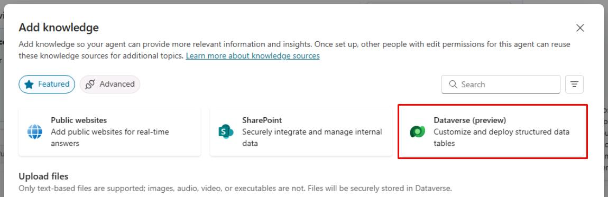
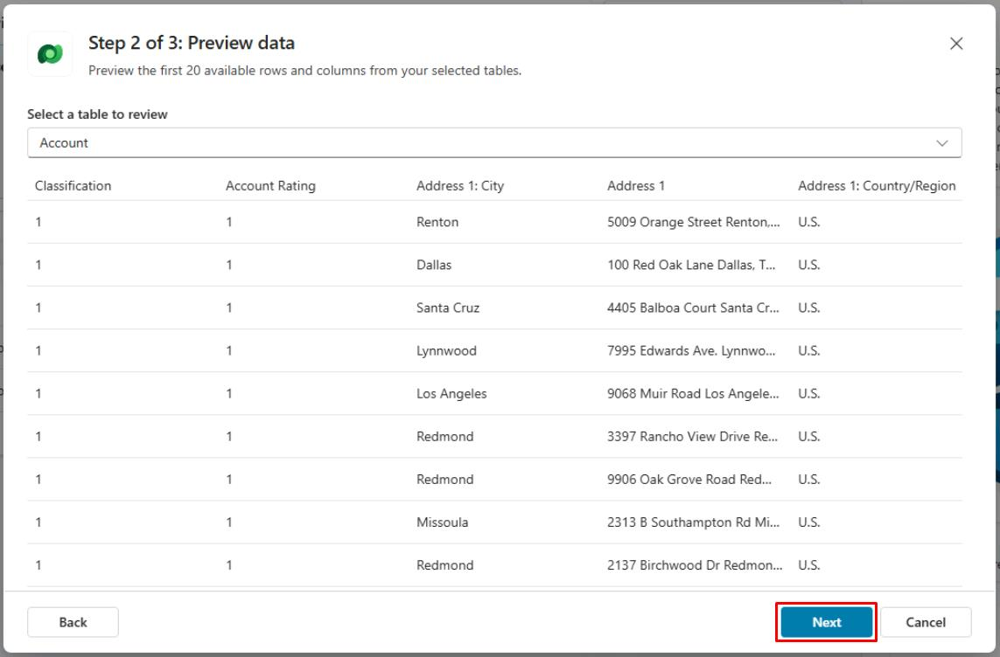
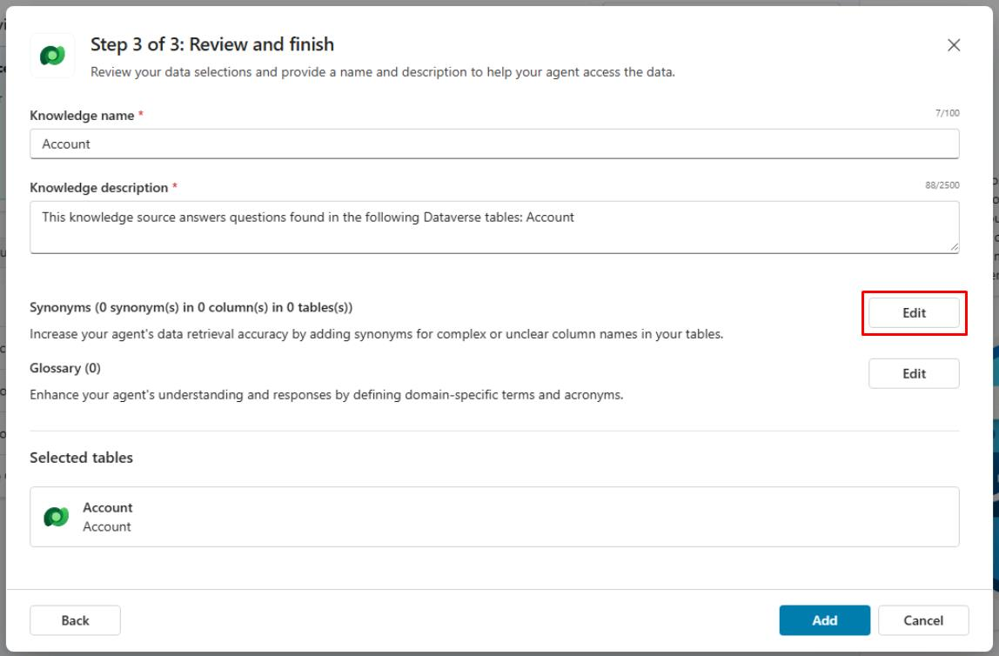
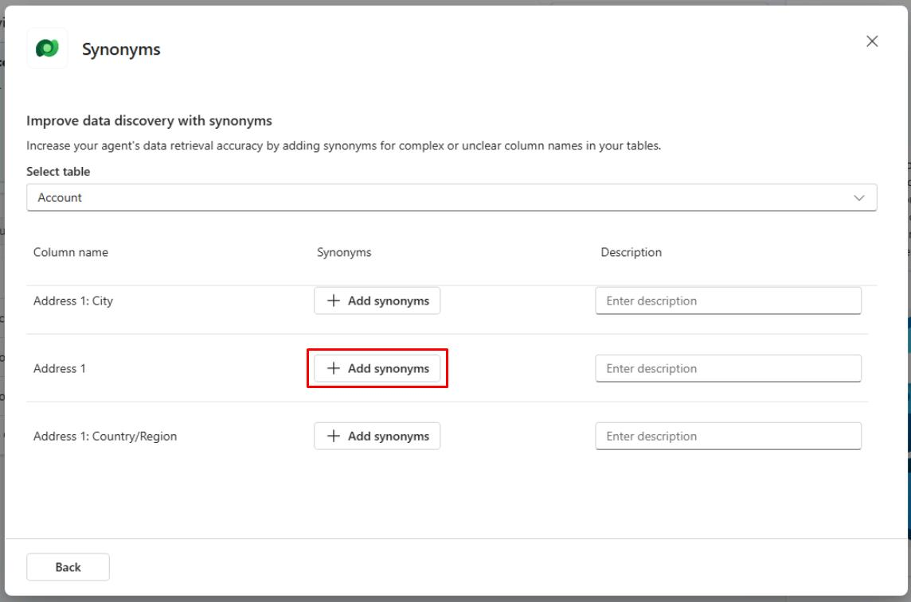
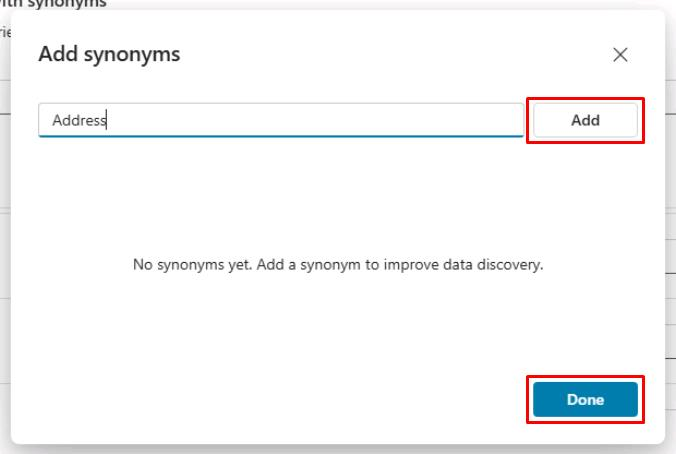
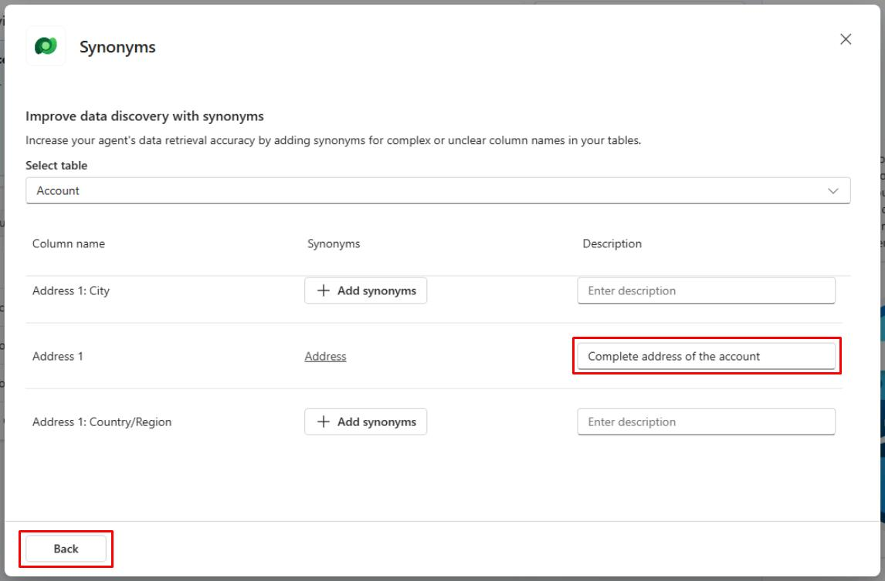
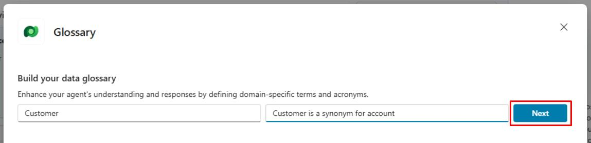
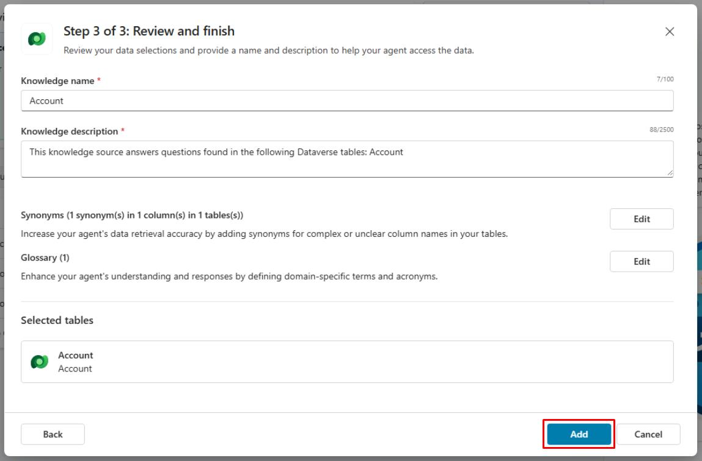
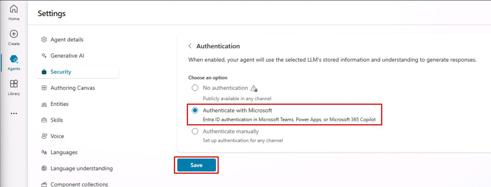
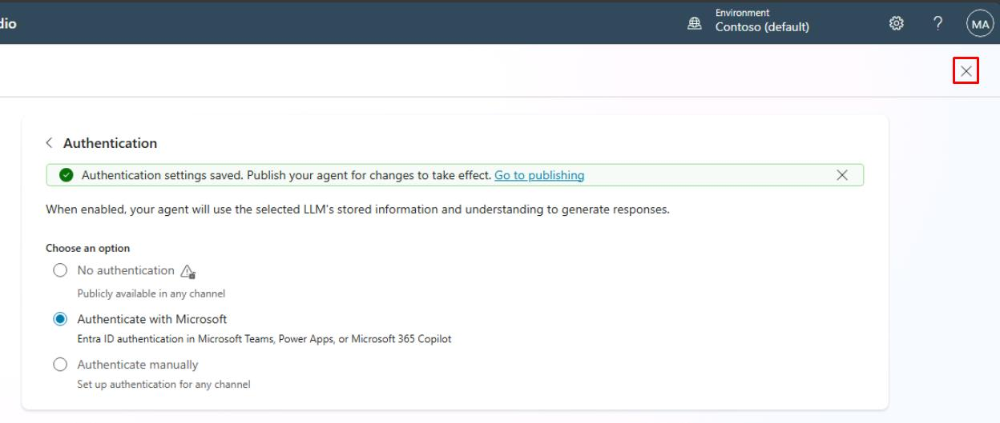

# タスク 03: Dataverse ナレッジソースの構成

## はじめに

SharePoint ナレッジソースの構成が完了したら、次に Dataverse ナレッジソースを構成し、Contoso のエージェントが Dataverse の構造化データへアクセスし、顧客に詳細な情報を提供できるようにします。

## 説明

このタスクでは、Dataverse ナレッジソースをセットアップし、エージェントが Dataverse テーブルから情報を取得できるようにします。Dataverse への接続を確立し、必要なテーブルを構成します。

## 成功基準

-   正しい接続とテーブルで Dataverse ナレッジソースを構成できた。
-   エージェントが Dataverse テーブルから情報を取得できることを確認した。
-   関連する質問をしてナレッジソースをテストした。

## 主な作業

### 01: Dataverse ナレッジソースの構成

 
  
<strong>解答を表示するにはこのセクションを展開してください</strong>
 

Dataverse ナレッジソースを使うと、Dataverse テーブルに保存された構造化データに対して自然言語クエリを実行できます。

1. 画面左上の **Add knowledge** を選択します。

1. **Dataverse** を選択します。

	

1. **Available tables** で **Account** を選択し、画面右下の **Next** を選択します。

1. **Preview data** ステップで **Next** を選択します。

	

1. **Synonyms** の右側にある **Edit** を選択します。テーブルの特定属性に関する質問の理解を向上させます。

	

1. **Address 1** の行を見つけ、**Add synonyms** を選択します。

	

1. `Address` と入力し、**Add** を選択してから **Done** を選択します。

	

1. **Description** フィールドに `Complete address of the account` と入力します。

1. 画面左下の **Back** を選択します。

    

1. **Review and finish** ステップに戻り、**Glossary** の横にある **Edit** を選択します。

1. 以下を入力します:

	| 項目 | 値 |
    |----------|----------------------|
    | **用語を入力** | `Customer` |
    | **説明を入力** | `Customer は account の同義語です` |

1. **Next** を選択します。

	

> [!NOTE]
> これにより、アカウントに関するユーザーの質問の理解が向上します。

1. 画面左下の **Back** を選択します。

1. **Review and finish** ステップに戻り、画面右下の **Add** を選択します。

	

1. **Dataverse** は内部データソースのため、エンドユーザーはサインインが必要です。

	画面右上の **Settings** を選択します。

	
	
1. 左側の設定メニューで **Security** を選択します。

1. **Authentication** を選択し、**Authenticate with Microsoft** を選択して **Save** をクリックします。

	

> [!IMPORTANT]
> このデータソースは認証が必要です。検索は接続されたエンドユーザーのコンテキストで実行され、ユーザーが少なくとも読み取り権限を持つレコードのみが返され要約されます。

1. ダイアログで **Save** を選択します。

1. 保存が完了したら、Settings ページ右上の **X** を選択してナレッジソース一覧に戻ります。

	

---

[次のページへ → 0504.md](0504.md)