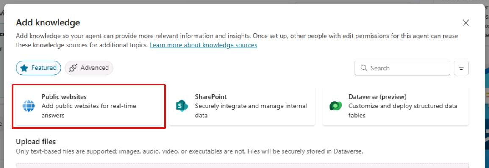
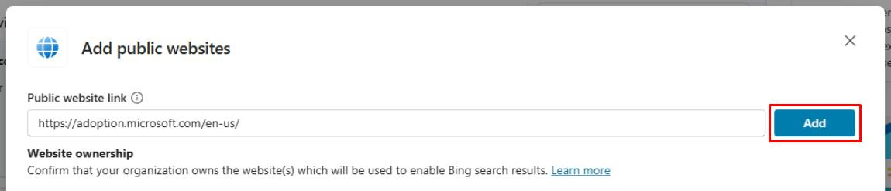
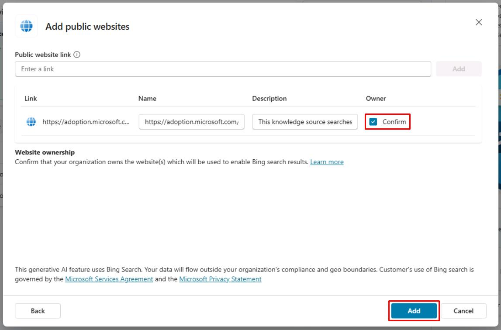

# タスク 04: Web サイト ナレッジソースの構成

## はじめに

Contoso の顧客に追加情報を提供するため、Web サイトをナレッジソースとして統合できます。

## 説明

このタスクでは、Web サイト ナレッジソースを構成し、エージェントが指定した Web サイトから情報を取得できるようにします。Web サイトの URL を設定し、アクセス権限を構成します。

## 成功基準

-   正しい URL とアクセス権限で Web サイト ナレッジソースを構成できた。

## 主な作業

### 01: Web サイト ナレッジソースの構成

 
  
<strong>解答を表示するにはこのセクションを展開してください</strong>
 

1. 画面左上の **Add knowledge** を再度選択します。

1. **Public websites** を選択します。

	

1. `https://adoption.microsoft.com/en-us/` を入力し、**Add** を選択します。

	

1. **Owner** 列の下にある **Confirm** チェックボックスをオンにし、画面右下の **Add** を選択します。

	

	[!IMPORTANT]
	> 各ナレッジソースには、返せる内容を明確に記載した意味のある名前と説明を付けてください。

---

[!IMPORTANT]
> **プロのヒント**:  
>  - デフォルトの組み込み自然言語理解モデルを使用する場合、ナレッジソースは **Create generative answers** ノードから呼び出されます。デフォルトでは、トピックに一致しないユーザー文は **Conversational boosting** トピックに送られ、ここに **Generative answers** ノードが事前構成されています。  
>  - ジェネレーティブ AI オーケストレーションが有効な場合、大規模言語モデルは各ナレッジソースの説明を参照し、どのデータソースを使うか判断します。
 
 

---

[次のページへ → 0505.md](0505.md)