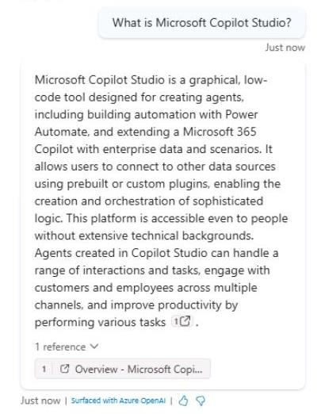

# タスク 05: Web サイト ナレッジソースのテスト

## はじめに

Contoso, Inc. は、カスタマーサービスエージェントが構成済みのナレッジソースを効果的に活用し、顧客に正確かつ迅速な情報を提供できることを確認する必要があります。ここでは、Web サイト ナレッジソースのテストを行います。

## 説明

このタスクでは、Microsoft Copilot Studio で構成した Web サイト ナレッジソースをテストし、エージェントが情報を取得し、顧客の質問に適切な回答を提供できるかを検証します。

## 成功基準

-   Microsoft Copilot Studio で Web サイト ナレッジソースのテストに成功した。
-   エージェントが Web サイト ナレッジソースから情報を取得し、適切な回答を提供できることを確認した。
-   エージェントが提供する情報の正確性と関連性を確認した。

## 主な作業

### 01: Web サイト ナレッジソースのテスト

<details markdown="block"> 
  <summary><strong>解答を表示するにはこのセクションを展開してください</strong></summary> 

1. **Test your agent** ペイン右上のリフレッシュアイコンを選択し、新しい会話を開始します。

1. 既存のトピックに一致しない質問をして、**Conversational boosting** トピックをトリガーします:

	```
	Microsoft Copilot Studio とは何ですか？
	```

    

	{: .note }
	> 回答の根拠となる引用が表示され、どのソースが使われたかのリンクがあることに注目してください。

1. 続けてフォローアップの質問をします:

	```
	ビジネス環境でどのように使われていますか？
	```

    {: .note }
	> フォローアップの質問に特定の製品名が含まれていなくても、ジェネレーティブな回答は文脈を維持し、前のメッセージに関連付けて解釈されます。

	{: .note }
	> 他の追加ナレッジソースのテストは後ほど行います。準備に時間がかかる場合があります。
 
</details>

## カスタム命令

プロンプトの修正により、ジェネレーティブな回答やナレッジソースの機能を拡張できます。カスタム命令を使う際は、プロンプトエンジニアリングのベストプラクティスに従うことが重要です。

以下は、この機能を最大限に活用するためのヒントです:

- **具体的に** - カスタム命令は明確かつ具体的に記述し、エージェントが何をすべきか正確に伝えましょう。曖昧な表現は混乱や誤った応答につながります。

- **例を使う** - 命令の例を示すことで、エージェントが期待を理解しやすくなります。例は正確で関連性の高い応答を生成する助けになります。

- **シンプルに** - 複雑なロジックや詳細を詰め込みすぎず、シンプルで分かりやすい命令にしましょう。

- **「できない場合」の指示も** - エージェントがタスクを完了できない場合の代替パスを用意しましょう。たとえば「答えが見つからない場合は 'not found' と返答する」などです。これにより誤った回答を避けられます。

- **テストと改善** - カスタム命令が意図通りに動作するか十分にテストし、必要に応じて調整して精度と有効性を高めましょう。

---

[次のページへ → 0506.md](0506.md)
