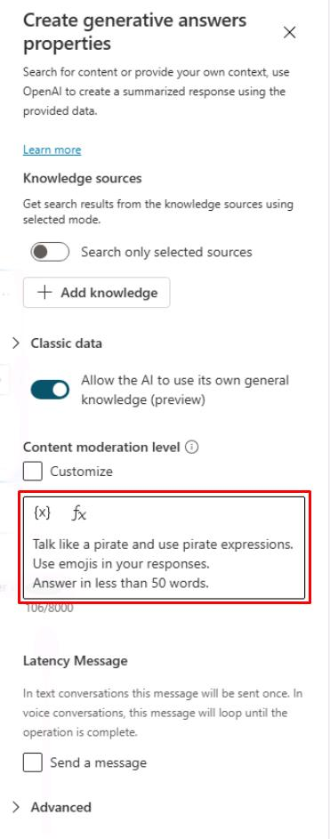
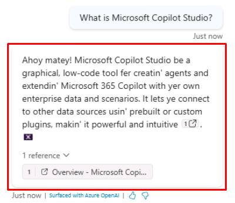

# タスク 06: クラシック オーケストレーション用カスタム命令の構成

## はじめに

Contoso のカスタマーサービスエージェントの動作を、ビジネス要件や顧客の期待により適合させるため、クラシック オーケストレーション用のカスタム命令を構成します。

## 説明

このタスクでは、Microsoft Copilot Studio でカスタマーサービスエージェントのカスタム命令を構成し、特定の要件に基づいて応答や動作を変更できるようにします。

## 成功基準

-   Microsoft Copilot Studio でカスタム命令を正しく構成できた。
-   エージェントの応答や動作が指定した要件に沿っていることを確認した。

## 主な作業

### 01: クラシック オーケストレーション用カスタム命令の構成

<details markdown="block"> 
  <summary><strong>解答を表示するにはこのセクションを展開してください</strong></summary> 

**Classic** オーケストレーションがインテント認識に有効な場合、命令は通常 **Conversational boosting** システムトピックの **Create generative answers** ノードレベルで設定します（このノードはどこにでも追加可能です）。

1. 上部バーの **Topics** を選択します。

1. 左上付近の **System** トピックフィルターを選択し、**Conversational boosting** トピックを選択します。

	

1. **Create generative answers** ノードで、右上の省略記号を選択し、**Properties** を選択します。

	

1. **Content moderation level** 下のテキストボックスに、次の内容を入力します:

	```
	海賊のように話し、海賊用語を使ってください。
	回答に絵文字を使ってください。
	50語以内で答えてください。
	```

    

1. 画面右上の **Save** を選択してトピックを保存します。

1. **Test your agent** ペイン右上のリフレッシュアイコンを選択し、新しい会話を開始します。

1. 既存のトピックに一致しない質問でテストします。

	`Microsoft Copilot Studio とは？`

	

</details>

---

[次のページへ → 0507.md](0507.md)