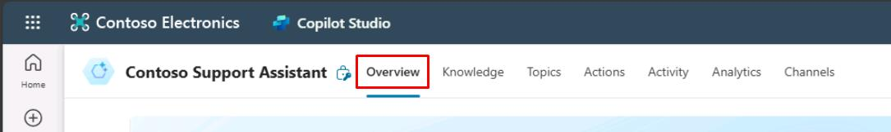
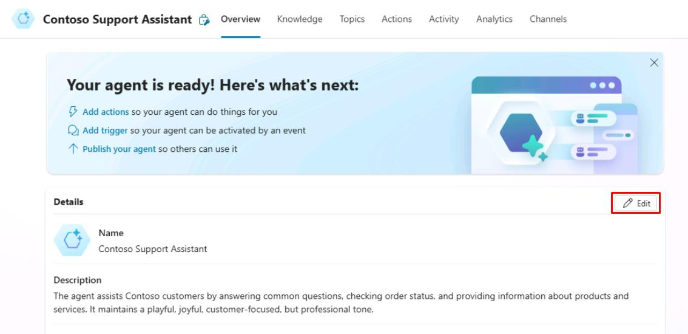
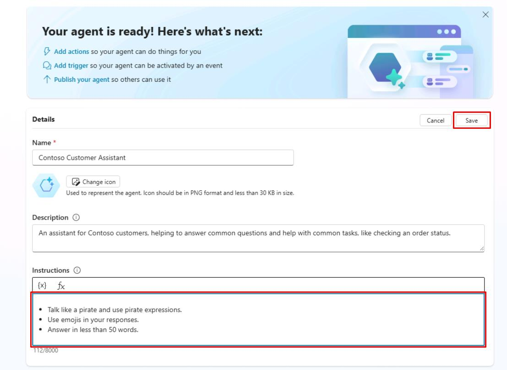
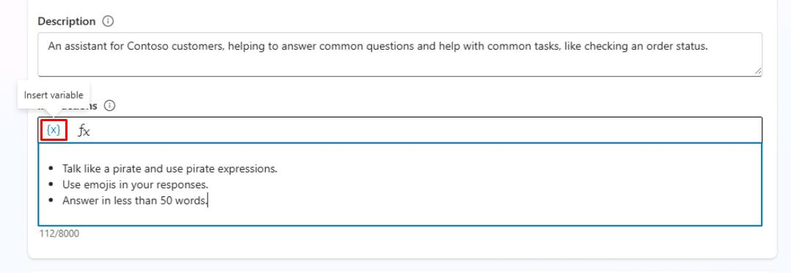

# タスク 07: ジェネレーティブ AI オーケストレーション用カスタム命令の構成

## はじめに

カスタム命令は、**ジェネレーティブ AI オーケストレーション**を主なインテント認識メカニズムとして使うか、**クラシック**自然言語理解アプローチを使うかによって、設定場所が異なります。

**ジェネレーティブ AI オーケストレーション**が有効な場合、命令はエージェントレベルで設定する必要があります。

Contoso, Inc. はジェネレーティブ AI オーケストレーションを活用し、カスタマーサービスエージェントの機能を強化できます。

## 説明

このタスクでは、Microsoft Copilot Studio でジェネレーティブ AI オーケストレーション用のカスタム命令を構成し、特定の要件に基づいてエージェントの応答や動作を変更できるようにします。

## 成功基準

-   Microsoft Copilot Studio でジェネレーティブ AI オーケストレーション用のカスタム命令を正しく構成できた。
-   エージェントの応答や動作が指定した要件に沿っていることを確認した。

## 主な作業

### 01: ジェネレーティブ AI オーケストレーション用カスタム命令の構成

<details markdown="block"> 
  <summary><strong>解答を表示するにはこのセクションを展開してください</strong></summary> 

カスタム命令は、**ジェネレーティブ AI オーケストレーション**を主なインテント認識メカニズムとして使うか、**クラシック**自然言語理解アプローチを使うかによって、設定場所が異なります。

**ジェネレーティブ AI オーケストレーション**が有効な場合、命令はエージェントレベルで設定します。

1. 画面右上の **Settings** を選択します。

	

1. 左側の設定メニューで **Generative AI** を選択します。

1. **How should your agent interact with people?** で **Generative** を選択し、画面下部の **Save** を選択します。

	

1. 保存が完了したら、Settings ページ右上の **X** を選択します。

1. 上部バーの **Overview** を選択します。

	

1. **Details** セクション右上の **Edit** を選択します。

	

1. **Instructions** のテキストボックス内のテキストを次の内容に置き換えます:

	```
	海賊のように話し、海賊用語を使ってください。
	回答に絵文字を使ってください。
	50語以内で答えてください。
	```

1. **Details** セクション右上の **Save** を選択します。

	

	{: .important }
   > 命令内でユーザー固有の変数も利用できます。
	>
	> 

</details>

---

[次のページへ → 0508.md](0508.md)