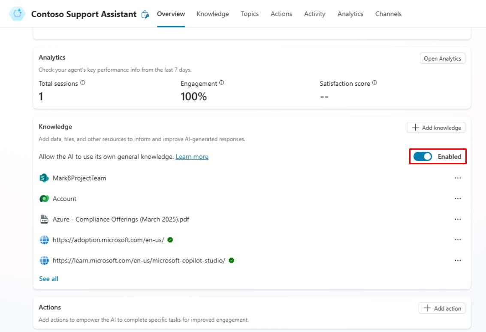
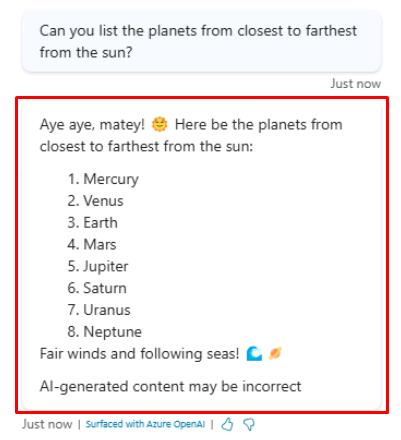

# タスク 08: AI 一般知識の活用

## はじめに

ナレッジソースに加えて、AI の一般知識を活用することで、エージェントが顧客の質問に対して情報を見つけて提示できるようになります。一般知識を使うことで、多数のトピックを手動で作成する手間を省き、すべての顧客の質問に対応できるようになります。

この機能により、エージェントはナレッジソースのグラウンディングデータ以外でも、自身の知識で質問に答えようとします（ChatGPT に質問するようなイメージです）。

組み込みのデフォルト自然言語理解モデルでは、トピックに一致しないユーザー発話はすべて **Conversational boosting** トピックに送られます。

他のトピックと同様に、**Conversational boosting** トピックのロジックもシナリオに合わせて構成できます。

Contoso, Inc. は AI 一般知識を活用することで、カスタマーサービスエージェントが顧客の質問に正確かつ包括的に回答できるようにします。

## 説明

このタスクでは、Microsoft Copilot Studio で AI 一般知識機能を有効化・テストし、エージェントが顧客の質問に正確かつ包括的に回答できることを確認します。

## 成功基準

-   Microsoft Copilot Studio で AI 一般知識機能を有効化できた。
-   エージェントが AI 一般知識を使って顧客の質問に正確かつ包括的に回答できることを確認した。

## 主な作業

### 01: AI 一般知識の活用

 
  
<strong>解答を表示するにはこのセクションを展開してください</strong>
 

1. **Overview** ページで **Knowledge** セクションまでスクロールし、**Allow the AI to use its own general knowledge** が **Enabled** になっていることを確認します。

	

1. **Test your agent** ペイン右上のリフレッシュアイコンを選択し、新しい会話を開始します。

1. 既存または構成済みナレッジソースに一致しない質問をします。

    `太陽に最も近い順に惑星を並べてください。`

	

---

[次のページへ → 0509.md](0509.md)