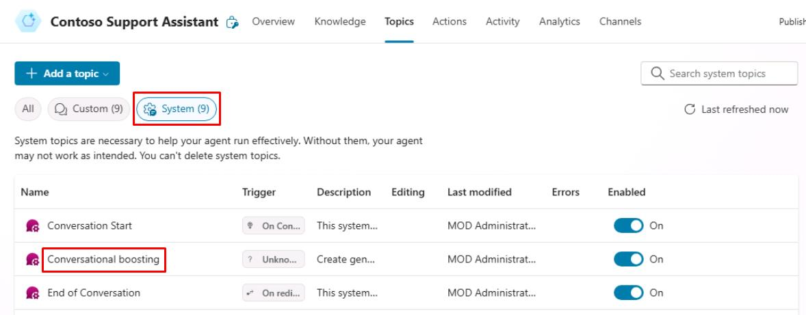
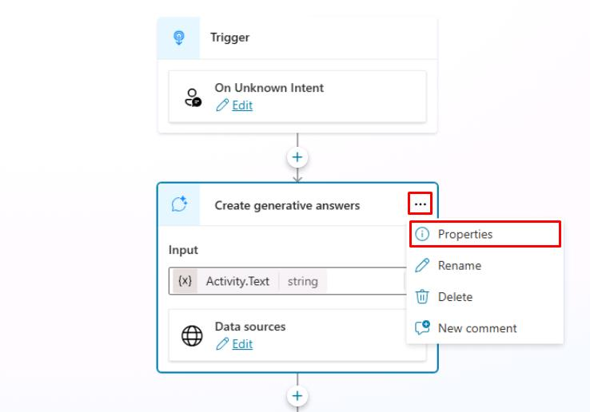
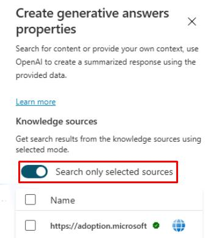
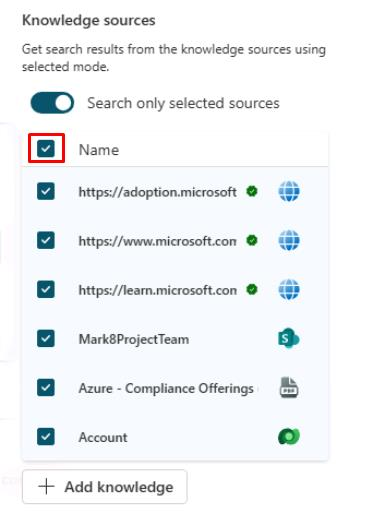
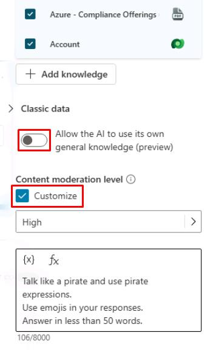
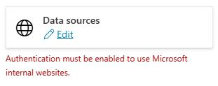

# タスク 09: ジェネレーティブ回答ノードの確認

## はじめに

Contoso, Inc. は、カスタマーサービスエージェントが **ジェネレーティブ回答** ノードを効果的に活用し、顧客に正確かつ迅速な情報を提供できることを確認する必要があります。

## 説明

このタスクでは、Microsoft Copilot Studio の **ジェネレーティブ回答** ノードを確認し、エージェントが情報を取得し、顧客の質問に適切な回答を提供できることを検証します。

## 成功基準

-   Microsoft Copilot Studio で **ジェネレーティブ回答** ノードを正しく確認できた。
-   エージェントが **ジェネレーティブ回答** ノードから情報を取得し、適切な回答を提供できることを確認した。

## 主な作業

### 01: ジェネレーティブ回答ノードの確認

 
  
<strong>解答を表示するにはこのセクションを展開してください</strong>
 

1. 上部バーの **Topics** を選択します。

1. 左上付近の **System** トピックフィルターを選択し、**Conversational boosting** トピックを選択します。

    

1. **Create generative answers** ノードで、右上の省略記号を選択し、**Properties** を選択します。

    

1. **Knowledge sources** で **Search only selected sources** のトグルをオンにします。

    

    [!NOTE]
    > これを選択すると、そのノードに入ったときに使用するナレッジソースを個別に選択できます。

1. **Name** ヘッダー横のチェックボックスで、すべてのナレッジソースを選択します。

      

1. **Classic data** で **Allow the AI to use its own general knowledge** をオフにします。

1. **Content moderation level** で **Customize** チェックボックスをオンにします。

    

    [!IMPORTANT]
    > **Content moderation** 設定は、グラウンディングデータの誤解釈や過剰解釈による誤答（ハルシネーション）を防ぐための制御レベルです。

1. 画面右上の **Save** を選択してトピックを保存します。

    [!WARNING]
    > **Data sources** の認証エラーは、このラボのテストには影響しないため無視してください。
    >
    > 

---

[次のページへ → 0510.md](0510.md)