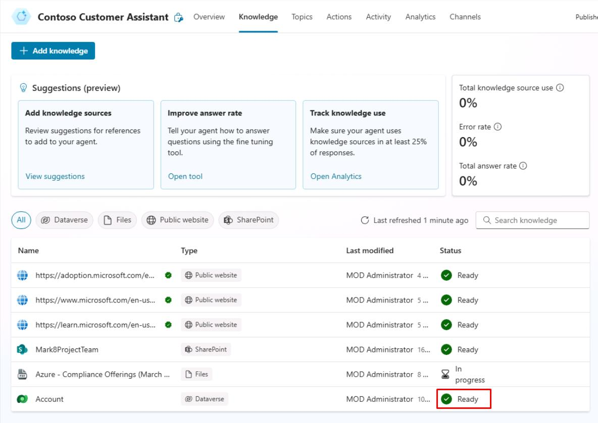
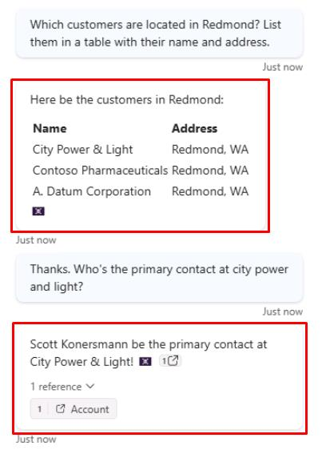

# タスク 10: Dataverse ナレッジソースのテスト

## はじめに

ここでは、Contoso のカスタマーサービスエージェントが Dataverse ナレッジソースを効果的に活用し、正確な情報を提供できることを確認します。

## 説明

このタスクでは、Microsoft Copilot Studio で構成した Dataverse ナレッジソースをテストし、エージェントが構造化データを取得し、適切な回答を提供できることを検証します。

## 成功基準

-   Microsoft Copilot Studio で Dataverse ナレッジソースのテストに成功した。
-   エージェントが Dataverse ナレッジソースから構造化データを取得し、適切な回答を提供できることを確認した。

## 主な作業

### 01: Dataverse ナレッジソースのテスト

 
  
<strong>解答を表示するにはこのセクションを展開してください</strong>
 

1. 上部バーの **Knowledge** を選択します。

1. **Dataverse** の **Status** が **Ready** になっていることを確認します。

	

1. **Test your agent** ペイン右上のリフレッシュアイコンを選択し、新しい会話を開始します。

1. テーブル内のアカウントについて、次のように質問します:

	`Redmond に所在する顧客は誰ですか？名前と住所を表で一覧にしてください。`

1. 続けてフォローアップの質問をします:

    `ありがとう。city power and light の主担当者は誰ですか？`

	

    

---

[次のページへ → 0511.md](0511.md)