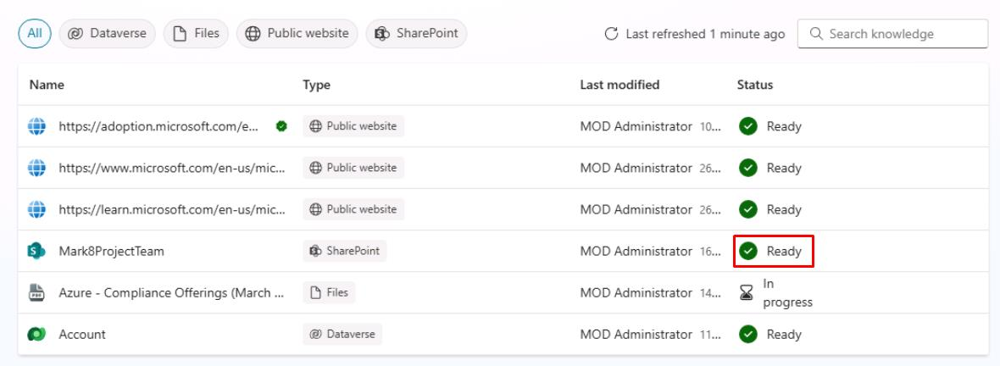
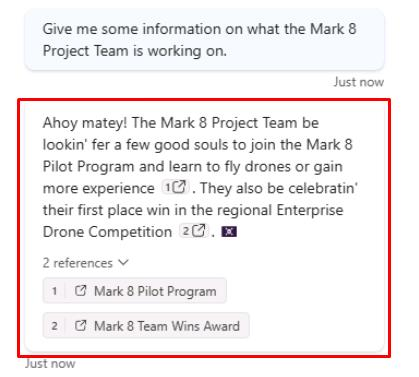

# タスク 11: SharePoint ナレッジソースのテスト

## はじめに

Contoso, Inc. は、カスタマーサービスエージェントが SharePoint ナレッジソースを利用できることも確認する必要があります。

## 説明

このタスクでは、Microsoft Copilot Studio で構成した SharePoint ナレッジソースをテストし、エージェントが情報を取得し、適切な回答を提供できることを検証します。

## 成功基準

-   Microsoft Copilot Studio で SharePoint ナレッジソースのテストに成功した。
-   エージェントが SharePoint ナレッジソースから情報を取得し、適切な回答を提供できることを確認した。

## 主な作業

### 01: SharePoint ナレッジソースのテスト

 
  
<strong>解答を表示するにはこのセクションを展開してください</strong>
 

1. 上部バーの **Knowledge** を選択します。

	

> [!NOTE]
> **Status** が **Ready** になっていても、SharePoint ナレッジソースの全コンテンツのインデックス作成には時間がかかる場合があります。このテストには影響しませんので、何らかのコンテンツが取得できることだけを確認します。

1. **Test your agent** ペイン右上のリフレッシュアイコンを選択し、新しい会話を開始します。

1. SharePoint サイトに関連する質問をします:

	`Mark 8 Project Team が取り組んでいる内容について教えてください。`

	

---

[次のページへ → 0512.md](0512.md)