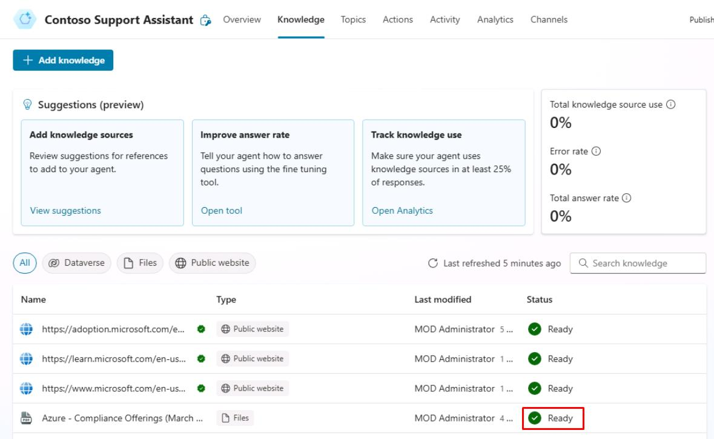
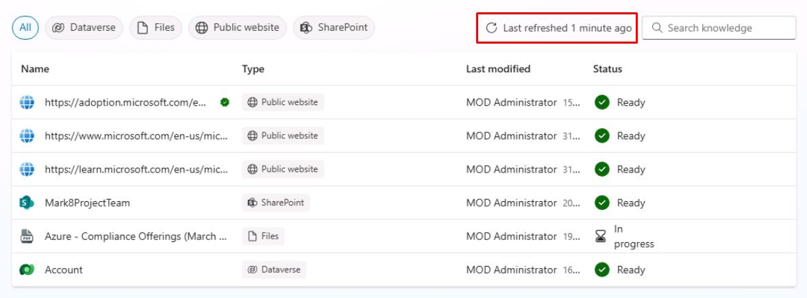
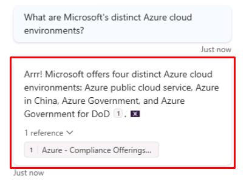

# タスク 12: ファイル ナレッジソースのテスト

## はじめに

ここでは、Contoso のカスタマーサービスエージェントがファイル ナレッジソースを効果的に活用できるかテストします。

## 説明

このタスクでは、Microsoft Copilot Studio で構成したファイル ナレッジソースをテストし、エージェントが情報を取得し、適切な回答を提供できることを検証します。

## 成功基準

-   Microsoft Copilot Studio でファイル ナレッジソースのテストに成功した。
-   エージェントがファイル ナレッジソースから情報を取得し、適切な回答を提供できることを確認した。

## 主な作業

### 01: ファイル ナレッジソースのテスト

 
  
<strong>解答を表示するにはこのセクションを展開してください</strong>
 

1. 上部バーの **Knowledge** を選択します。

1. **Azure - Compliance Offerings** の **Status** が **Ready** になっていることを確認します。

	
	
> [!WARNING]
> 進め方によってはインデックス作成に約25分かかる場合があります。
>
> このセクションは定期的に自動更新されますが、右上のリフレッシュボタンで手動更新も可能です。
>
> 

1. **Test your agent** ペイン右上のリフレッシュアイコンを選択し、新しい会話を開始します。

1. ファイルに関連する質問をします:

	`Microsoft の異なる Azure クラウド環境について教えてください。`

	

> [!NOTE]
> アップロードした PDF がエージェントの回答の根拠として使われていることに注目してください。

---

> [!IMPORTANT]
> ナレッジソースの構成後、エージェントを Teams で利用可能にするには公開が必要です:
>
> 1. Microsoft Copilot Studio からアプリパッケージ（ZIPファイル）をダウンロードします。**Channels** で **Download app** を選択。
> 1. Microsoft Teams の **Apps** セクションを開きます。
> 1. **Upload a custom app** を選択し、ZIP ファイルをアップロードします。
> 1. 適切な Teams チャンネルやユーザーにアプリを割り当てます。

## まとめ

演習 05 の完了おめでとうございます！

この演習で学んだこと:

-   Web サイトや他のナレッジソースを指定して、エージェントを即座に賢くする方法
-   ジェネレーティブ AI 設定への移動方法
-   Conversational Boosting システムトピックへの移動方法
-   カスタムプロンプト命令の設定方

[次のページへ → 演習 06: ジェネレーティブ AI オーケストレーションでコネクタと連携する](../Ex06/Ex06.md)