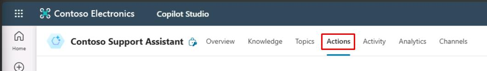
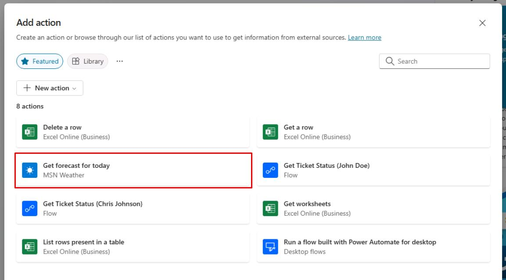
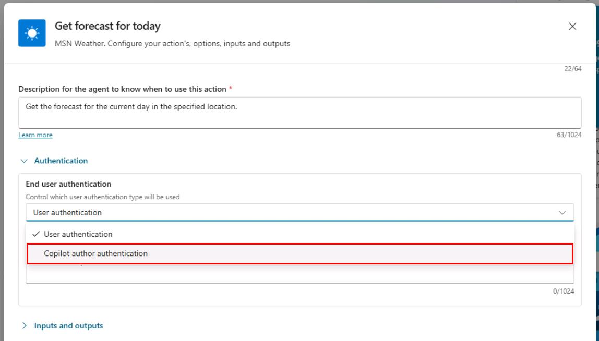
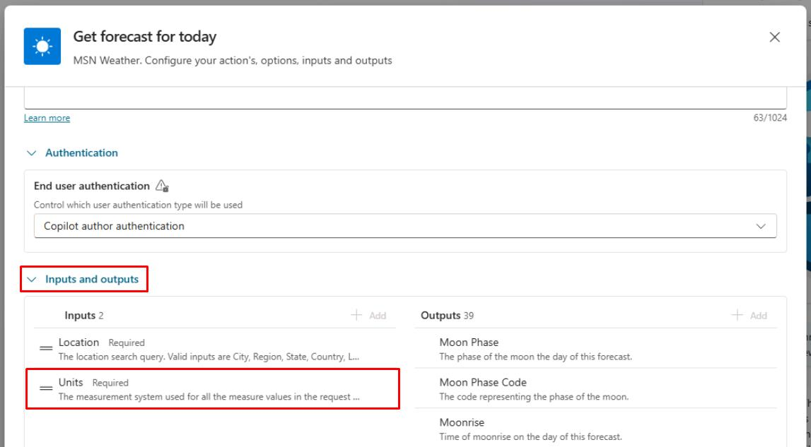
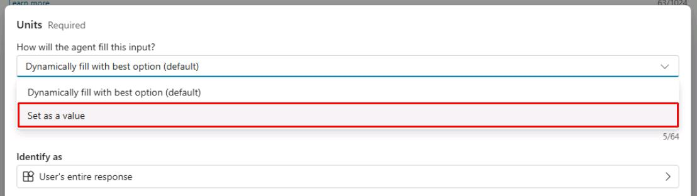
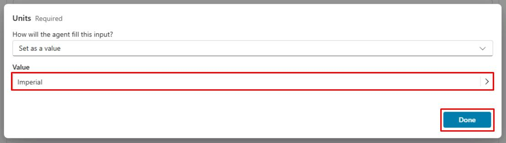
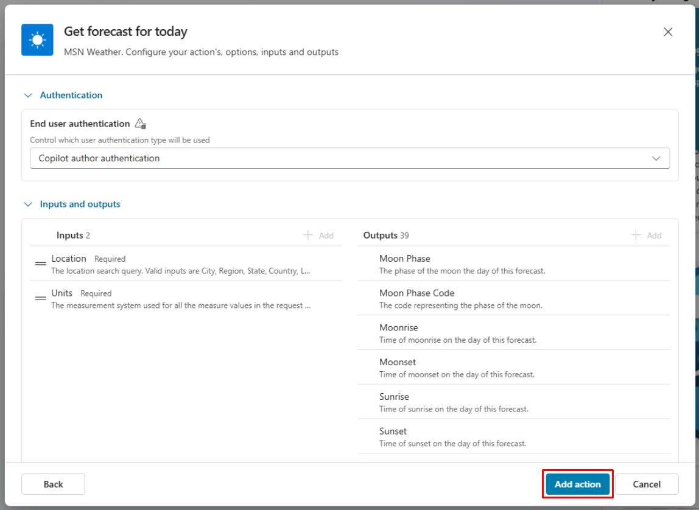

# タスク 01: アクションの作成

## はじめに

構成済みのナレッジソースを活用し、Contoso のエージェントはユーザーの問い合わせに基づいてアクションを実行し、シームレスな顧客体験を提供する必要があります。このタスクでは、ジェネレーティブ AI オーケストレーションを使ってアクションを作成します。

ジェネレーティブモードを有効にすると、エージェントは実行時に最適なアクションやトピックを自動的に選択して応答できます。クラシックモードでは、エージェントはトピックのみで応答しますが、トピック内から明示的にアクションを呼び出す設計も可能です。

アクションは以下のいずれかのコアアクションタイプに基づきます:

  - 組み込みコネクタアクション
  - カスタムコネクタアクション
  - Power Automate クラウドフロー
  - AI Builder プロンプト
  - Bot Framework スキル

各コアアクションには目的を説明する追加情報があり、エージェントはジェネレーティブ AI を使って質問を生成します。これらの質問はアクション実行に必要な入力を埋めるために必要です。そのため、フローの入力など全ての入力を集めるための **Question** ノードを手動で作成する必要はありません。入力は実行時に自動で処理されます。

アクションは、アクションの結果を使ってユーザーの問い合わせに文脈に応じた応答を生成できます。または、アクション用の応答を明示的に作成することも可能です。

## 説明

このタスクでは、エージェントが外部コネクタと連携し特定のタスクを実行できるアクションを作成します。アクションの構成と必要な入力・出力の設定を行います。

## 成功基準

-   正しい入力・出力でアクションを作成できた
-   エージェントがユーザーの問い合わせに基づいてアクションを実行できることを確認した
-   関連する質問でアクションをテストした

## 主な作業

### 01: アクションの作成

 
  
<strong>解答を表示するにはこのセクションを展開してください</strong>
 

1. 上部バーの **Actions** を選択します。

	

1. **Add an action** を選択します。

1. **Get forecast for today** MSN Weather コネクタを選択します。

	

1. 画面右下の **Next** を選択します。

1. **End user authentication** でドロップダウンメニューから **Copilot author authentication** を選択します。

	  

> [!IMPORTANT]
> これはエージェント作成者のコンテキストでコネクタを利用し、エンドユーザーに接続を促しません。

1. **Inputs and outputs** セクションで **Inputs** の **Units** を選択します。

	

1. **How will the agent fill this input?** のドロップダウンで **Set as a value** を選択します。

	

1. ダイアログで **Confirm** を選択します。

1. **Value** のテキストボックスで **Imperial** を選択し、画面右下の **Done** を選択します。

	

1. 設定内容を確認し、画面右下の **Add action** を選択します。

	

  

---

[次のページへ → 0602.md](0602.md)