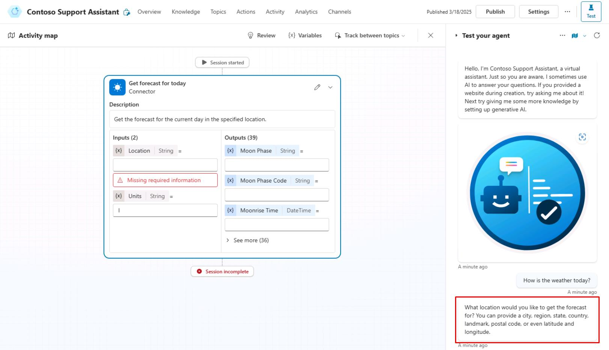
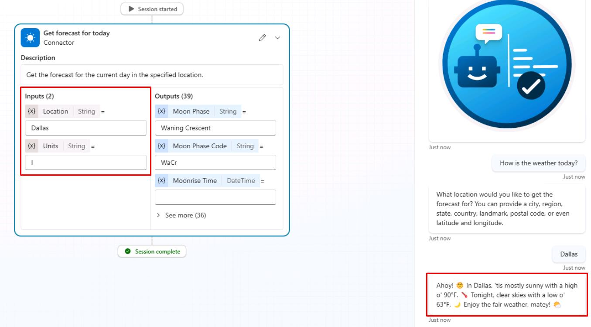
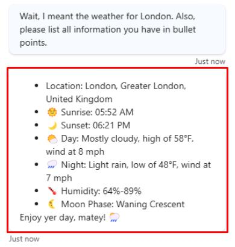

# タスク 02: アクションのテスト

## はじめに

アクションを作成したら、エージェントが正確にアクションを実行できるかテストする必要があります。

## 説明

このタスクでは、エージェントと対話しながら作成したアクションをテストし、エージェントの動作や応答を観察・検証します。

## 成功基準

-   エージェントと対話してアクションのテストに成功した
-   エージェントがユーザーの問い合わせに基づき正確にアクションを実行できることを確認した
-   エージェントの動作を観察・記録した

## 主な作業

### 01: アクションのテスト

 
  
<strong>解答を表示するにはこのセクションを展開してください</strong>
 

1. **Test your agent** ペイン右上のリフレッシュアイコンを選択し、新しい会話を開始します。

1. 天気について曖昧な質問をします:

	`今日の天気は？`

	

	{: .note }
	> エージェントは詳細な場所を尋ね、**Activity map** がメインペインに表示されます。

1. 都市名で答えます:

	`ダラス`

	

	{: .note }
	> エージェントは自動的に **Inputs** を都市で更新し、回答を返します。

1. 間違いを伝え、別の場所を尋ねます:

	`待って、ロンドンの天気が知りたかった。持っている情報をすべて箇条書きで教えて。`

	

    {: .note }
	> エージェントがコネクタへのクエリを更新し、指示通りすべての情報を箇条書きで返す様子を観察してください。

## まとめ

演習 06 の完了おめでとうございます！

- Copilot Studio でアクションを作成しました。
- ユーザーに動的データを表示しました。
- 会話の文脈を活用してフォローアップ質問を行いました。

---

[次のページへ → Ex06.md](Ex06.md)
