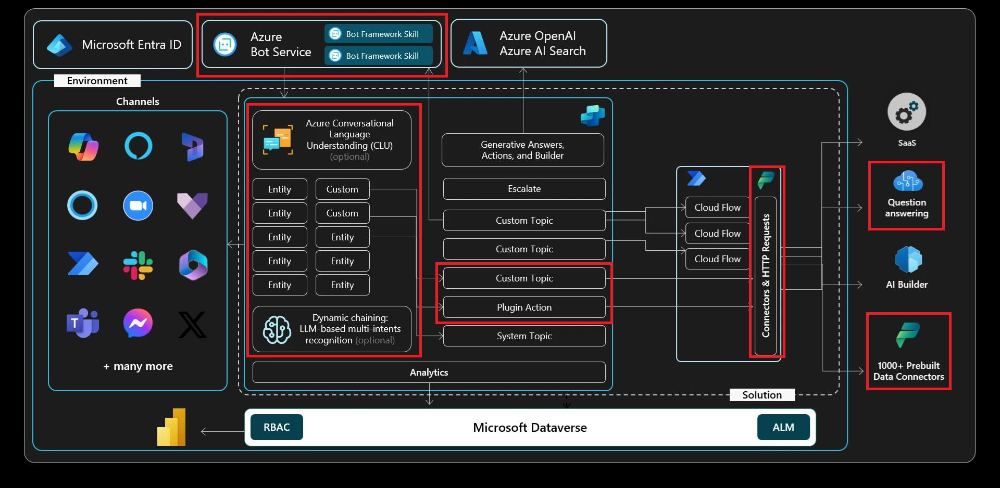

# 演習 06: ジェネレーティブ AI オーケストレーションでコネクタと連携する

## シナリオ

一部の顧客リクエストには静的な回答ではなく動的なアクションが必要です。Contoso は、エージェントがオンデマンドで呼び出せるプラグインアクションを通じて、業務オペレーション（ケースの作成や更新など）を公開することを目指しています。この演習では、ジェネレーティブ AI オーケストレーションを有効化し、エージェントが実行時に最適なアクションを選択し、エンドツーエンドのフローをテストする方法を学びます。

## 目標

この演習の後、次のことができるようになります:

-   プラグインアクションの基本を理解する
-   Copilot Studio でプラグインアクションを使って他のデータソースからデータを取得し、会話形式でユーザーに返す

## アーキテクチャ

## 所要時間

目安時間: *20分*

## ジェネレーティブ AI オーケストレーション

デフォルトでは、エージェントはユーザーの問い合わせに最も近いトリガーフレーズを持つトピックを起動し、会話コンテキストからトピック入力を埋めます。エージェントを設定して、作成したトピックや追加したアクションの中からジェネレーティブ AI で選択させることも可能です。

ジェネレーティブモードでは、エージェントは会話コンテキストだけでなく、ユーザーに値を尋ねる質問を生成してトピック入力を埋めることができます。この動作や管理方法の詳細は [トピックの入力と出力の管理](https://learn.microsoft.com/ja-jp/microsoft-copilot-studio/advanced-managing-topic-inputs-outputs) を参照してください。

ジェネレーティブ AI を使って応答方法を決定することで、ユーザーとの会話がより自然でスムーズになります。ユーザーがメッセージを送信すると、エージェントは応答のために1つ以上のアクションやトピックを選択します。選択にはトピックやアクションの説明が最も重要な要素となり、他にも名前や入出力パラメータ、その説明などが影響します。説明があることで、エージェントはユーザーの意図とアクション・トピックをより正確に結び付けられます。

ジェネレーティブモードでは、エージェントは複数のアクションやトピックを同時に選択し、マルチインテントの問い合わせにも対応できます。選択後、エージェントは実行順序を決定するプランを生成します。

Copilot Studio でジェネレーティブモードを使うエージェントをテストする際は、会話マップを開いてプランの実行を追跡できます。

---

[次のページへ → 0601.md](0601.md)