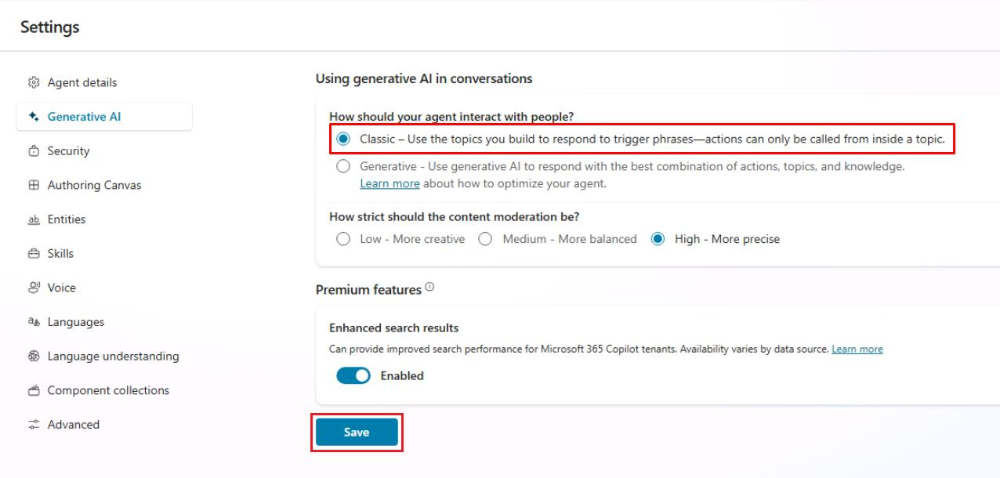

# タスク 01: クラシックオーケストレーションに切り替える

## はじめに

ジェネレーティブオーケストレーションは強力ですが、厳格な規制業界や高い決定性が求められるワークフローなど、Contoso がこれを無効化しクラシック（トピックのみ）モデルに戻す必要があるシナリオも存在します。このタスクでは、エージェントをクラシックオーケストレーションに切り替える手順を説明します。

## 説明

Generative AI 設定ペインを開き、対話モードを「ジェネレーティブ」から「クラシック」に変更し、設定を保存します。その後、エージェントの設定で変更を確認し、トピックのトリガーやアクション選択への影響を理解します。

## 成功基準

- Generative AI 設定がクラシックに設定され、エラーなく保存された。
- エージェントの概要ページにジェネレーティブバッジが表示されなくなった。
- 手動テストで明示的なトピックトリガーのみが実行され、自動アクション実行が発生しないことを確認した。

## 主な作業

### 01: クラシックオーケストレーションに切り替える

  
<strong>解答を表示するにはこのセクションを展開してください</strong>

1. ページ右上付近の **設定** を選択します。

	

1. 左側の設定メニューで **Generative AI** を選択します。

1. **エージェントの対話方法** で **クラシック** を選択し、下部の **保存** を選択します。

	

1. 正常に保存されたら、**設定** ページ右上の **X** を選択します。

[次のページへ進む → 2. プロンプトを作成する](0702.md)
