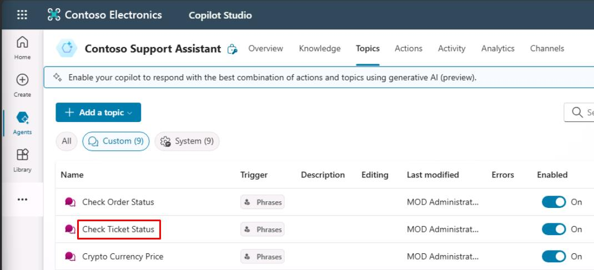
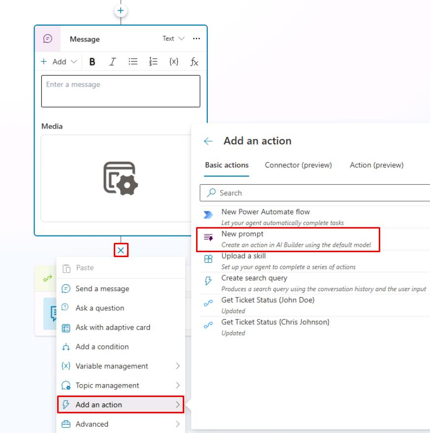
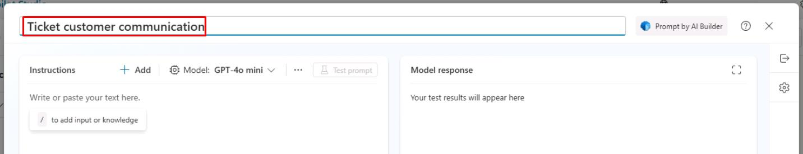

# タスク 02: プロンプトを作成する

## はじめに

Contoso は、エージェントが動的な入力に基づいて応答を生成し、パーソナライズされた顧客サービスを提供できるようにしたいと考えています。これをサポートするのが AI Builder プロンプトです。

## 説明

このタスクでは、Copilot Studio の変数を活用してパーソナライズされた応答を生成するカスタムプロンプトを作成します。プロンプトの構成と必要な入力・出力の設定を行います。

## 成功基準

- 正しい入力・出力でカスタムプロンプトを作成できた。
- エージェントが動的な入力に基づいてパーソナライズされた応答を生成できることを確認した。
- エージェントと対話してプロンプトをテストした。

## 主な作業

### 01: プロンプトを作成する

  
<strong>解答を表示するにはこのセクションを展開してください</strong>

1. 上部バーの **トピック** を選択します。

1. **チケットステータス確認** トピックを選択します。

	

	{: .note }
	> ServiceNow チケットで報告された課題に基づき、ユーザー宛てのレターをジェネレーティブ AI で下書きすることが目標です。

1. **メッセージ** ノードの下で **+** ボタンを選択し、**アクションを追加** → **新しいプロンプト** を選択します。

	

1. プロンプト名に `チケット顧客コミュニケーション` と入力します。

	

1. 左側の **指示** セクションに次の指示を入力します：

<!-- ここに指示内容を記載 -->

[次のページへ進む → 3. プロンプトのテストと改善](0703.md)
