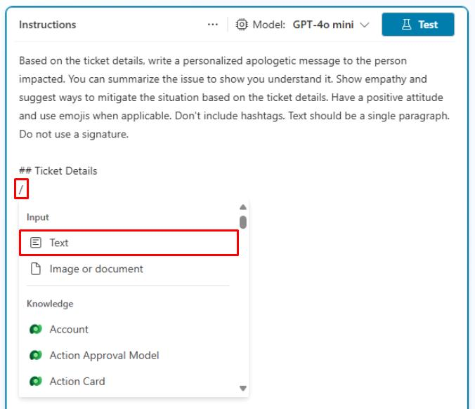
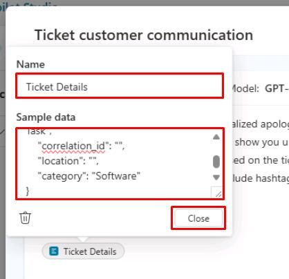
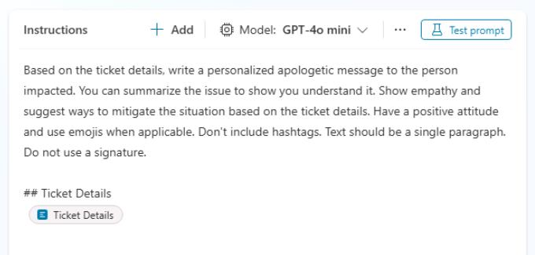
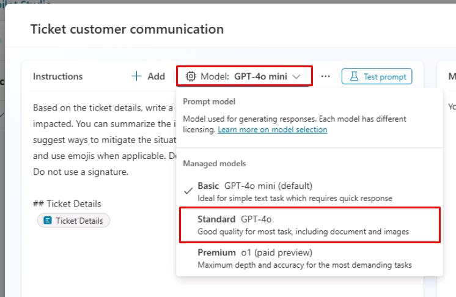
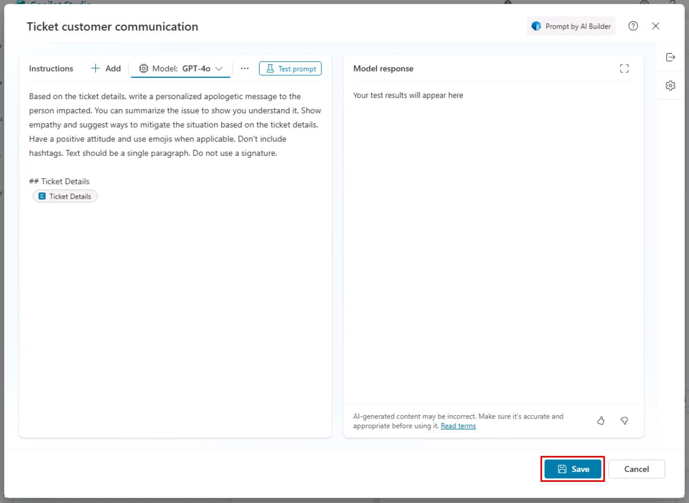
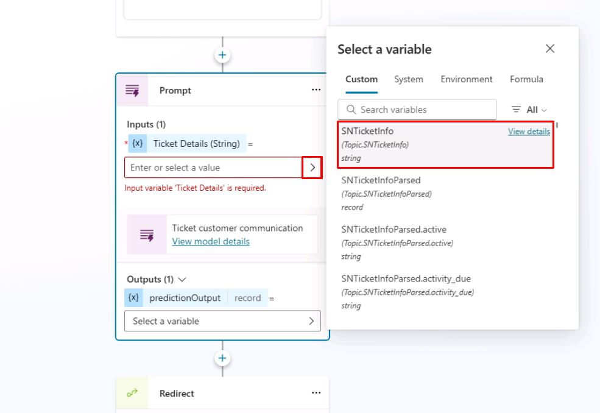
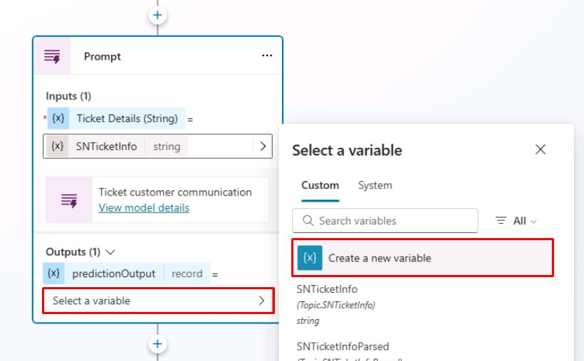
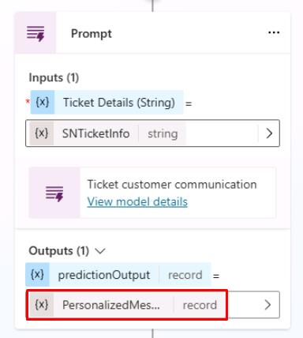
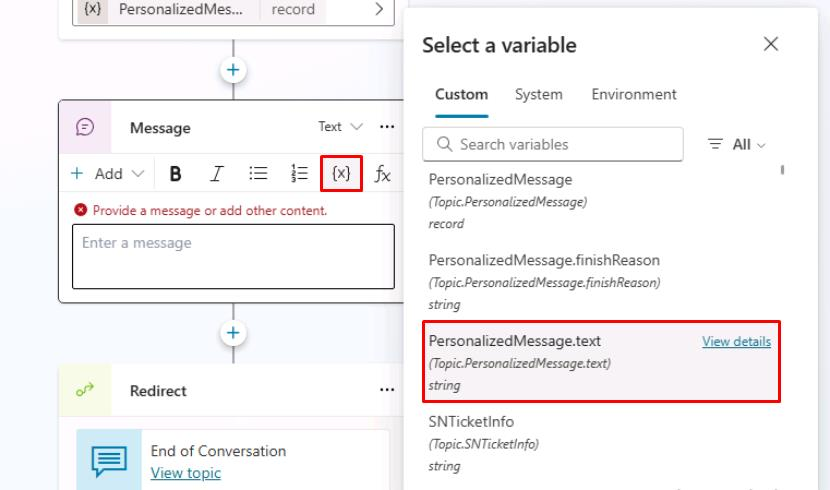
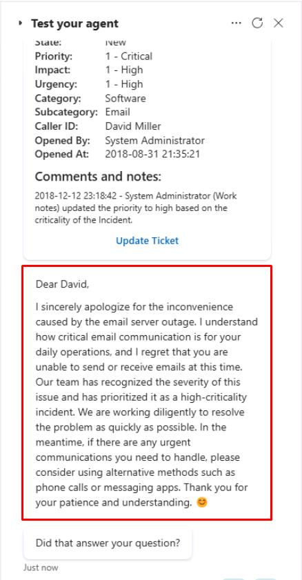

# タスク 02: プロンプトの作成

## はじめに

Contoso は、エージェントが動的な入力に基づいてパーソナライズされたカスタマーサービスを提供できるようにしたいと考えています。これをサポートするのが AI Builder プロンプトです。

## 説明

このタスクでは、Copilot Studio の変数を活用してパーソナライズされた応答を生成するカスタムプロンプトを作成します。プロンプトの構成と必要な入力・出力の設定を行います。

## 成功基準

-   正しい入力・出力でカスタムプロンプトを作成できた
-   エージェントが動的な入力に基づきパーソナライズされた応答を生成できることを確認した
-   エージェントと対話してプロンプトをテストした

## 主な作業

### 01: プロンプトの作成

<details markdown="block"> 
  <summary><strong>解答を表示するにはこのセクションを展開してください</strong></summary> 

1. 上部バーの **Topics** を選択します。

1. **Check Ticket Status** トピックを選択します。

	

	{: .note }
	> 目標は、ServiceNow チケットの内容に基づき、ユーザー宛ての謝罪メッセージをジェネレーティブ AI で作成することです。

1. **Message** ノードの下で **+** ボタンを選択し、**Add an action** → **New prompt** を選択します。

	

1. プロンプト名に `Ticket customer communication` と入力します。

	

1. 左側の **Instructions** セクションに次の指示を入力します:
 
	```
	チケットの詳細に基づき、影響を受けた方へのパーソナライズされた謝罪メッセージを書いてください。内容を要約し、理解していることを示してください。共感を示し、状況を改善する方法を提案してください。前向きな態度で、適宜絵文字を使ってください。ハッシュタグは使わないでください。テキストは1段落で、署名は不要です。
	
	## Ticket Details
	```

1. **Enter** で新しい行を追加します。

1. `/` を入力して新しい入力やナレッジを追加するメニューを表示し、**Text** を選択します。
 
	
 
1. ダイアログで **Name** に `Ticket Details` と入力します。

1. **Sample data** には、以前使った **ServiceNow Sample JSON Payload** を入力します。

	{: .warning }
	> 下記コードブロックの **Copy** を使い、**Ctrl+V** で貼り付けてください。

	```json
	{
		"parent": "",
		"made_sla": "true",
		"caused_by": "",
		"watch_list": "",
		"upon_reject": "Cancel all future Tasks",
		"sys_updated_on": "2018-12-12 23:18:55",
		"child_incidents": "0",
		"hold_reason": "",
		"origin_table": "",
		"task_effective_number": "INC0009005",
		"approval_history": "",
		"number": "INC0009005",
		"resolved_by": "",
		"sys_updated_by": "admin",
		"opened_by": "System Administrator",
		"user_input": "",
		"sys_created_on": "2018-08-31 21:35:45",
		"sys_domain": "global",
		"state": "New",
		"route_reason": "",
		"sys_created_by": "admin",
		"knowledge": "false",
		"order": "",
		"calendar_stc": "",
		"closed_at": "",
		"cmdb_ci": "",
		"delivery_plan": "",
		"contract": "",
		"impact": "1 - High",
		"active": "true",
		"work_notes_list": "",
		"business_service": "",
		"business_impact": "",
		"priority": "1 - Critical",
		"sys_domain_path": "/",
		"rfc": "",
		"time_worked": "",
		"expected_start": "",
		"opened_at": "2018-08-31 21:35:21",
		"business_duration": "",
		"group_list": "",
		"work_end": "",
		"caller_id": "David Miller",
		"reopened_time": "",
		"resolved_at": "",
		"approval_set": "",
		"subcategory": "Email",
		"work_notes": "2018-12-12 23:18:42 - System Administrator (Work notes)\nupdated the priority to high based on the criticality of the Incident.\n\n",
		"universal_request": "",
		"short_description": "Email server is down.",
		"correlation_display": "",
		"delivery_task": "",
		"work_start": "",
		"assignment_group": "",
		"additional_assignee_list": "",
		"business_stc": "",
		"cause": "",
		"description": "Unable to send or receive emails.",
		"origin_id": "",
		"calendar_duration": "",
		"close_notes": "",
		"notify": "Do Not Notify",
		"service_offering": "",
		"sys_class_name": "Incident",
		"closed_by": "",
		"follow_up": "",
		"parent_incident": "",
		"sys_id": "ed92e8d173d023002728660c4cf6a7bc",
		"reopened_by": "",
		"incident_state": "New",
		"urgency": "1 - High",
		"problem_id": "",
		"company": "",
		"reassignment_count": "0",
		"activity_due": "2018-12-13 01:18:55",
		"assigned_to": "",
		"severity": "3 - Low",
		"comments": "",
		"approval": "Not Yet Requested",
		"sla_due": "UNKNOWN",
		"comments_and_work_notes": "2018-12-12 23:18:42 - System Administrator (Work notes)\nupdated the priority to high based on the criticality of the Incident.\n\n",
		"due_date": "",
		"sys_mod_count": "3",
		"reopen_count": "0",
		"sys_tags": "",
		"escalation": "Normal",
		"upon_approval": "Proceed to Next Task",
		"correlation_id": "",
		"location": "",
		"category": "Software"
	}
	```

1. ダイアログ右下の **Close** を選択します。
 
	

	
 
1. **Instructions** セクション上部の **Model** ドロップダウンで **Standard GPT-4o** を選択します。
 
	
 
1. プロンプトペイン右下の **Save** を選択します。
 
	

### 02: **Prompt** ノードと **Message** ノードの構成

1. 新しい **Prompt** ノードの **Inputs** でシェブロン（>）を選択し、**SNTicketInfo** 変数を選択します。

	

1. **Outputs** で **Select a variable** → **Create a new variable** を選択します。

	

1. **Outputs** の **Var1** 変数を選択し、**Variable name** を `PersonalizedMessage` に設定します。

	

1. **Prompt** ノードの下に **Message** ノードを追加します。

1. **Message** ノードで **{x}**（変数挿入）アイコンを選択し、**PersonalizedMessage.text** 変数を選択します。

	

1. 画面右上の **Save** を選択してトピックを保存します。

1. **Test your agent** ペイン右上のリフレッシュアイコンを選択し、新しい会話を開始します。

1. 次のプロンプトでエージェントをテストします:

	`Hi, could I get an update on ticket INC0007001?`

	

## まとめ

演習 07 の完了おめでとうございます！

- Copilot Studio でカスタムプロンプトを作成しました。
- 入力を渡し、その出力をエンドユーザーへの生成回答として利用しました。

# 結論

**おめでとうございます！** このラボを完了しました！

---

[次のページへ → Ex07.md](Ex07.md)
