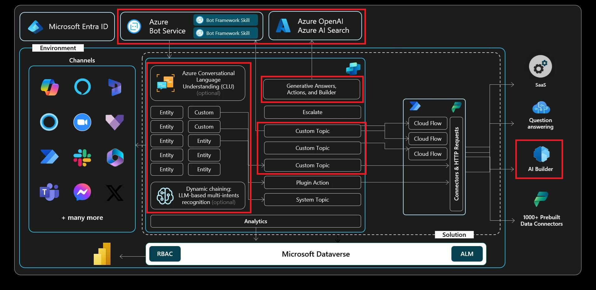

# 演習 07: AI Builder プロンプトの呼び出し

## シナリオ

Contoso は、単なるデータ取得を超えたパーソナライズされたフォローアップメッセージや要約をエージェントから送信したいと考えています。AI Builder プロンプトを使えば、会話中に取得した変数を活用し、大規模言語モデル出力向けのカスタム指示を設計できます。この演習では、顧客向けコミュニケーションを自動で下書きするプロンプトを作成・テストします。

## 目標

この演習の後、次のことができるようになります:

-   AI Builder プロンプトの基本を理解する
-   Copilot Studio 変数を活用したカスタムプロンプトを呼び出す

## アーキテクチャ

## 所要時間

目安時間: *25分*

## AI Builder プロンプト

AI Builder プロンプトでは、自然言語で大規模言語モデル（LLM）にタスクや目標を定義できます。Prompt Builder を使えば、動的な入力変数付きのカスタムプロンプトを作成・テスト・再利用でき、特定のビジネスニーズに合わせて調整可能です。

これらのプロンプトは Power Automate、Power Apps、Copilot Studio で共有・利用できます。たとえば、社内メールからアクションアイテムを抽出し、Power Automate でワークフローを起動するプロンプトを作成できます。他にも、内容の要約、リクエストの分類、重要情報の抽出、応答の翻訳、感情分析、適切なトーンでの返信下書きなど、さまざまな用途があります。

プロンプトはフローに組み込んでタスクを自動化したり、Copilot Studio エージェントに組み込んで実行時に文脈に応じた自然な応答を返すことも可能です。指示を工夫することでモデルの動作を制御でき、AI Builder は業務効率化、体験のパーソナライズ、生産性向上に役立つ強力で柔軟なツールとなります。

---

[次のページへ → 0701.md](0701.md)
